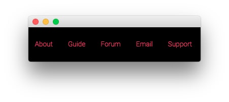
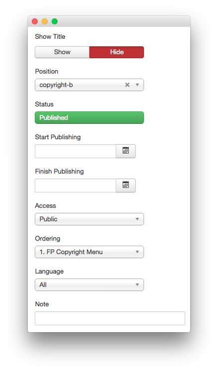
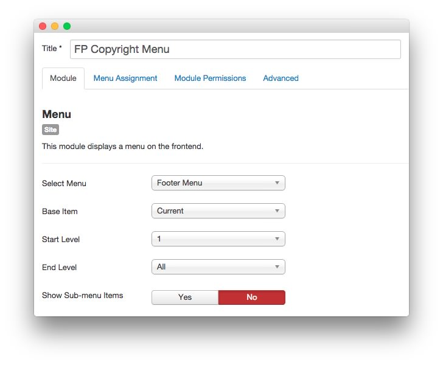
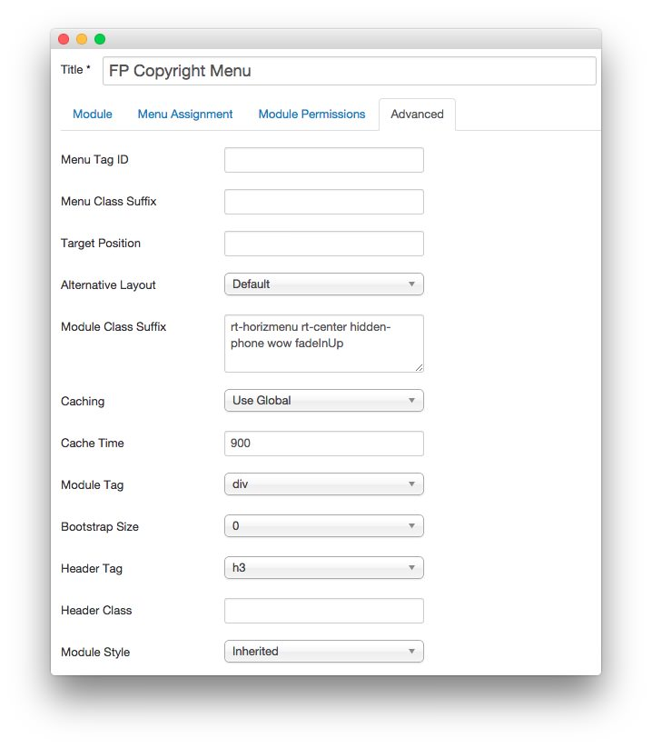

FP Copyright Menu
-----

This area of the demo is a **Menu** module. Here are the options used in our demo.

#### Module

|   Option   |       Setting       |
| :--------- | :------------------ |
| Title      | `FP Copyright Menu` |
| Show Title | Hide                |
| Position   | copyright-b         |
| Status     | Published           |
| Access     | Public              |

#### Options

|        Option       |   Setting   |
| :------------------ | :---------- |
| Select Menu         | Footer Menu |
| Base Item           | Current     |
| Start Level         | 1           |
| End Level           | All         |
| Show Sub-menu Items | No          |

#### Advanced

|        Option       |                      Setting                       |
| :------------------ | :------------------------------------------------- |
| Module Class Suffix | `rt-horizmenu rt-center hidden-phone wow fadeInUp` |