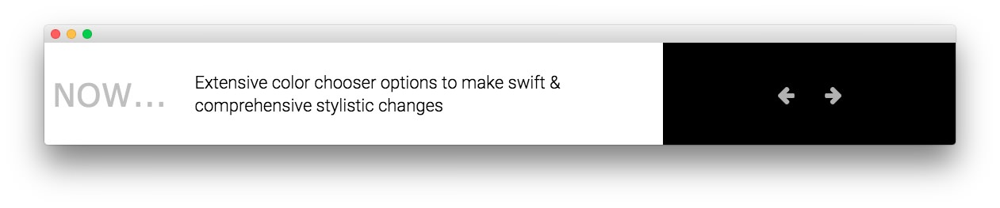
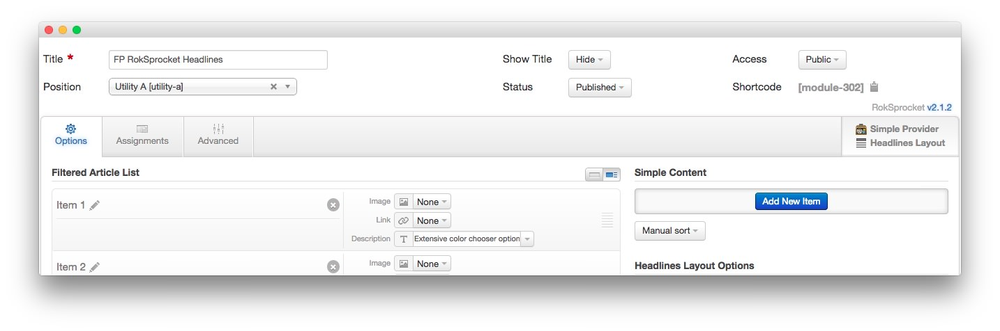
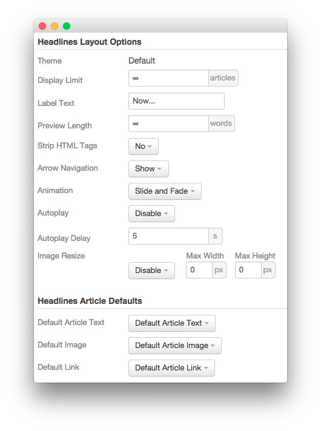
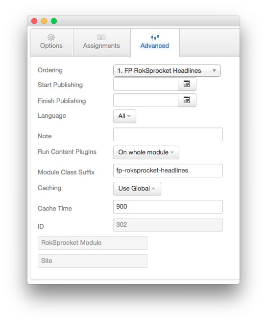

FP RokSprocket Headlines
-----

The **RokSprocket** module used here utilizes the **Headlines** layout type to present interesting information to visitors in a way that maximizes a relatively small amount of space.

### Details

|      Option      |          Setting           |
| :--------------- | :------------------------- |
| Title            | `FP RokSprocket Headlines` |
| Show Title       | Hide                       |
| Access           | Public                     |
| Position         | utility-a                  |
| Status           | Published                  |
| Content Provider | Simple                     |
| Type             | Headlines                  |

### Simple Content Provider

In this instance, we used the **Simple** content provider to enable us to create custom content for the module without having to create entire articles for it. Below is an example of the settings used on a **Simple Item** in this module.

| Option | Setting |
| :----- | :------ |
| Image  | None    |
| Link   | None    |

~~~ .html
Extensive color chooser options to make swift &amp; comprehensive stylistic changes
~~~

### Layout Options

|      Option      |    Setting     |
| :--------------- | :------------- |
| Theme            | Default        |
| Display Limit    | `∞`            |
| Label Text       | `Now...`       |
| Preview Length   | `∞`            |
| Strip HTML Tags  | No             |
| Arrow Navigation | Show           |
| Animation        | Slide and Fade |
| Autoplay         | Disable        |
| Autoplay Delay   | 5              |
| Image Resize     | Disable        |

### Advanced

| Option              | Setting                    |
| :------------------ | :------                    |
| Module Class Suffix | `fp-roksprocket-headlines` |
