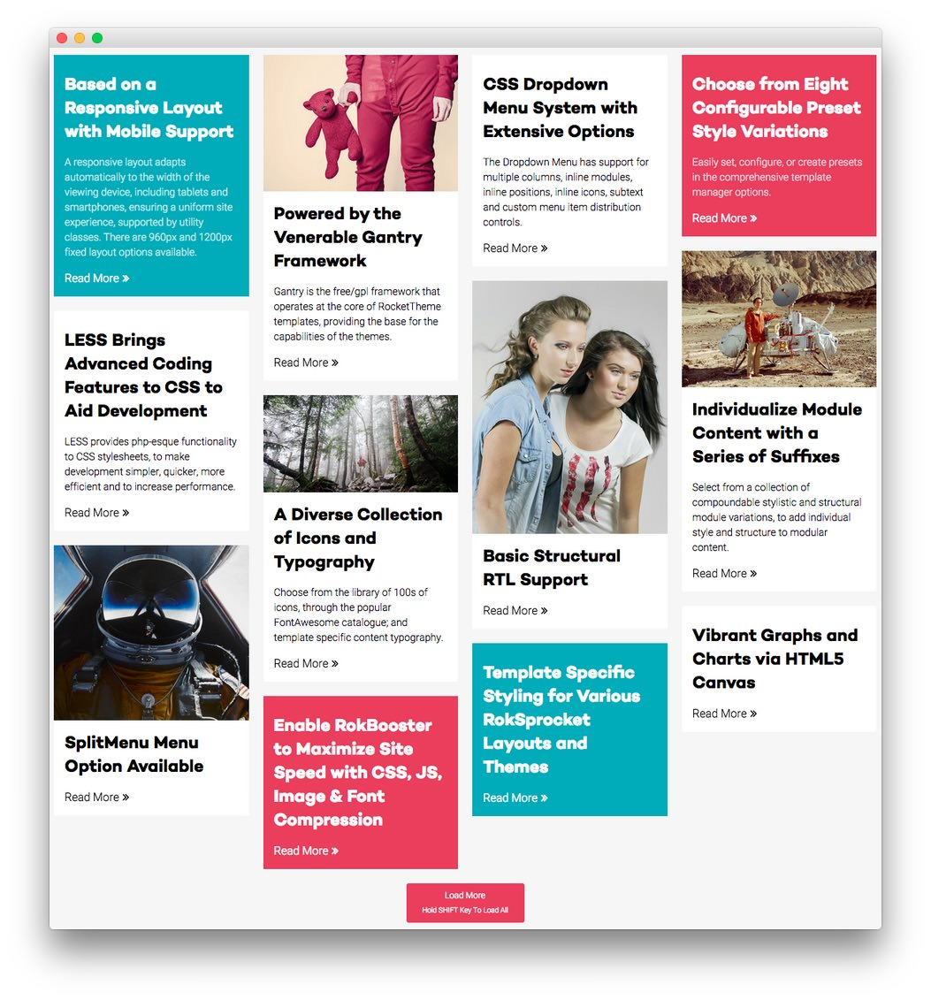
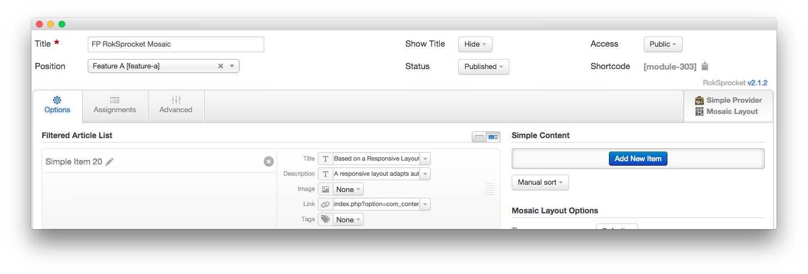
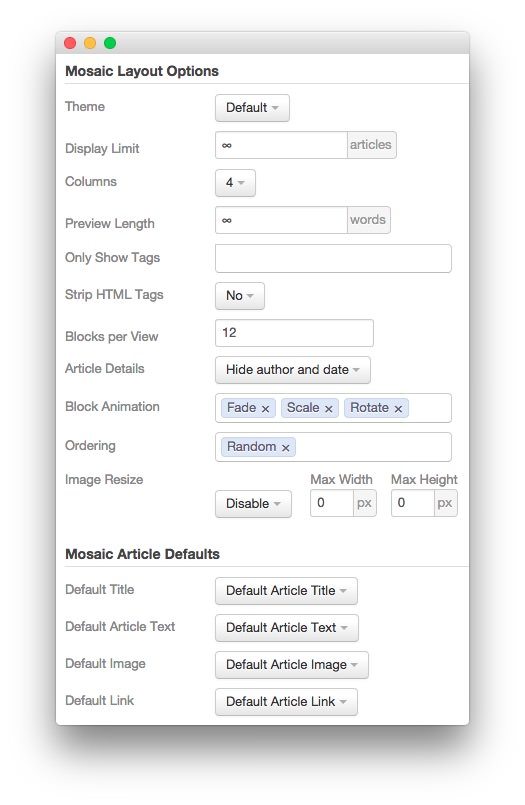
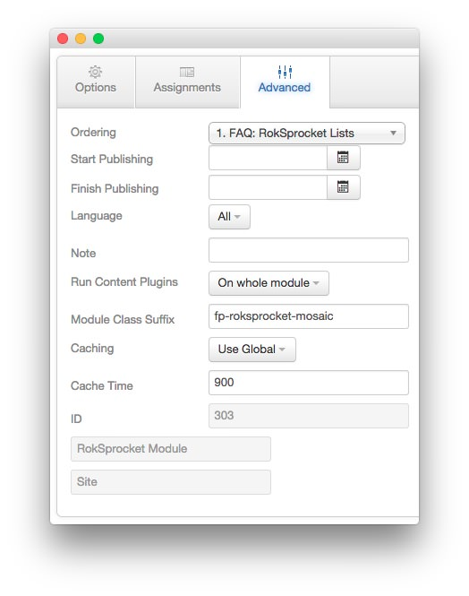

---
title: Sirocco: Recreating the Demo - FP RokSprocket Mosaic
description: Your Guide to Recreating Elements of the Sirocco Demo for Joomla
breadcrumb: /joomla:Joomla/!templates:Templates/sirocco:Sirocco

---

FP RokSprocket Mosaic
-----

The **RokSprocket** module used in this area of the page is a great way to feature some of your site's more notable articles or areas of interest. We used the **Mosaic** layout in this case.

We utilized the **Simple** Content Provider, linking each item in the RokSprocket module to an article. You can find examples of the **Simple** items used in this module in the **Filtered Article List** section below.

### Details

|      Option      |         Setting         |
| :--------------- | :---------------------- |
| Title            | `FP RokSprocket Mosaic` |
| Show Title       | Hide                    |
| Access           | Public                  |
| Position         | feature-a               |
| Status           | Published               |
| Content Provider | Simple                  |
| Type             | Mosaic                  |

### Filtered Article List

#### Simple Item 1

| Option | Setting |
| :----- | :------ |
| Image  | None    |
| Link   | Custom  |
| Tags   | None    |

**Title**

~~~ .html
Based on a Responsive Layout with Mobile Support
~~~

**Description**

~~~ .html
A responsive layout adapts automatically to the width of the viewing device, including tablets and smartphones, ensuring a uniform site experience, supported by utility classes. There are 960px and 1200px fixed layout options available.
~~~

#### Simple Item 2

| Option | Setting |
| :----- | :------ |
| Image  | Custom  |
| Link   | Custom  |
| Tags   | None    |

**Title**

~~~
Powered by the Venerable Gantry Framework
~~~

**Description**

~~~ .html
Gantry is the free/gpl framework that operates at the core of RocketTheme templates, providing the base for the capabilities of the themes.
~~~

#### Simple Item 3

| Option | Setting |
| :----- | :------ |
| Image  | None    |
| Link   | Custom  |
| Tags   | None    |

**Title**

~~~ .html
CSS Dropdown Menu System with Extensive Options
~~~

**Description**

~~~ .html
Easily set, configure, or create presets in the comprehensive template manager options.
~~~

### Layout Options

|         Option        |        Setting        |
| :-------------------- | :-------------------- |
| Theme                 | Default               |
| Display Limit         | `∞`                   |
| Columns               | 4                     |
| Preview Length        | `∞`                   |
| Only Show Tags        | Blank                 |
| Strip HTML Tags       | No                    |
| Blocks Per View       | `12`                  |
| Article Details       | Hide Author and Date  |
| Block Animation       | Fade, Scale, Rotate   |
| Image Resize          | Disable               |
| Default Title         | Default Article Title |
| Default Article Text  | Default Article Text  |
| Default Article Image | Default Article Image |
| Default Link          | Default Article Link  |

### Advanced

|        Option       |         Setting         |
| :------------------ | :---------------------- |
| Module Class Suffix | `fp-roksprocket-mosaic` |
