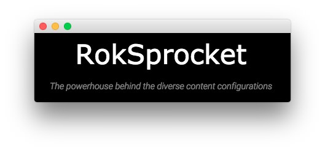
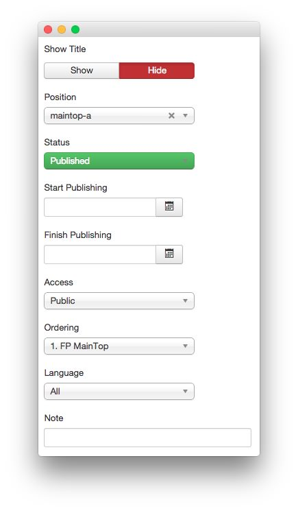
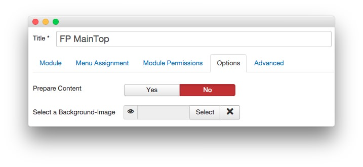
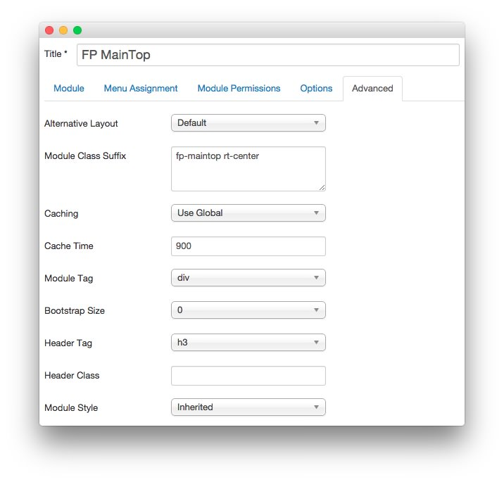

FP MainTop
----

This area of the front page is a **Custom HTML** module. You will find the settings used in our demo below.

>> Any **mod_custom** (Custom HTML) modules are best handled using either RokPad or no editor as a WYSIWYG editor can cause issues with any code that exists in the **Custom Output** field.

### Details

|   Option   |   Setting    |
| :--------- | :----------- |
| Title      | `FP MainTop` |
| Show Title | Hide         |
| Position   | maintop-a    |
| Status     | Published    |
| Access     | Public       |

### Custom Output

Enter the following in the **Custom Output** text editor.

~~~ .html
<h2>RokSprocket</h2>
The powerhouse behind the diverse content configurations
~~~

### Basic

|           Option          | Setting |
| :------------------------ | :------ |
| Prepare Content           | No      |
| Select a Background Image | Blank   |

### Advanced

|        Option       |        Setting         |
| :------------------ | :--------------------- |
| Module Class Suffix | `fp-maintop rt-center` |
