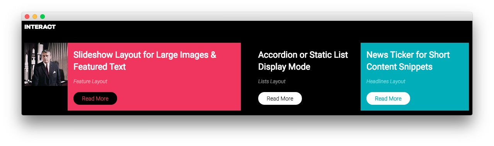
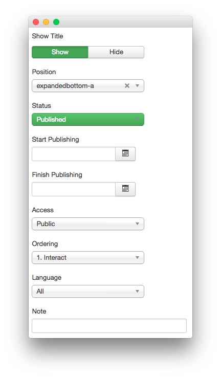
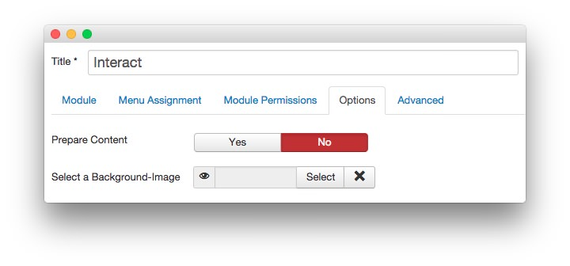
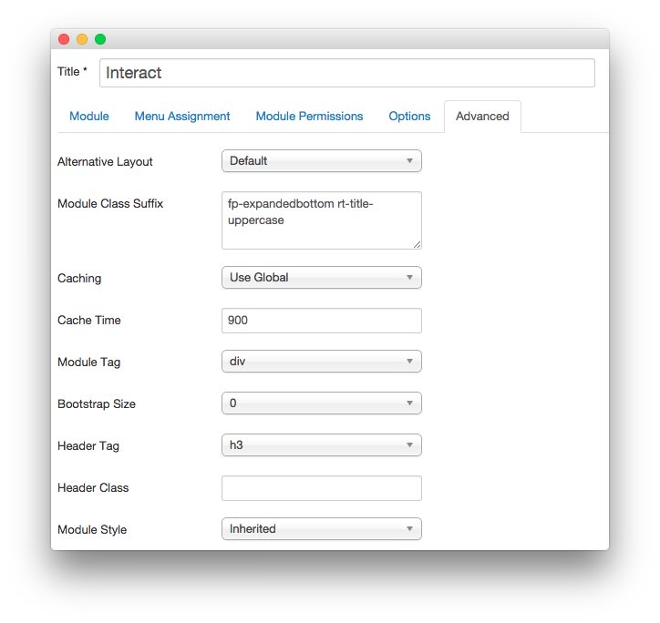

Interact
-----

This area of the front page is a **Custom HTML** module. You will find the settings used in our demo below.

>> Any **mod_custom** (Custom HTML) modules are best handled using either RokPad or no editor as a WYSIWYG editor can cause issues with any code that exists in the **Custom Output** field.

### Details

|   Option   |     Setting      |
| :--------- | :--------------- |
| Title      | `Interact`       |
| Show Title | Show             |
| Position   | expandedbottom-a |
| Status     | Published        |
| Access     | Public           |

### Custom Output

~~~ .html

    

        

            

                

                    
                

                

                    

                        <h2>Slideshow Layout for Large Images &amp; Featured Text</h2>
                        Feature Layout
                        <a href="index.php?option=com_content&amp;view=article&amp;id=1&amp;Itemid=111" class="readon">Read More</a>                        
                    

                

            

        
  
        

            

                

                    

                        <h2>Accordion or Static List Display Mode</h2>
                        Lists Layout
                        <a href="index.php?option=com_content&amp;view=article&amp;id=1&amp;Itemid=111" class="readon">Read More</a>                        
                    

                

                

                    

                        <h2>News Ticker for Short Content Snippets</h2>
                        Headlines Layout
                        <a href="index.php?option=com_content&amp;view=article&amp;id=1&amp;Itemid=111" class="readon">Read More</a>                        
                    

                

            

        
          
    

~~~

### Basic

|           Option          | Setting |
| :------------------------ | :------ |
| Prepare Content           | No      |
| Select a Background Image | Blank   |

### Advanced

|        Option       |                Setting                 |
| :------------------ | :------------------------------------- |
| Module Class Suffix | `fp-expandedbottom rt-title-uppercase` |
