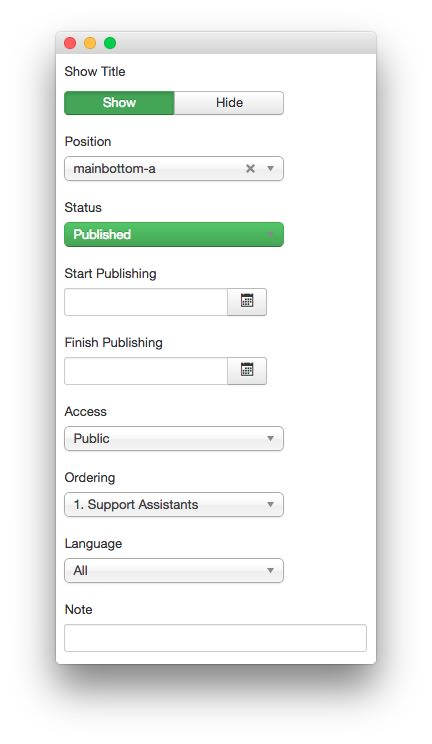
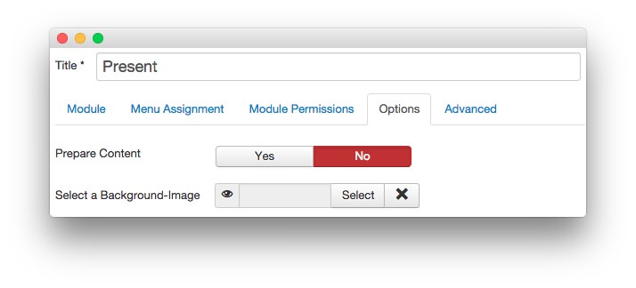
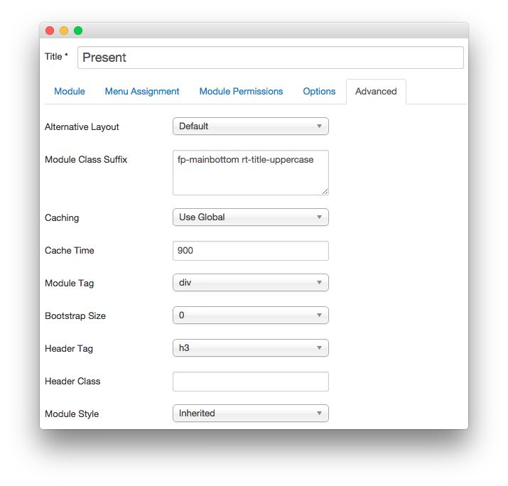

Present
-----

This area of the front page is a **Custom HTML** module. You will find the settings used in our demo below.

>> Any **mod_custom** (Custom HTML) modules are best handled using either RokPad or no editor as a WYSIWYG editor can cause issues with any code that exists in the **Custom Output** field.

### Details

|   Option   |   Setting    |
| :--------- | :----------- |
| Title      | `Present`    |
| Show Title | Show         |
| Position   | mainbottom-a |
| Status     | Published    |
| Access     | Public       |

### Custom Output

~~~ .html

    

        

            

                

                    

                        
                    

                    

                        

                            <h2 class="title">Table Display with 
Image Support
</h2>
                            #tabulation       
                                           
                        

                    
          
                

            

        
  
        

            

                

                    

                        
                    

                    

                        

                            <h2 class="title">Quote Balloons for 
Testimonials
</h2>
                            #citation     
                                               
                        

                    
          
                

            

        
          
    

~~~

### Basic

|           Option          | Setting |
| :------------------------ | :------ |
| Prepare Content           | No      |
| Select a Background Image | Blank   |

### Advanced

|        Option       |              Setting               |
| :------------------ | :--------------------------------- |
| Module Class Suffix | `fp-mainbottom rt-title-uppercase` |
