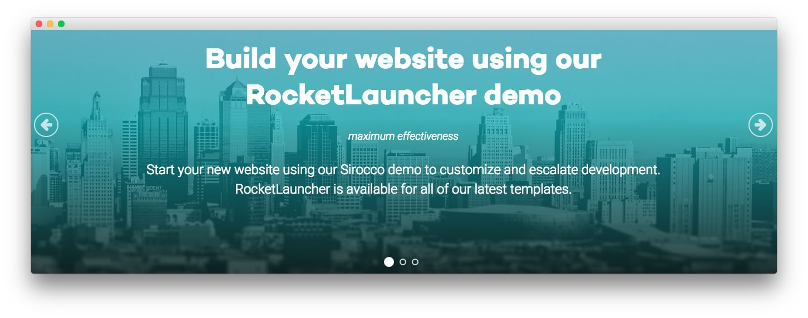
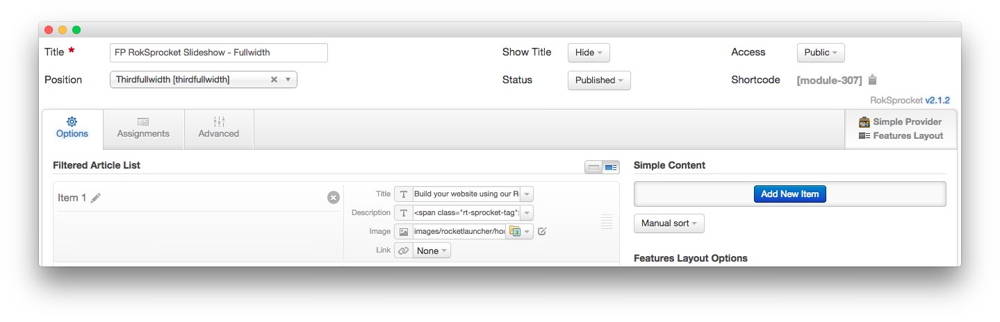
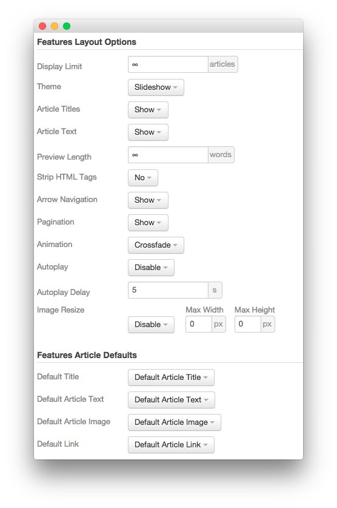
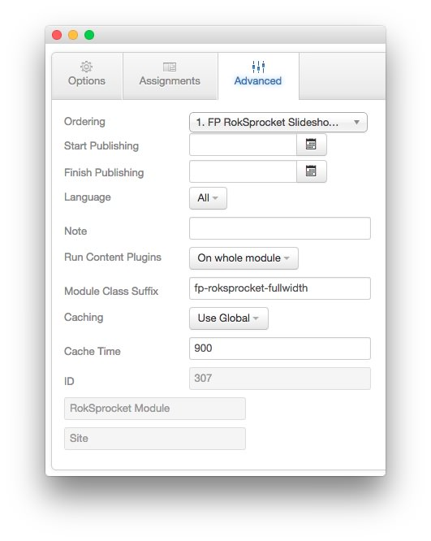

FP RokSprocket Slideshow - Fullwidth
-----

The **RokSprocket** module used in this area of the front page is a great way to feature some of your site's more notable articles or areas of interest.

We utilized the **Simple** Content Provider, linking each item in the RokSprocket module to an article. You can find examples of the **Simple** items used in this module in the **Filtered Article List** section below.

### Details

|      Option      |                Setting                |
| :--------------- | :------------------------------------ |
| Title            | `FP RokSprocket Features - Slideshow` |
| Show Title       | Hide                                  |
| Access           | Public                                |
| Position         | thirdfullwidth                        |
| Status           | Published                             |
| Content Provider | Simple                                |
| Type             | Features                              |

### Filtered Article List

#### Simple Item 1

| Option | Setting |
| :----- | :------ |
| Image  | Custom  |
| Link   | None    |

**Title**

~~~ .html
Build your website using our RocketLauncher demo
~~~

**Description**

~~~ .html
maximum effectivenessStart your new website using our Sirocco demo to customize and escalate development. RocketLauncher is available for all of our latest templates.
~~~

#### Simple Item 2

| Option | Setting |
| :----- | :------ |
| Image  | Custom  |
| Link   | None    |

**Title**

~~~
Style with ease via the extensive Color Chooser options
~~~

**Description**

~~~ .html
unique huesThe Style panel in the Sirocco template administrator provides several options for configuring the main stylistic aspects of the template.
~~~

#### Simple Item 3

| Option | Setting |
| :----- | :------ |
| Image  | Custom  |
| Link   | None    |

**Title**

~~~ .html
Adjust module widths with a charismatic layout interface
~~~

**Description**

~~~ .html
powerful themeSirocco's Layout Panel is represented with sliders to allow for control over how modules are laid out based on how many positions are published.
~~~

### Layout Options

|         Option        |        Setting        |
| :-------------------- | :-------------------- |
| Display Limit         | `∞`                   |
| Theme                 | Slideshow             |
| Article Titles        | Show                  |
| Article Text          | Show                  |
| Preview Length        | `∞`                   |
| Strip HTML Tags       | No                    |
| Arrow Navigation      | Show                  |
| Pagination            | Show                  |
| Animation             | Crossfade             |
| Autoplay              | Disable               |
| Autoplay Delay        | 5                     |
| Image Resize          | Disable               |
| Default Title         | Default Article Title |
| Default Article Text  | Default Article Text  |
| Default Article Image | Default Article Image |
| Default Link          | Default Article Link  |

### Advanced

|        Option       |          Setting           |
| :------------------ | :------------------------- |
| Module Class Suffix | `fp-roksprocket-fullwidth` |
