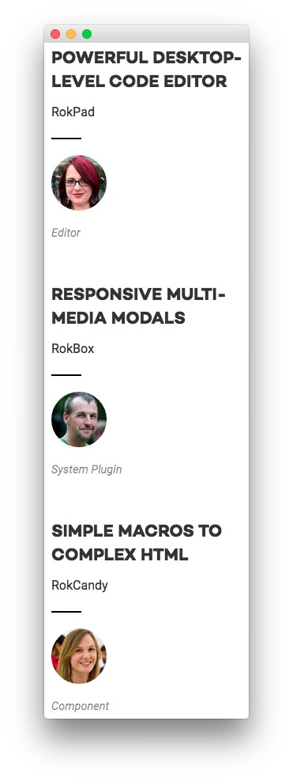
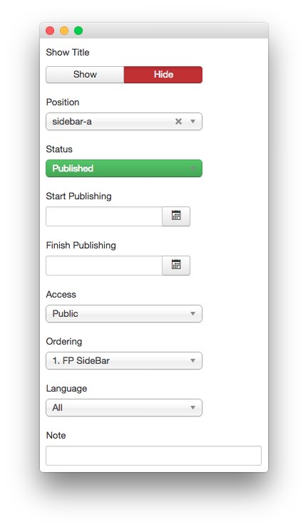
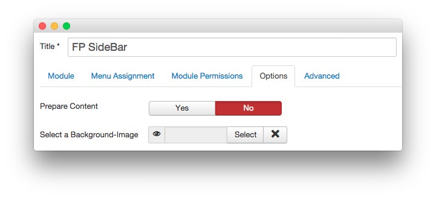
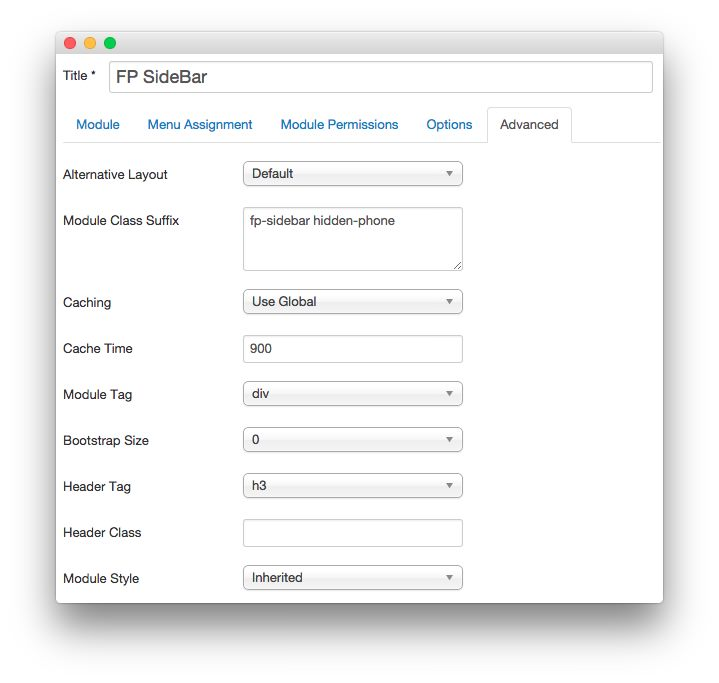

FP SideBar
-----

This area of the page is a **Custom HTML** module. You will find the settings used in our demo below.

>> Any **mod_custom** (Custom HTML) modules are best handled using either RokPad or no editor as a WYSIWYG editor can cause issues with any code that exists in the **Custom Output** field.

### Details

|   Option   |   Setting    |
| :--------- | :----------- |
| Title      | `FP SideBar` |
| Show Title | Hide         |
| Position   | sidebar-a    |
| Status     | Published    |
| Access     | Public       |

### Custom Output

~~~ .html

    <h2 class="title rt-uppercase">Powerful Desktop-Level Code Editor</h2>
    
RokPad

    

    
    
Editor
 

    <h2 class="title rt-uppercase">Responsive Multi-Media Modals</h2>
    
RokBox

    

    
    
System Plugin
  

    <h2 class="title rt-uppercase">Simple Macros to Complex HTML</h2>
    
RokCandy

    

    
    
Component
  

~~~

### Basic

|           Option          | Setting |
| :------------------------ | :------ |
| Prepare Content           | No      |
| Select a Background Image | Blank   |

### Advanced

|        Option       |          Setting          |
| :------------------ | :------------------------ |
| Module Class Suffix | `fp-sidebar hidden-phone` |
