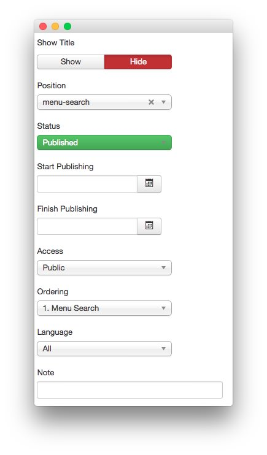
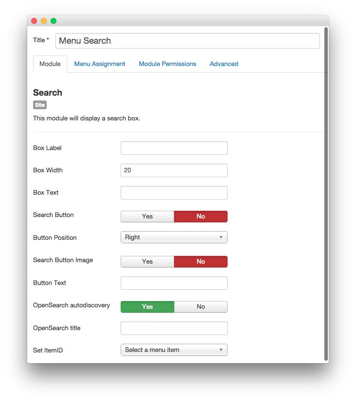
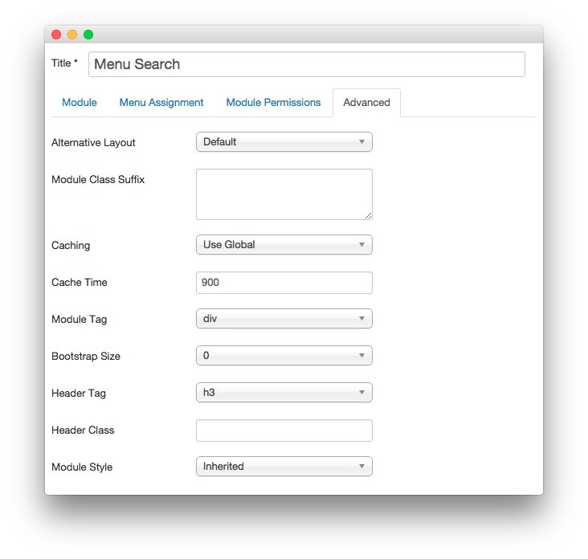

Menu Search
-----

:   1. **Search** [7%, 87%, se]

The **Search** element that appears to the right of the **Main Menu** is a **Menu** item, and which includes a **Search** module. To recreate this as it appears in the demo, follow these steps:

1. Navigate to **Admin > Menus > Main Menu** and create a **System Links > Text Separator** menu item.
2. Under **Dropdown Menu Options**, add `hidden-phone menu-item-search` in the **Custom CSS Class** field.
3. Set the **Menu Title** to **Search**.
4. Under **Link Type**, toggle the **Add Menu Title** option to **On**.
5. Set the **Status** to **Published** and assign its **Menu Location** to **Main Menu**. 

Now, you will need to create the **Search** module to place in the **menu-search** module position. This module will appear when the search icon is selected in the menu.

### Details

|   Option   |    Setting    |
| :--------- | :------------ |
| Title      | `Menu Search` |
| Show Title | Hide          |
| Position   | menu-search   |
| Status     | Published     |
| Access     | Public        |

### Search

|          Option          |            Setting            |
| :----------------------- | :---------------------------- |
| Box Label                |                               |
| Box Width                | `20`                          |
| Box Text                 |                               |
| Search Button            | No                            |
| Button Position          | Right                         |
| Search Button Image      | No                            |
| Button Text              |                               |
| OpenSearch autodiscovery | Yes                           |
| OpenSearch title         |                               |
| Set ItemID               | Select a menu item (none set) |

### Advanced

|        Option       | Setting |
| :------------------ | :------ |
| Module Class Suffix |         |