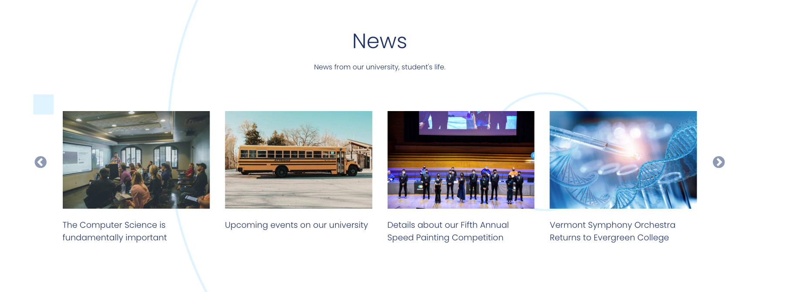
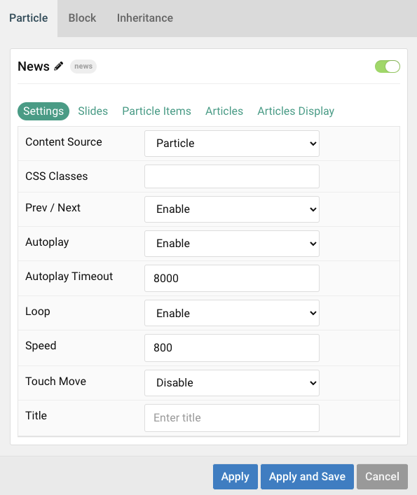
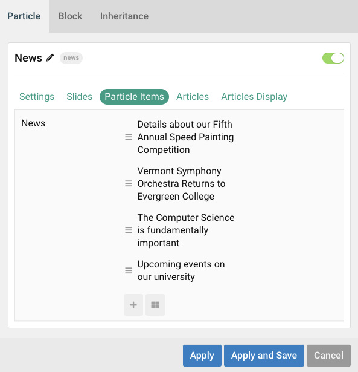
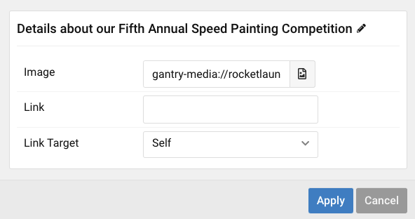
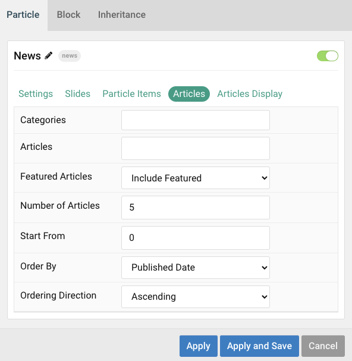
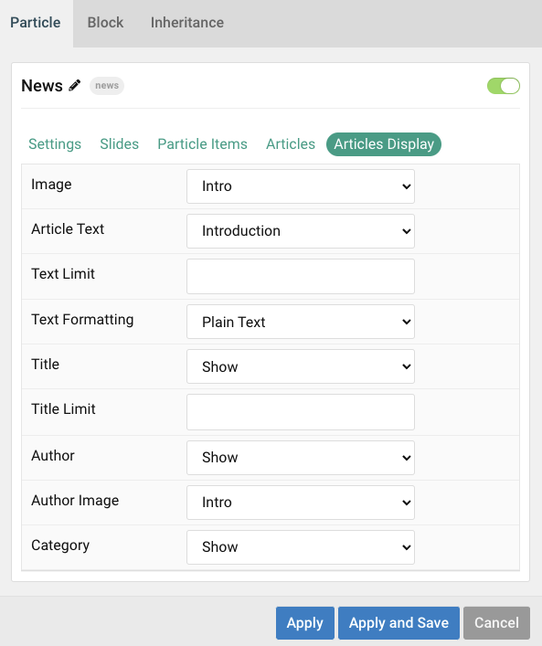

## Introduction

The **News** particle creates a slider of news headlines with images.

Here are the topics covered in this guide:

* [Configuration](#configuration)
    - [Main Options](#main-options)
    - [Item Options](#item-options)
    - [Articles](#articles)
    - [Display](#display)

## Configuration

### Main Options 

These options affect the main area of the particle, and not the individual items within. You can set the title of the particle, as well as give it an introductory paragraph here.

| Option        | Description                                                                     |
| :-----        | :-----                                                                          |
| Particle Name | Give the particle a name. This only appears on the backend.                     |
| Content Source | Choose between **Particle** and **Joomla** as the Content Source.   |
| CSS Classes    | Enter any CSS class(es) you wish to have apply to the particle.   |
| Prev/Next         | **Enable** or **Disable** navigation buttons.                                                      |
| Autoplay         | **Enable** or **Disable** autoplay.                                                                 |
| Autoplay Timeout | Enter (in milliseconds) the delay between automatic switching between items.                        |
| Loop             | **Enable** or **Disable** looping of items.                                                         |
| Speed            | Set the transition speed (in milliseconds).                                                         |
| Touch Move            | **Enable** or **Disable** touch movements.                                                                      |
| Title          | Enter a title for the particle that appears on the front end.                                                                                            |

### Item Options

These items make up the individual featured items in the particle. They sit apart from the particle's title and introduction. Each item can have its own properties, including icons and written content.

| Option              | Description                                                            |
| :-----              | :-----                                                                 |
| Image | Pick desired image. |
| Link     | Enter the url you want the link to go to.  
| Link Target          | Set the target for the link. You can choose between **Self** which opens the link in the current tab or **New Window** which opens links in a new tab. |

### Articles

| Option             | Description                                                                                                     |
| :-----             | :-----                                                                                                          |
| Categories         | Select the categories of articles this particle will display.                                                   |
| Articles           | Select the number of articles you would like the particle to fetch.                                             |
| Featured Articles  | Choose how Featured Articles should be filtered. Choose between **Include**, **Exclude**, or **Only Featured**. |
| Number of Articles | Enter the maximum number of articles to display.                                                                |
| Start From         | Enter offset specifying the first article to return. The default is '0' (the first article).                    |
| Order By           | Choose the type of factor to order by.                                                                          |
| Ordering Direction | Choose between **Ascending** and **Descending** as the article ordering method.                                 |

### Display

This section configures how articles are displayed.

| Option          | Description                                                                                                                                              |
| :-----          | :-----                                                                                                                                                   |
| Image           | Select which image in an article should be displayed.                                                                                                    |
| Article Text    | Choose between showing the **Introduction** or **Full Article** text to display. You can also **Hide** text.                                             |
| Text Limit      | Set a limit (in characters) of the article's text to appear.                                                                                             |
| Text Formatting | Select between **Plain Text** and **HTML** text formatting.                                                                                              |
| Title           | Choose whether or not the title of an article should be shown.                                                                                           |
| Title Limit     | Set a character limit for titles.                                                                                                                        |
| Author Image                      | Select an image to display in the author section of the item.                           |
| Author Text                       | Enter the name of the author.                           |
| Category       | Select to **Show** or **Hide** the article's category. |