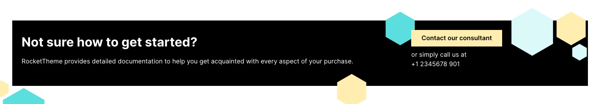
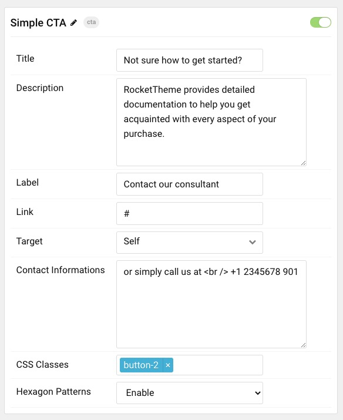

## Introduction

The **Simple CTA** particle displays a simple call to action.

Here are the topics covered in this guide:

* [Configuration](#configuration)
    - [Main Options](#settings)

## Configuration

### Main Options 

These options affect the main area of the particle.

| Option        | Description                                                                                 |
| :------------ | :------------------------------------------------------------------------------------------ |
| Title | Enter title.  |
| Descriptioon      	| Enter description.                                                         |
| Label        	| Enter button label.                                       |
| Link      | Enter button link.                                            |
| Target   | et the target for the button. You can choose between **Self** which opens the link in the current tab or **New Window** which opens links in a new tab.       |   
| Contact   | Enter contact info.       | 
| CSS Classes   | Enter any CSS class(es) you wish to have apply to the particle.       | 
| Hexagon Patterns   | **Enable** or **Disable** hexagon background patterns.       | 