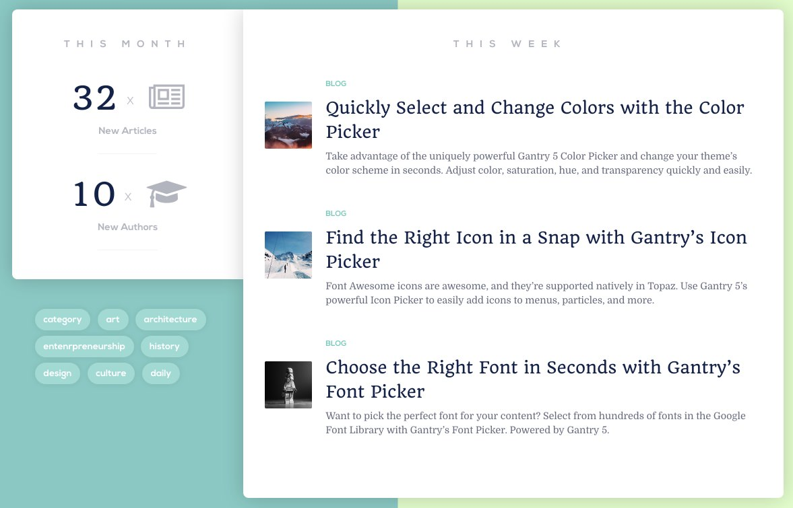
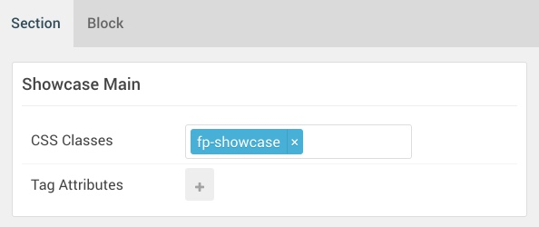
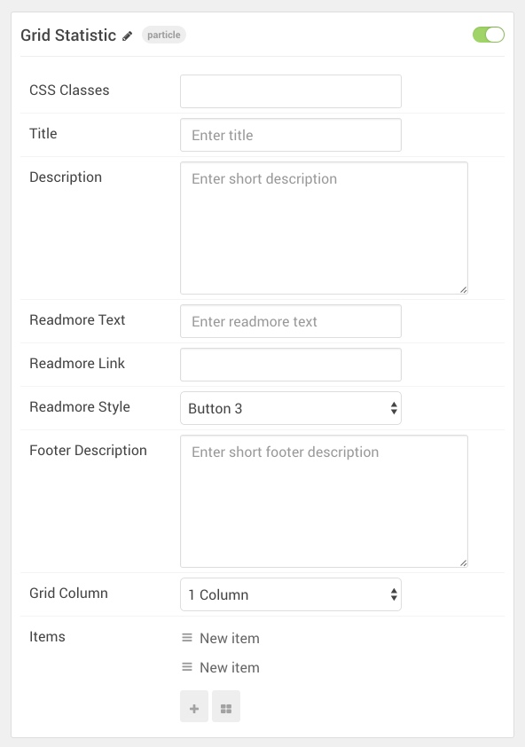
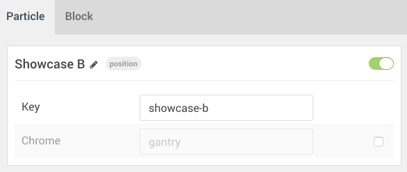
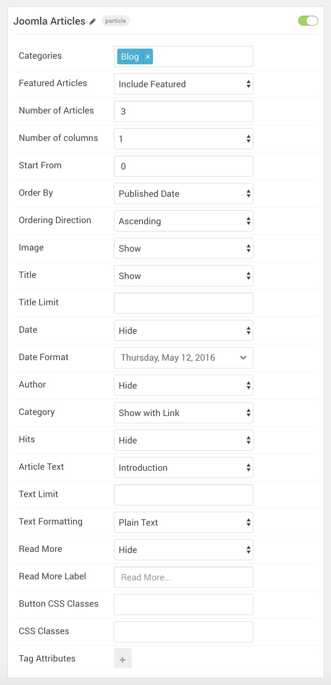

## Introduction

:   1. **Grid Statistic (Particle)** [7%, 2%, se]
    2. **Custom HTML (Particle)** [57%, 2%, se]
    3. **Joomla Articles (Particle)** [7%, 35%, se]

The **Showcase** area of the page is made up of three columned sections wrapped in a **Container**. **Showcase Left** and **Showcase Right** do not appear on the front end as they have no assigned content. However, there is a **Slideshow A** module position in the **Showcase Main** section which contains three different particles: **Grid Statistic**, **Custom HTML**, and **Joomla Articles**.

Here is a breakdown of the module(s) and particle(s) that appear in these sections:

* [Container](#container)
    - Showcase Left
    - [Showcase Main](#showcase-main)
        + [Grid Statistic (particle)](#grid-statistic-(particle))
        + [Custom HTML (Particle)](#custom-html-(particle))
        + [Joomla Articles (Particle)](#menu-(particle))
    - Showcase Right

## Container

| Option         | Setting          |
| :-----         | :-----           |
| Layout         | Remove Container |
| CSS Classes    | Blank            |
| Tag Attributes | Blank            |

The container wrapping the **Showcase** sections enables the three sections to exist within a single horizontal space. 

## Showcase Main

The **Showcase Main** section hosts the **Grid Statistic**, **Custom HTML**, and **Joomla Articles** particles on the front page. You will find the settings used in the section below.

### Section Settings

| Option         | Setting       |
| :-----         | :-----        |
| CSS Classes    | `fp-showcase` |
| Tag Attributes | Blank         |

### Section Block Settings

| Option         | Setting           |
| :-----         | :-----            |
| CSS ID         | Blank             |
| CSS Classes    | `g-middle-column` |
| Variations     | Blank             |
| Tag Attributes | Blank             |
| Fixed Size     | Checked           |
| Block Size     | `70%`             |

#### Showcase A (Module Position)

##### Particle Settings

| Option | Setting      |
| :----- | :-----       |
| Key    | `showcase-a` |
| Chrome | `gantry`     |

##### Block Settings

| Option         | Setting            |
| :-----         | :-----             |
| CSS ID         | Blank              |
| CSS Classes    | `fp-showcase-left` |
| Variations     | Centered Title     |
| Tag Attributes | Blank              |
| Fixed Size     | Unchecked          |
| Block Size     | `30%`              |

##### Grid Statistic (Particle)

The **Grid Statistic** particle is assigned to the **Showcase A** module position. This is done by creating a **Gantry 5 Particle** module and assigning it to the **showcase-a** position, then selecting **Grid Statistic** as the **Particle** in the module's settings. You will find its settings below.

| Option                | Setting             |
| :-----                | :-----              |
| CSS Classes           | Blank               |
| Title                 | Blank               |
| Description           | Blank               |
| Readmore Text         | Blank               |
| Readmore Link         | Blank               |
| Readmore Style        | Button 3            |
| Footer Description    | Blank               |
| Grid Column           | 1 Column            |
| Item 1 Name           | `New item`          |
| Item 1 Static Number  | `32`                |
| Item 1 Icon           | `fa fa-newspaper-o` |
| Item 1 Statistic Text | `New Articles`      |

##### Custom HTML (Particle)demo_showcase_10

The **Custom HTML** particle is assigned to the **Showcase A** module position. This is done by creating a **Gantry 5 Particle** module and assigning it to the **showcase-a** position, then selecting **Custom HTML** as the **Particle** in the module's settings. You will find its settings below.

| Option             | Setting   |
| :-----             | :-----    |
| Process Twig       | Unchecked |
| Process Shortcodes | Unchecked |

~~~ .html
<ul>
   <li><a href="#">category</a></li>
   <li><a href="#">art</a></li>
   <li><a href="#">architecture</a></li>
   <li><a href="#">entenrpreneurship</a></li>
   <li><a href="#">history</a></li>
   <li><a href="#">design</a></li>
   <li><a href="#">culture</a></li>
   <li><a href="#">daily</a></li>
</ul>
~~~

#### Showcase B (Module Position)

##### Particle Settings

| Option | Setting      |
| :----- | :-----       |
| Key    | `showcase-b` |
| Chrome | `gantry`     |

##### Block Settings

| Option         | Setting             |
| :-----         | :-----              |
| CSS ID         | Blank               |
| CSS Classes    | `fp-showcase-right` |
| Variations     | Centered Title      |
| Tag Attributes | Blank               |
| Fixed Size     | Unchecked           |
| Block Size     | `70%`               |

##### Joomla Articles (Particle)

The **Joomla Articles** particle is assigned to the **Showcase B** module position. This is done by creating a **Gantry 5 Particle** module and assigning it to the **showcase-b** position, then selecting **Joomla Articles** as the **Particle** in the module's settings. You will find its settings below.

| Option             | Setting                   |
| :-----             | :-----                    |
| Categories         | `Blog`                    |
| Featured Articles  | Include Featured          |
| Number of Articles | `3`                       |
| Number of Columns  | 1                         |
| Start From         | `0`                       |
| Order By           | Published Date            |
| Ordering Direction | Ascending                 |
| Image              | Show                      |
| Title              | Show                      |
| Title Limit        | Blank                     |
| Date               | Hide                      |
| Date Format        | Weekday, Month Date, Year |
| Author             | Hide                      |
| Category           | Show with Link            |
| Hits               | Hide                      |
| Article Text       | Introduction              |
| Text Limit         | Blank                     |
| Text Formatting    | Plain Text                |
| Read More          | Hide                      |
| Read More Label    | Blank                     |
| Button CSS Classes | Blank                     |
| CSS Classes        | Blank                     |
| Tag Attributes     | Blank                     |
