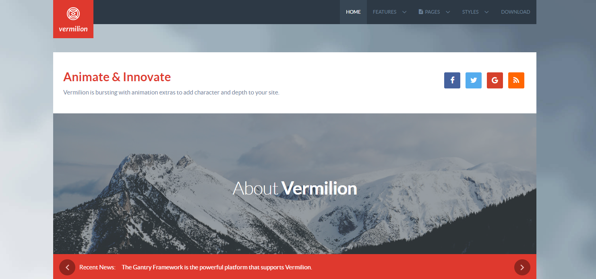

Introduction
-----

Vermilion adopts a business or commercial centric visual model, with corporate background shades interwoven with configurable, vibrant or brand colors, allowing for an equilibrium between professionalism and artistic allure.

Requirements
-----

* PHP 7.1+
* Curl
* OpenSSL Libraries
* Multibyte String Support
* MySQL

>> NOTE: Gantry v5.4.27+ is required for Vermilion to work correctly. For more details on the Gantry Framework, please visit its [Dedicated Website](http://gantry.org).

Key Features
-----

### Included Particles & Atoms

* Animation on Scroll
* Audio Player
* Block Content
* Branding
* Breadcrumbs
* Calendar
* Contact
* Content List
* Content Tabs
* Copyright
* Custom HTML
* Date
* Feature Blocks
* Joomla Content
* Headlines
* Horizontal Menu
* Image Grid
* Info List
* Lists
* Login
* Logo
* MailChimp
* Menu
* Mobile Menu
* Mosaic
* Parallax
* Pricing Table
* Progress Bar
* Promo Image
* Search
* Showcase
* Simple Counter
* Slider
* Social
* Strips Slider
* Tab Image
* Testimonials
* To Top
* Video 

### Template Features

* Responsive Layout
* 6 Preset Styles
* Custom Typography
* Unlimited Positions
* Custom Particles
* Mobile Menu
* Coming Soon Page
* Font Awesome Icons 

### Gantry Core Features

* YAML-based Configuration
* Twig Templating
* Powerful Particle System
* Visual Menu Editor
* MegaMenu Support
* Off-Canvas Panel
* Ajax Admin
* Layout Manager
* Template Inheritance
* SCSS Support
* Sophisticated Fields
* Unlimited Undo/Redo
* Styles Panel

## Content Animations

Content is the core of any website. Nevertheless, the presentation must also be inviting, vibrant and engaging to give the content life and interest. With Vermilion, this is aided through subtle, non-intrusive but visually stunning content animations.

## Parallax

Parallax is the apparent motion of a 3D object as based against your perspective, in short, an object appears to move as your glance changes. This effect has been transposed into the full page's background image, as varying between presets.

## Font Awesome

The template features the Font Awesome library. Font Awesome offers over 350 icons, which are fully scalable and easy to integrate into the design of the template and/or content, from module titles to inside content items themselves.
