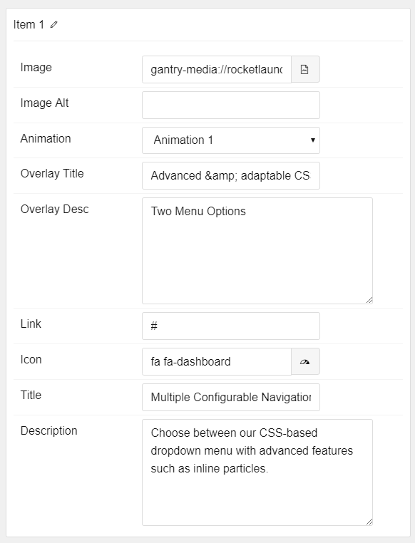

## Introduction

The **Feature Blocks** particle is an excellent choice for displaying images side-by-side with animated text appearing on hover. 

Here are the topics covered in this guide:

* [Configuration](#configuration)
    - [Main Options](#main-options)
    - [Item Options](#item-options)

## Configuration

### Main Options 

These options affect the main area of the particle, and not the individual items within.

| Option        | Description                                                         |
| :-----        | :-----                                                              |
| Particle Name | Used for backend organization and does not appear on the front end. |
| Grid Column   | Select the number of columns for items to appear in.                |

### Item Options

These items make up the individual featured items in the particle.

| Option              | Description                                                                      |
| :-----              | :-----                                                                           |
| Item Name           | This name is used for backend organization and does not appear on the front end. |
| Image               | Select the image you would like to have displayed with the item.                 |
| Image Alt           | Enter alt text to be included with the image.                                    |
| Animation           | Select the animation style to trigger on hover.                                  |
| Overlay Title       | Enter the title for the block item which appears in the overlay.                 |
| Overlay Description | Enter a description for the block item which appears in the overlay.             |
| Link                | Enter a link for the item to go to on click.                                     |
| Icon                | Select an icon to appear with the title and description.                         |
| Title               | Enter the title for the block item.                                              |
| Description         | Enter a description for the block item .                                         |