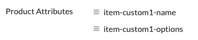
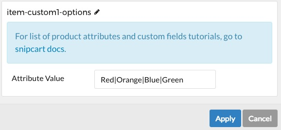

## Introduction

The **Product List** particle enables you to display your store's products in a clean way. Its tabbed navigation scheme makes it easy for users to navigate through your products and find the item that they're searching for.

Here are the topics covered in this guide:

* [Configuration](#configuration)
    - [Main Options](#main-options)
    - [Category Item Options](#category-item-options)
    - [Item Options](#item-options)

## Configuration

### Main Options 

These options affect the main area of the particle, and not the individual items within.

| Option            | Description                                                                               |
| :-----            | :-----                                                                                    |
| Particle Name     | Sets the name for the particle that appears on the back end.                              |
| CSS Classes       | Enter any CSS class(es) that you would like to have apply to the particle's content here. |
| Title             | Sets the title for the particle that appears on the front end.                            |
| Demo Sync         | Enables or disables                                                                       |
| Currency Symbol   | Set the symbol that will accompany pricing in your particle.                              |
| Add To Cart Label | Add a label that will appear as the Add to Cart button.                                   |
| API Key           | This is your Snipcart API key.                                                            |

This particle is powered by [Snipcart](https://snipcart.com/), an API key is necessary to add this functionality to your site and enable you to manage and track your store's performance. Here's how to get one:

* Sign in and log in to [Snipcart](https://snipcart.com/).
* [Add your domain](https://app.snipcart.com/dashboard/account/domains) to Snipcart.
* [Copy your API key](https://app.snipcart.com/dashboard/account/credentials) from Snipcart's Credentials page.
* Paste your API key to the **API Key** field in this particle and/or the **Shopping Cart** particle.

It's also important to note that your site needs to be publicly accessible in order for it to work. Snipcart needs to be able to communicate with your site. This could be achieved by pointing your browser to your domain as it is served remotely or a localhost that points to a domain name.

Snipcart gives you a test mode you can switch to live when you're ready to take live orders. Test mode enables you to test your cart. You can switch between these modes [here](https://app.snipcart.com).

### Category Item Options

Items in this particle are the categories of products as they are displayed in this particle. This is where you create the categories of products you will have on your site.

### Item Options

This is where you can create items in the category.

| Option        | Description                                                                                                                     |
| :-----        | :-----                                                                                                                          |
| Custom ID     | You can create a unique ID for each item in this field. This is optional, but the ID must be unique to each individual product. |
| Brand         | You can add a brand name here to display on the front end.                                                                      |
| Price         | Set a price for your product.                                                                                                   |
| Product Image | Here, you can set an image to be displayed as the product image.                                                                |
| Description   | Add the description of your product here.                                                                                       |

### Product Attributes Options

Here you can create product attributes such as colors and sizes for each of your products. Create a new item and edit the title so that it displays as **item-custom1-[X]**. As an example, the [X] can be **name** or **options**:

>>Note: The title of each attribute must be setup properly as explained in order for it to work.

Next, you can then add the desired value for the attribute. For instance, if you want to add colors as **options** for a specific product, enter each color followed by the **|** symbol:

You can learn more about custom attributes like this [here](https://docs.snipcart.com/configuration/custom-fields).

>>Note: Any attributes you add to your products will appear when the user adds the item to the shopping cart.
