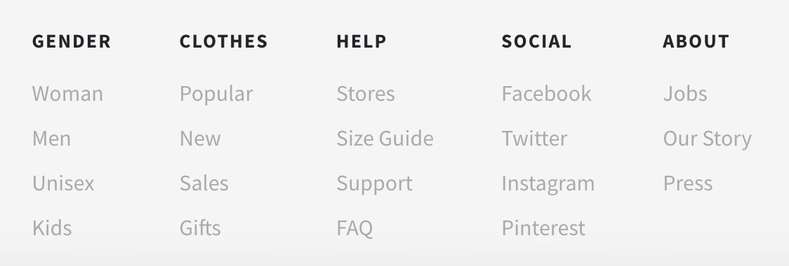
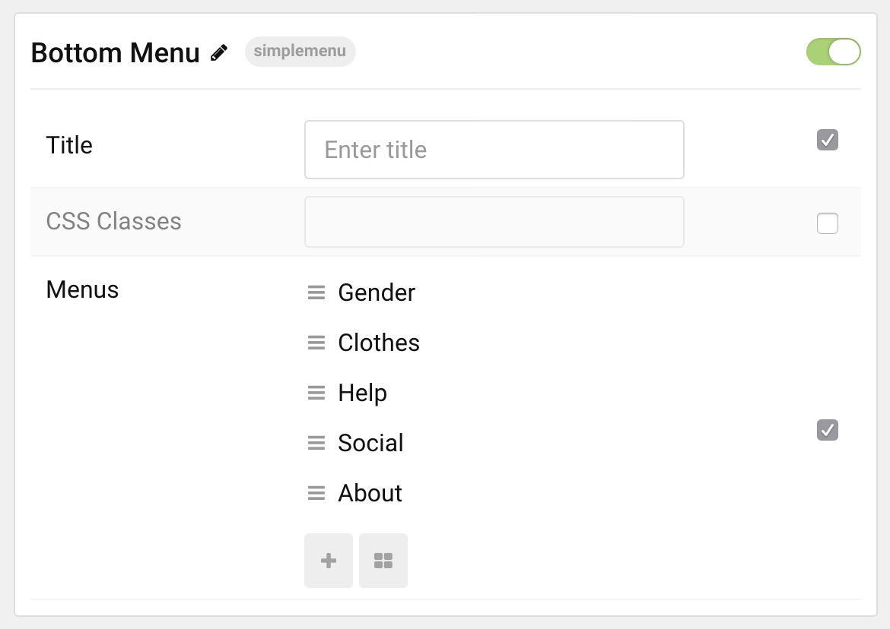

## Introduction

The **Simple Menu** particle is a quick and easy way to navigate your website. Setting it up is as simple as filling in the blanks in the particle.

Here are the topics covered in this guide:

* [Configuration](#configuration)
    - [Main Options](#main-options)

## Configuration

### Main Options 

| Option      | Description                                                               |
| :-----      | :-----                                                                    |
| CSS Classes | Set the CSS class(es) you would like to have apply at the particle level. |
| Title       | Sets the title for the particle that appears on the front end.            |

### Item Options 

This stage of the particle enables you to set up columns (or categories) of products to highlight in the particle.

### Sub-item Options 

| Option    | Description                                                               |
| :-----    | :-----                                                                    |
| Item Name | Here you can assign a name to the item that will appear in the front end. |
| Icon      | Choose the Font Awesome icon you want to have appear.                     |
| Link      | Set the link clicking on the item will take you to.                       |
| Target    | Set the target for the link.                                              |