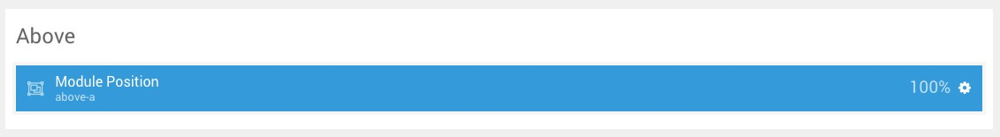
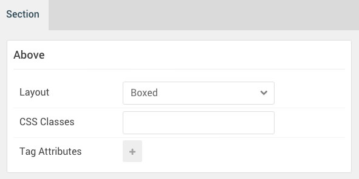

## Introduction

The **Above** section includes a single **News Ticker** particle assigned to the **above-a** module position.

Here is a breakdown of the module(s) and particle(s) that appear in this section:

* [News Ticker (particle)](#news-ticker-(particle))

## Section Settings

| Option           | Setting     |
| :--------------- | :---------- |
| Layout           | Boxed       |
| CSS Classes      | Blank       |
| Tag Attributes   | Blank       |

## News Ticker (Particle)

The **News Ticker** particle is a **Gantry 5 Particle** module placed within the **above-a** module position. Adding a particle to a module position can be done by creating a **Gantry 5 Particle** module, adding the particle using the settings found in the section below, and assigning it to the position.

### Module Position Particle Settings

#### Particle Settings

| Option        | Setting      |
| :-----        | :-----       |
| Particle Name | `FP Above A` |
| Key           | `above-a`    |
| Chrome        | `gantry`     |

#### Block Settings

| Option         | Setting   |
| :-----         | :-----    |
| CSS ID         | Blank     |
| CSS Classes    | Blank     |
| Variations     | Blank     |
| Tag Attributes | Blank     |
| Fixed Size     | Unchecked |
| Block Size     | `100%`    |

### News Ticker Particle Settings

#### Particle Settings

| Option                 | Setting                                                              |
| :-----                 | :-----                                                               |
| Particle Name          | `News Ticker`                                                        |
| CSS Classes            | Blank                                                                |
| Title                  | Blank                                                                |
| Label                  | `Newsflash:`                                                         |
| Item 1 Name            | `Introducing the News Ticker particle, perfect for content snippets` |
| Item 1 Content         | `Introducing the News Ticker particle, perfect for content snippets` |
| Item 1 Read More Label | `Read More`                                                          |
| Item 1 Read More Link  | `#`                                                                  |
| Item 1 Target          | Self                                                                 |
