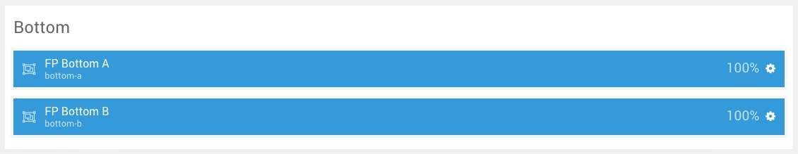
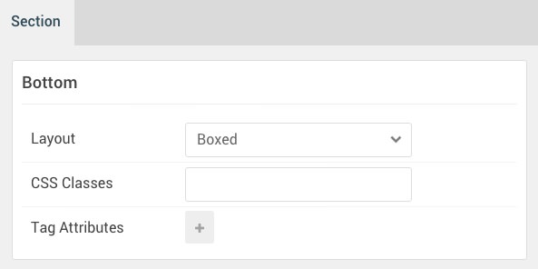

## Introduction

:	1. **Testimonial (Particle)** [5%, 5%, se]
	2. **Promo Content (Particle)** [75%, 5%, se]

The **Bottom** section includes both a **Testimonial** and a **Promo Content** particle assigned to the **bottom-a** and **bottom-b** positions.

Here is a breakdown of the module(s) and particle(s) that appear in this section:

* [Testimonial (particle)](#testimonial-(particle))
* [Promo Content (particle)](#promo-content-(particle))

## Section Settings

| Option           | Setting     |
| :--------------- | :---------- |
| Layout           | Boxed       |
| CSS Classes      | Blank       |
| Tag Attributes   | Blank       |

## Testimonial (Particle) 1

The **Testimonial** particle was placed within the **bottom-a** module position. This was done to make it easier for users of the RocketLauncher to replace this item with a module if they so desired. It also makes it possible to set CSS classes and variations for the whole position rather than on a per-item basis. Adding a particle to a module position can be done by creating a **Gantry 5 Particle** module and assigning it to the position.

### Module Position Particle Settings

#### Particle Settings

| Option        | Setting          |
| :-----        | :-----           |
| Particle Name | `FP Bottom A` |
| Key           | `bottom-a`    |
| Chrome        | `gantry`         |

#### Block Settings

| Option         | Setting       |
| :-----         | :-----        |
| CSS ID         | Blank         |
| CSS Classes    | `fp-bottom-a` |
| Variations     | Blank         |
| Tag Attributes | Blank         |
| Fixed Size     | Unchecked     |
| Block Size     | `100%`        |

### Testimonial Particle Settings

#### Particle Settings

| Option                   | Setting                                                                                                                               |
| :-----                   | :-----                                                                                                                                |
| Particle Name            | `Testimonial`                                                                                                                         |
| CSS Classes              | Blank                                                                                                                                 |
| Title                    | Blank                                                                                                                                 |
| Intro                    | Blank                                                                                                                                 |
| Grid Column              | 3 Columns                                                                                                                             |
| Item 1 Name              | `Item-01`                                                                                                                             |
| Item 1 Testimonial Style | Standard                                                                                                                              |
| Item 1 Image             | Custom                                                                                                                                |
| Item 1 Content           | `Install the RocketLauncher onto your server, to get a near equivalent copy of the demo, to help understand how Xenon is configured.` |
| Item 1 Author            | `Jeffrey Beck`                                                                                                                        |
| Item 1 Company           | `Creative Director`                                                                                                                   |
| Item 1 Link              | Blank                                                                                                                                 |

## Promo Content (Particle)

The **Promo Content** particle was placed within the **bottom-b** module position. This was done to make it easier for users of the RocketLauncher to replace this item with a module if they so desired. It also makes it possible to set CSS classes and variations for the whole position rather than on a per-item basis. Adding a particle to a module position can be done by creating a **Gantry 5 Particle** module and assigning it to the position.

### Module Position Particle Settings

#### Particle Settings

| Option        | Setting       |
| :-----        | :-----        |
| Particle Name | `FP Bottom B` |
| Key           | `bottom-b`    |
| Chrome        | `gantry`      |

#### Block Settings

| Option         | Setting       |
| :-----         | :-----        |
| CSS ID         | Blank         |
| CSS Classes    | `fp-bottom-b` |
| Variations     | Blank         |
| Tag Attributes | Blank         |
| Fixed Size     | Unchecked     |
| Block Size     | `100%`        |

### Promo Content Particle Settings

#### Particle Settings

| Option           | Setting             |
| :-----           | :-----              |
| Particle Name    | `Promo Content`     |
| CSS Classes      | Blank               |
| Title            | Blank               |
| Promo Style      | Promo               |
| Promo Text       | `We Are Hiring!`    |
| Readmore Text    | `Apply for the job` |
| Readmore Classes | `button-2`          |
| Link             | `#`                 |
| Readmore Style   | Aside               |
| Tags             | Blank               |

**Description**

~~~ .txt
You think you have what it takes to work with us?
Work with us?
~~~
