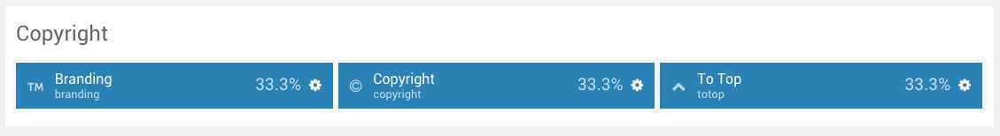
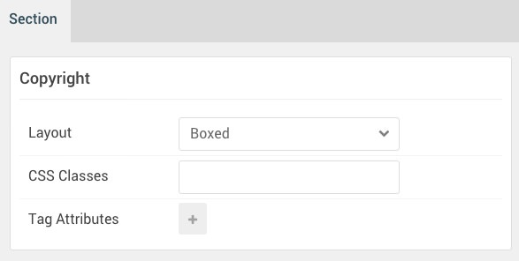

## Introduction

:	1. **Branding (Particle)** [5%, 1%, se]
	2. **Copyright (Particle)** [5%, 35%, se]
	3. **To Top (Particle)** [5%, 95%, se]

The **Copyright** section includes three particles.

Here is a breakdown of the module(s) and particle(s) that appear in this section:

* [Branding (particle)](#branding-(particle))
* [Copyright (particle)](#copyright-(particle))
* [To Top (particle)](#to-top-(particle))

## Section Settings

| Option           | Setting     |
| :--------------- | :---------- |
| Layout           | Boxed       |
| CSS Classes      | Blank       |
| Tag Attributes   | Blank       |

## Branding (Particle)

### Particle Settings

| Option        | Setting                                                                                                                                             |
| :-----        | :-----                                                                                                                                              |
| Particle Name | `Branding`                                                                                                                                          |
| Content       | `Powered by <a href="http://www.gantry.org/" title="Gantry Framework" class="g-powered-by">Gantry Framework</a>` |
| CSS Classes   | `g-branding`                                                                                                                                        |

### Block Settings

| Option         | Setting   |
| :-----         | :-----    |
| CSS ID         | Blank     |
| CSS Classes    | Blank     |
| Variations     | Blank     |
| Tag Attributes | Blank     |
| Fixed Size     | Unchecked |
| Block Size     | `33.3%`   |

## Copyright (Particle)

### Particle Settings

| Option            | Setting           |
| :-----            | :-----            |
| Particle Name     | `Copyright`       |
| Start Year        | `2007`            |
| End Year          | `now`             |
| Copyright Owner   | `RocketTheme LLC` |
| Owner Link        | Blank             |
| Owner Link Target | New Window        |
| CSS Classes       | Blank             |

### Block Settings

| Option         | Setting   |
| :-----         | :-----    |
| CSS ID         | Blank     |
| CSS Classes    | Blank     |
| Variations     | Blank     |
| Tag Attributes | Blank     |
| Fixed Size     | Unchecked |
| Block Size     | `33.3%`   |

## To Top (Particle)

### Particle Settings

| Option        | Setting  |
| :-----        | :-----   |
| Particle Name | `To Top` |
| CSS Classes   | `totop`  |
| Icon          | Blank    |
| Text          | `To Top` |

### Block Settings

| Option         | Setting       |
| :-----         | :-----        |
| CSS ID         | Blank         |
| CSS Classes    | `fp-copyright-c` |
| Variations     | Blank         |
| Tag Attributes | Blank         |
| Fixed Size     | Unchecked     |
| Block Size     | `33.3%`         |

