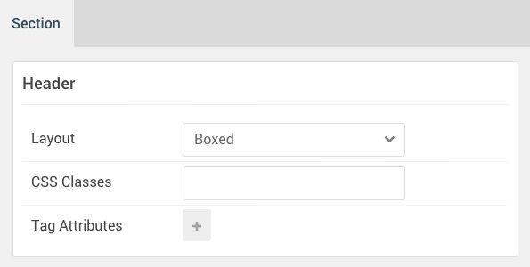

## Introduction

The **Header** section includes a single **FlexSlider** particle assigned to the **header-a** module position.

Here is a breakdown of the module(s) and particle(s) that appear in this section:

* [FlexSlider (particle)](#flexslider-(particle))

## Section Settings

| Option           | Setting     |
| :--------------- | :---------- |
| Layout           | Boxed       |
| CSS Classes      | Blank       |
| Tag Attributes   | Blank       |

## FlexSlider (Particle)

The **FlexSlider** particle was placed within the **header-a** module position. This was done to make it easier for users of the RocketLauncher to replace this item with a module if they so desired. It also makes it possible to set CSS classes and variations for the whole position rather than on a per-item basis. Adding a particle to a module position can be done by creating a **Gantry 5 Particle** module and assigning it to the position.

### Module Position Particle Settings

#### Particle Settings

| Option        | Setting       |
| :-----        | :-----        |
| Particle Name | `FP Header A` |
| Key           | `header-a`    |
| Chrome        | `gantry`      |

#### Block Settings

| Option         | Setting       |
| :-----         | :-----        |
| CSS ID         | Blank         |
| CSS Classes    | `fp-header-a` |
| Variations     | Blank         |
| Tag Attributes | Blank         |
| Fixed Size     | Unchecked     |
| Block Size     | `100%`        |

### FlexSlider Particle Settings

#### Particle Settings

| Option                  | Setting                                                                                                                                                    |
| :-----                  | :-----                                                                                                                                                     |
| Particle Name           | `FlexSlider`                                                                                                                                               |
| CSS Classes             | `fp-flexslider-slideshow`                                                                                                                                  |
| Title                   | Blank                                                                                                                                                      |
| Layout                  | Slideshow                                                                                                                                                  |
| Thumbnail Width         | `150`                                                                                                                                                      |
| Autoplay                | Enable                                                                                                                                                     |
| Autoplay Speed          | `10000`                                                                                                                                                    |
| Pause on Hover          | Enable                                                                                                                                                     |
| RTL Mode                | Disable                                                                                                                                                    |
| Item 1 Name             | `Item 01`                                                                                                                                                  |
| Item 1 Background Image | `gantry-media://rocketlauncher/home/header/img-01.jpg`                                                                                                     |
| Item 1 Overlay Image    | Blank                                                                                                                                                      |
| Item 1 Overlay Parallax | Disabled                                                                                                                                                   |
| Item 1 Parallax Ratio   | Blank                                                                                                                                                      |
| Item 1 Title            | `Sky is the limit`                                                                                                                                         |
| Item 1 Description      | `Xenon is an excellent example of precision design, with refined elements and structures to combine vibrancy, elegance and flexibility within one entity.` |
| Testimonial Image       | Blank                                                                                                                                                      |
| Testimonial Name        | Blank                                                                                                                                                      |
| Testimonial Position    | Blank                                                                                                                                                      |
| Link                    | `#`                                                                                                                                                        |
| Link Text               | Blank                                                                                                                                                      |
| Read More               | Blank                                                                                                                                                      |
| Target                  | Self                                                                                                                                                       |
| Button Class            | button-2                                                                                                                                                   |
