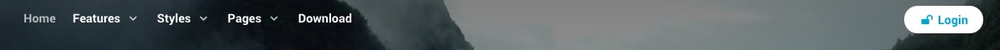
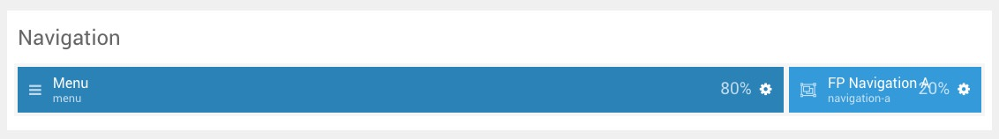
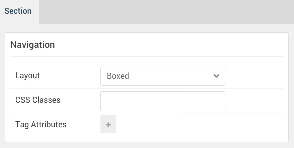

## Introduction

:   1. **Menu (Particle)** [10%, 2%, se]
    2. **Popup Module (Particle)** [10%, 88%, se]

The **Navigation** section includes two particles, **Menu** and **Popup Module**. The **Popup Module** particle puts the **Login** module in a popup.

Here is a breakdown of the module(s) and particle(s) that appear in this section:

* [Menu (particle)](#menu-(particle))
* [Popup Module (Particle)](#popup-module-(particle))

## Section Settings

| Option           | Setting     |
| :--------------- | :---------- |
| Layout           | Boxed       |
| CSS Classes      | Blank       |
| Tag Attributes   | Blank       |

## Menu (Particle)

### Particle Settings

| Option        | Setting          |
| :-----        | :-----           |
| Particle Name | `Menu`           |
| Menu          | Use Default Menu |
| Base Item     | Active           |
| Start Level   | `1`              |
| Max Levels    | `0`              |
| Render Titles | Unchecked        |
| Mobile Target | Unchecked        |

### Block Settings

| Option         | Setting   |
| :-----         | :-----    |
| CSS ID         | Blank     |
| CSS Classes    | Blank     |
| Variations     | Blank     |
| Tag Attributes | Blank     |
| Fixed Size     | Unchecked |
| Block Size     | `80%`     |

## Popup Module (Particle)

The **Popup Module** particle is a **Gantry 5 Particle** module placed within the **navigation-a** module position. Adding a particle to a module position can be done by creating a **Gantry 5 Particle** module, adding the particle using the settings found in the section below, and assigning it to the position.

### Module Position Particle Settings

#### Particle Settings

| Option        | Setting           |
| :-----        | :-----            |
| Particle Name | `FP Navigation A` |
| Key           | `navigation-a`    |
| Chrome        | `gantry`          |

#### Block Settings

| Option         | Setting           |
| :-----         | :-----            |
| CSS ID         | Blank             |
| CSS Classes    | `fp-navigation-a` |
| Variations     | Blank             |
| Tag Attributes | Blank             |
| Fixed Size     | Unchecked         |
| Block Size     | `20%`             |

### Popup Module Particle Settings

#### Particle Settings

| Option            | Setting              |
| :-----            | :-----               |
| Particle Name     | `Popup Module`       |
| CSS Classes       | Blank                |
| Title             | Blank                |
| Module ID         | `428`                |
| Guest Button Icon | `fa fa-unlock fa-fw` |
| Guest Text        | `Login`              |
| Guest button Icon | `fa fa-lock fa-fw`   |
| User Text         | `Logout`             |
| Button Classes    | `button-2`           |

### Login Module

A **Login** module needs to be created so it can be assigned (using its **Module ID**) to the particle. Here is a breakdown of the **Module** settings used in this module. It was not assigned to any position.

| Option                  | Setting        |
| :-----                  | :-----         |
| Title                   | `Login Module` |
| Show Title              | Yes            |
| Position                | Unassigned     |
| Status                  | Published      |
| Pre-text                | Blank          |
| Post-text               | Blank          |
| Login Redirection Page  | Default        |
| Logout Redirection Page | Default        |
| Show Greeting           | Yes            |
| Show Name/Username      | Name           |
| Encrypt Login Form      | No             |
| Display Labels          | Icons          |
