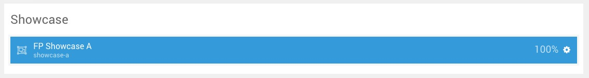
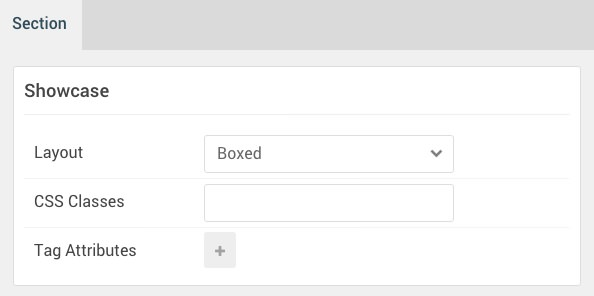

## Introduction

The **Showcase** section includes a single **Popup Grid** particle assigned to the **showcase-a** module position.

Here is a breakdown of the module(s) and particle(s) that appear in this section:

* [Popup Grid (particle)](#popup-grid-(particle))

## Section Settings

| Option           | Setting     |
| :--------------- | :---------- |
| Layout           | Boxed       |
| CSS Classes      | Blank       |
| Tag Attributes   | Blank       |

## Popup Grid (Particle)

The **Popup Grid** particle is a **Gantry 5 Particle** module placed within the **showcase-a** module position. Adding a particle to a module position can be done by creating a **Gantry 5 Particle** module, adding the particle using the settings found in the section below, and assigning it to the position.

### Module Position Particle Settings

#### Particle Settings

| Option        | Setting       |
| :-----        | :-----        |
| Particle Name | `FP Showcase A` |
| Key           | `showcase-a`    |
| Chrome        | `gantry`      |

#### Block Settings

| Option         | Setting       |
| :-----         | :-----        |
| CSS ID         | Blank         |
| CSS Classes    | `fp-showcase-a` |
| Variations     | Blank         |
| Tag Attributes | Blank         |
| Fixed Size     | Unchecked     |
| Block Size     | `100%`        |

### Popup Grid Particle Settings

#### Particle Settings

| Option                 | Setting                                                                                                                                                                  |
| :-----                 | :-----                                                                                                                                                                   |
| Particle Name          | `Popup Grid`                                                                                                                                                             |
| CSS Classes            | Blank                                                                                                                                                                    |
| Title                  | Blank                                                                                                                                                                    |
| Item 1 Name            | `Display volumes of content with the News Slider particle`                                                                                                               |
| Item 1 Image           | `gantry-media://rocketlauncher/home/showcase/img-01.jpg`                                                                                                                 |
| Item 1 Image Width     | `393px`                                                                                                                                                                  |
| Item 1 Image Size      | `460x920`                                                                                                                                                                |
| Item 1 Preview Overlay | Enabled                                                                                                                                                                  |
| Item 1 Preview Icon    | `fa fa-search-plus fa-fw fa-2x`                                                                                                                                          |
| Item 1 Tag             | `Slider`                                                                                                                                                                 |
| Item 1 Description     | `Xenon features a range of new interactive particles, including the News Slider particle, displayed below, with content previews in a continually scrolling side panel.` |
| Item 1 Animations      | `g-zoom`                                                                                                                                                                 |
| Item 1 Button Label    | `Read More`                                                                                                                                                              |
| Item 1 Button Link     | `#`                                                                                                                                                                      |
| Item 1 Target          | Self                                                                                                                                                                     |
| Item 1 Button Classes  | `button-2`                                                                                                                                                               |
