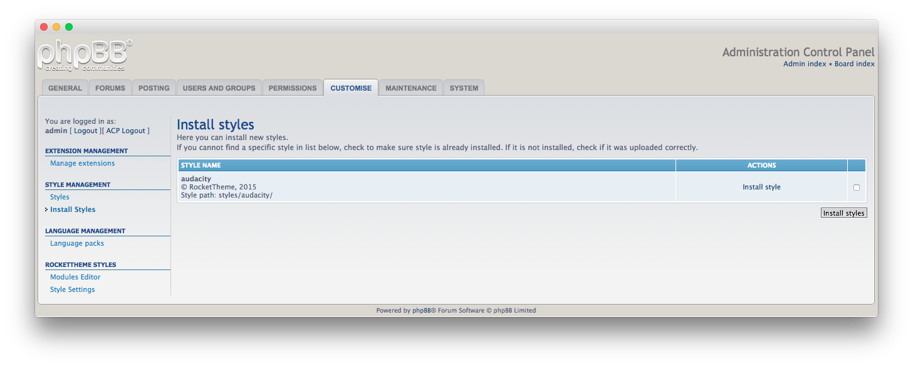
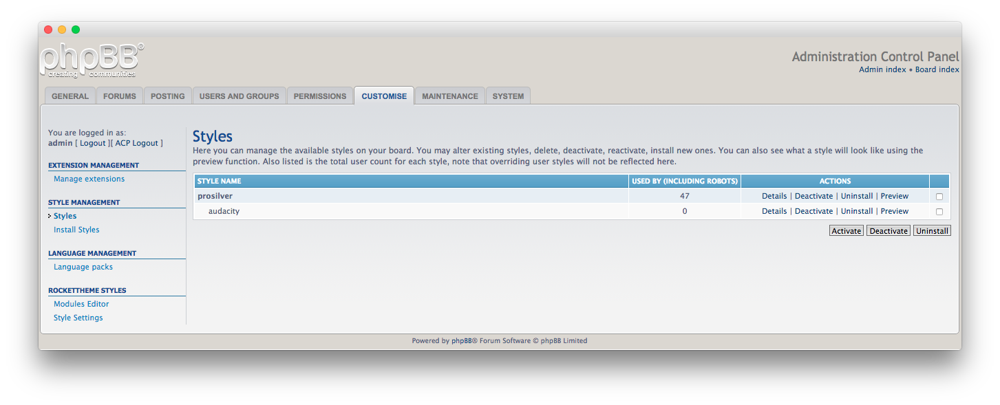
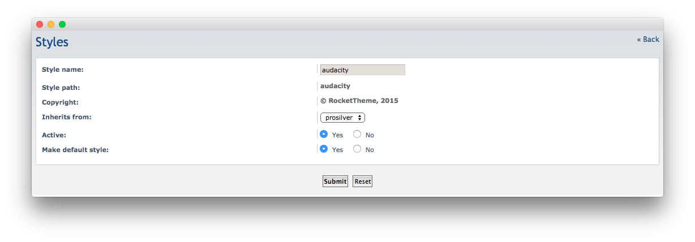
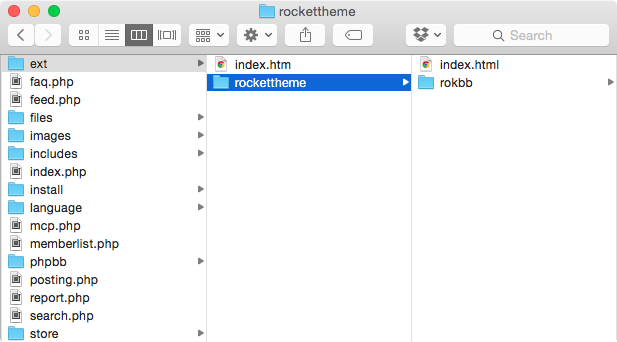
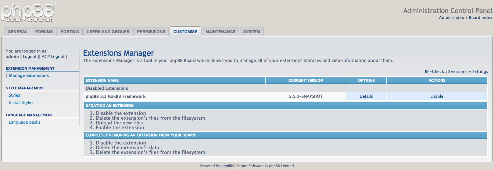
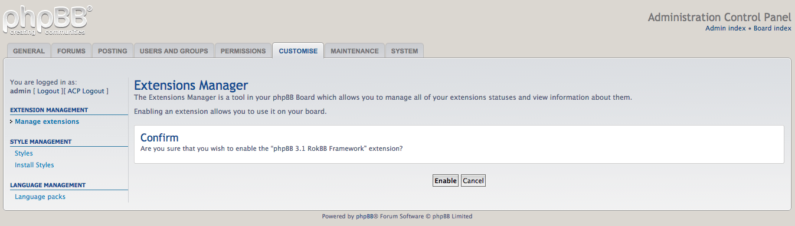

Introduction
-----

In phpBB, **styles** are made up of two components: **templates** and **themes** (which now includes **imagesets**). These components work together to create a unique user experience for members of your board. A style can be altered after installation, and you can freely switch between styles in the backend of your phpBB site.

Installing a new style in phpBB requires you to upload files to your site. One popular choice is [FileZilla][filezilla], though any dedicated or Web-based file transfer solution that allows you to transfer files to your server should work.

Secondly, you will want to familiarize yourself with the **Administration Control Panel (ACP)** in order to complete installation once uploading is complete. You can access the **Styles** area of the ACP by navigating to **Admin -> Styles** in the backend. You can typically find a direct link to the ACP by navigating to the very bottom of the front page of your phpBB installation and clicking **Administration Control Panel**. 

### Step 1: Download the Style

Downloading a RocketTheme phpBB style is pretty simple. All you need to do is navigate to the desired style of your choice on RocketTheme.com and click the **Download** link. From here, you will be taken to a page with three primary download options, along with the image sources you can use as a reference to customize images used in the style. These packages include:

* **Style**: This is a style package that includes just the files needed to install the style on your existing site. Only choose this option if you  already have the latest RokBB installed. It is most commonly selected by users that are switching from one RocketTheme phpBB style to another.
* **Bundle**: This package includes the style and the latest RokBB version. It is the preferred download option if you are installing a RocketTheme style for the first time.
* **RocketLauncher**: This package contains a full latest version of phpBB install, as well as the style, latest RokBB, and demo sample content allowing you to easily deploy your chosen forum with a few clicks. This should only be used if you are creating a new phpBB install. Existing sites should be created using either the **Style** or **Bundle** options.

>> NOTE: We always recommend installing a RocketLauncher first to trial and understand the style more efficiently. It contains sample content and initial configuration. It is ready for further customizations. It must be installed as new, and not over an existing phpBB install.

### Step 2: Unzip and Upload

Once you have downloaded your selected package, you can unzip it locally or choose to do so after the initial upload. In the case of the **Bundle** package, the unzipped package will include two additional zip files. One includes the style itself, and the other RokBB.

Uploading the new Style involves moving the folder containing the style into the **Style** folder within your main phpBB directory. For example, if you are installing the Audacity style, you will place the **Audacity** folder (and its associated contents) into the **pbpBB -> Styles** directory where the phpBB directory is whichever directory on your server that acts as the root folder for your phpBB installation.

>> NOTE: You can upload all the files via FTP, or use cPanel or SSH to upload the zip and unzip directly onto the server. Inquire with your hosting provider.

### Step 3: Activation

:	1. **Customise Tab** [25%, 37%, se]
    2. **Install Styles** [55%, 5%, se]

Once your style is uploaded, you can activate it and set it to default by accessing the **Administration Control Panel (ACP)**. From there, navigate to the **Customise** tab and select **Install Styles** in the **Style Management** category from the sidebar. If your style does not appear in the resulting list, it may have been placed in the wrong folder.

Once here, simply select the checkbox in the far-right column and select the **Install Styles** button. You should then receive a confirmation that the style has been successfully installed. You can now return to the **Installed Styles** list and see the following.

:	1. **Details** Select this option to go to the Style's details page. [50%, 77%, se]

After you have set these options, simply select **Details** to go to the style's details page.

Here, you can switch the style to **Default** as well as make sure it is **Active**. The style should inherit from **Prosilver** by default. Once you have done this, select **Submit**.

Now, all you need to do is set the new style as the style you want to have your guests see on the front end. You can do this by navigating to **General > Board Config > Board Settings** then setting the **Default** style to the new style you just installed, then either switching **Override user style** to **Yes** to make it the default style for guests (non-logged in users) as well or setting the Guest style to the new style manually.

Installing Administrative Modules
-----

### RokBB for phpBB 3.1

Installing RokBB for phpBB 3.1 is simple as uploading extension to the `ext` directory and activating it in **Admin Panel**. 

The RokBB zip file contains file structure which starts with a directory named `rockettheme`. This is vendor name and has to be uploaded into `ext` exactly this way. Renaming it in any kind will result in inability to install it.

Because there are now two versions of RokBB for phpBB 3.0 and 3.1, will have RokBB for Joomla 3.1 available to download **only** from the download panel for styles that support phpBB 3.1. 

Once you have uploaded the extension to the `ext` directory, access the Administrative Control Panel and navigate to **Customize > Manage Extensions**. Here, you will see **phpBB 3.1 RokBB Framework** listed. Simply select **Enable** under the **Actions** column to activate the extension.

Once you have done this, you will be taken to a page where you will be asked to confirm your selection. Click the **Enable** button to complete activation.

[filezilla]: https://filezilla-project.org/download.php