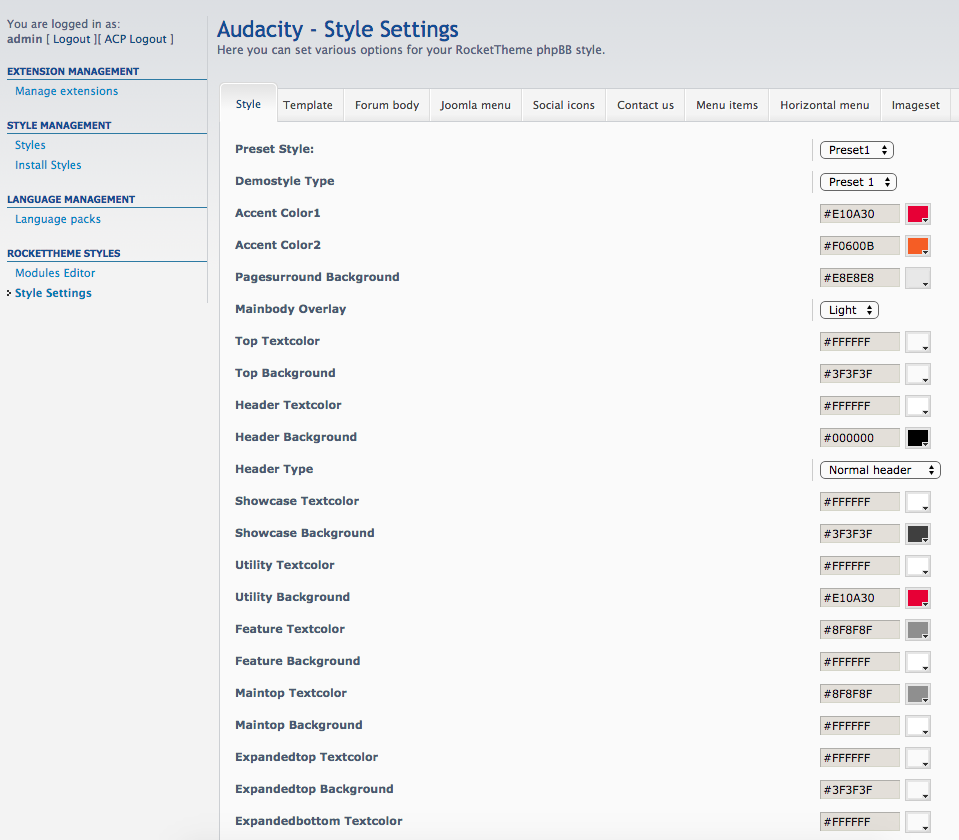
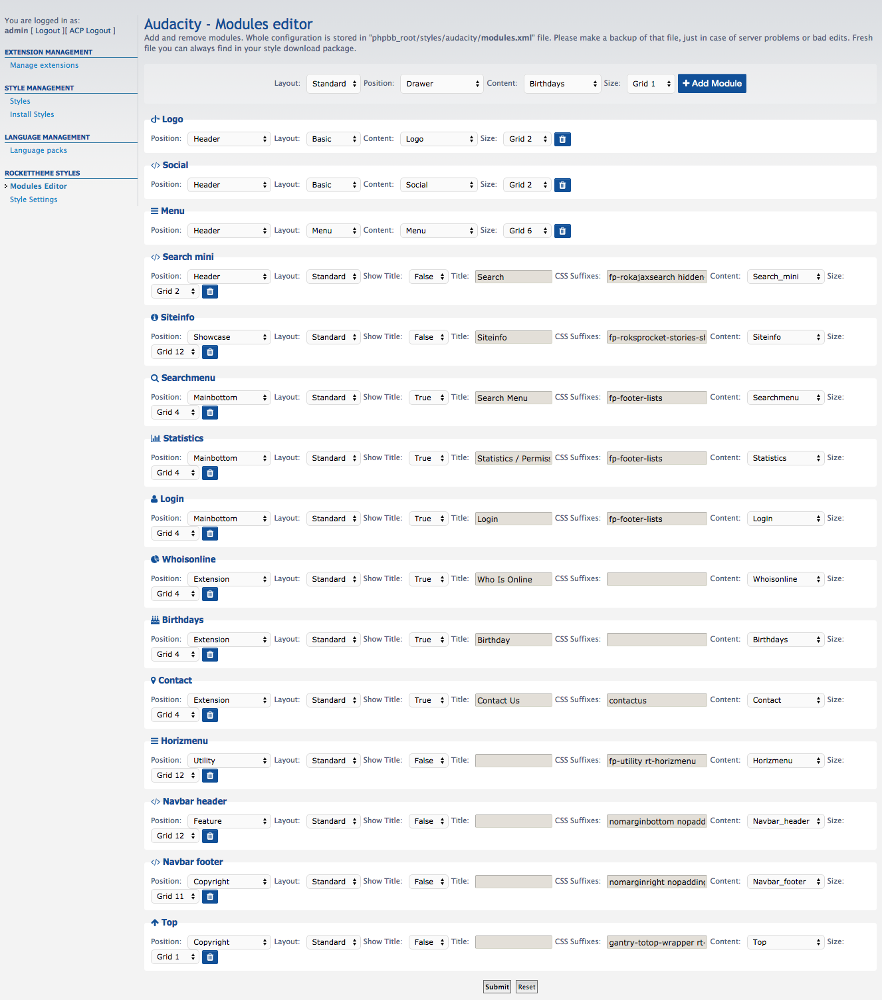
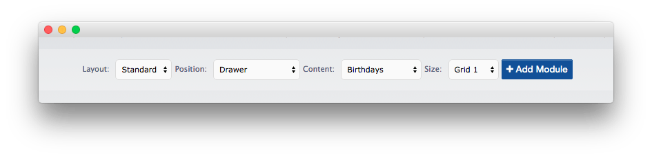
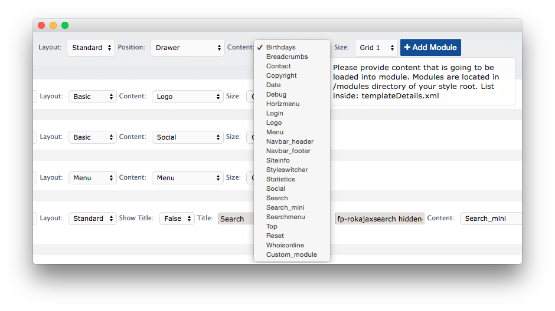
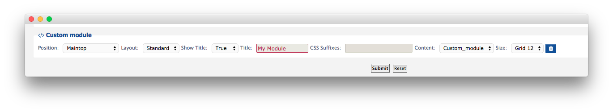
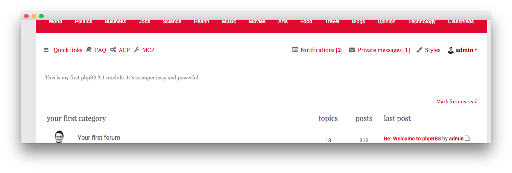

RokBB USer Guide
-----

RokBB for **phpBB 3.1** was rebuilt from the ground up. We have removed lots of useless features and added few useful ones. We also moved things into different places, so this guide will explain things a little.

To start using RokBB you have to remember about 2 things:

* RokBB has to be installed and **Enabled** in **Customise > Manage Extensions**
* RocketTheme style has to be installed and set as **default**. This is very important. If your style is not set as **default**, RokBB will not be able to pick up the settings.

When you’re done you can see following category in “Customise” tab:

:   1. **RocketTheme Styles** [78%, 3%, se]

We will explain Modules Editor later. Now, we will focus on **Style Settings**.

### Style Settings

:   1. **Style** [11%, 23%, se]
    2. **Template** [11%, 30%, se]
    3. **Forum Body** [11%, 37%, se]
    4. **Joomla Menu** [11%, 46%, se]
    5. **Social Icons** [11%, 55%, se]
    6. **Contact Us** [11%, 65%, se]
    7. **Menu Items** [11%, 72%, se]
    8. **Horizontal Menu** [11%, 81%, se]
    9. **Imageset** [11%, 93%, se]

This section contains all configuration settings for your phpBB forum including color chooser, special modules settings and forum icons. Now we’re gonna explain each style setting section:

* **Style**: This usually contains all of the Color Chooser settings. You can set the active preset, customize colors, overlays, backgrounds, and more.

* **Template**: This section contains more technical stuff. It is focused more on structure than on colors of the forum. You can, for example, enable/disable animations, Google Webfonts, specify sidebar size, showcase image and height, or even provide Google Analytics code. 

* **Forum body**: In RokBB 3.1, we decided not to remove things but to hide them - just in case you want to get back to more standard phpBB 3.1 layout approach. You can decide if you want to enable core elements in forum body like: navbar, **Who is online** module, **Login**, etc. Simply all the usual stuff you see in phpBB 3.1 after fresh install. All of this sections are moved into our new RokBB modules so there’s no need to have it enabled, but just in case, there is a possibility to do that.

* **Joomla menu**: We also removed **Global Configuration** section and moved all required options into **Style Settings**. This was always confusing people in RokBB for phpBB 3.0x, so now we made it simpler. Now, you can customize the **Joomla Menu** individually for each style. 

* **Social Icons, Contact Us, Horizontal menu**: This is configuration for special modules which are loaded using **Modules Editor (explained in next section)**. Whenever you load the Social, Contact, or Horizontal Menu modules, settings from these sections will be applied.

* **Menu items**: This is simple section which allows you to add custom menu items to the phpBB 3.1 main menu. You can also decide where items should be added: before or after existing items.

* **Imageset**: This section was also extended. Now, you can specify icons for 45 forum/topic states !! You can choose icons from latest FontAwesome library.

>> NOTE: In phpBB 3.1 we introduced new layout with avatars instead of icons for forum and topic view on frontend. To revert back to standard icon based layout you have to disable “Last Poster Avatar” in “Template” tab.

### Modules Editor

**Modules Editor** is one of our new features we introduced in **phpBB 3.1**.

Modules in phpBB are similar to Joomla Modules or Wordpress widgets, but due to some phpBB 3.1 limitations, they are much simpler. Every option in Modules Editor has a tooltip description. Hopefully, this is going to help you familiarize with the whole modules concept.

A couple examples of modules in phpBB 3.1 would be the logo or menu.

All module data is stored in `modules.xml` which is in the root of your style directory. It is always good to make a backup of that file, just in case something will go wrong. 

A list of module positions and modules themselves are always available in the Modules Editor's dropdowns, and defined in the `templateDetails.xml` file located inside the root of your phpBB style. 

Before adding the module, we need to go over few basic settings. 

* **Layout**: Just like **Chromes** in Joomla. You can choose:
    * **Standard**: Contains the title and the ability to add css suffixes.
    * **Basic**: Basic module without title and css suffixes.
    * **Menu**: Module layout for menus.
    * **Popup**: Special module layout which is going to be used in future styles.

* **Position**: again, similar to joomla, these are placeholder where you keep all of your modules. List of available module positions is always available on the Style's companion Joomla template demo. For example, you will [find Audacity's here](http://demo.rockettheme.com/live/joomla/audacity/features/module-positions).

>> Note: Due to some limitations there’s only one position for each section. For example in Joomla you have: **sidebar-a**, **sidebar-b**, **sidebar-c**. In phpBB you have only: **sidebar**.

* **Content**: This is simply content of the module. Modules are always located inside `phpbb_root/styles/your_style/template/modules` and have the `.html.twig` extension. For example, **Birthdays** are loaded from `phpbb_root/styles/your_style/template/modules/birthdays.html.twig`. You can customize every file, add your own text inside, HTML or Twig code, anything. In the next section we will describe how to add your own custom module. Right now, you can simply pick one of the pre-made ones.

* **Size**: As you may already know, **Joomla**, **WordPress**, and **phpBB** are using Grid to build the style layout. The size of the grid varies, but it is usually **960px** or **1200px**. Each grid is divided into **12** parts. So, for example, if you want your module to fill whole width of the section: set it to **12**, if half, set it to **6**. If you want to place two modules next to each other then both sizes will make up a sum of 12. For example: Who Is Online - **Grid 7**, Birthdays - **Grid 5**.

For standard modules you can also set:

* **Show title**: Enable or disable module title.
* **Title**: Title of your module.
* **CSS Suffixes**: Additional CSS suffixes.

To see how the whole Module Editor works it is best to see it in action on existing modules. Compare it with front end, change settings, etc..

Note: As mentioned before, several modules has special settings (social, horizmenu, contact). Content for this modules can be customized using “Style Settings” and corresponding tab (for example “Social”). Right now settings are provided only for: Contact, Horizmenu and Social. To compensate that limitation, in next section we created tutorial about creating custom modules. 

### Adding Custom Modules

Adding custom modules to your style is really easy. In **phpBB 3.1** modules can use **Twig**, **phpBB** template variables, **HTML**, **JS** and even **PHP** (when you enable it in Secuity Settings). It is the best way to add custom content like: banners, advertisements, or custom code. Here is a detailed tutorial on how to do that.

1. Go to `your_style/template/modules directory`. 
2. Create file `custom_module.html.twig`. You can use any code editor you want or even a text editor. Inside that file, enter some text.
3. Save the file.

Congratulations! Your module is now ready to use. Only thing left is adding it to the list of available modules. To do this: open your text editor and open the `templateDetails.xml` file which is located inside **root** of your phpBB style. You will see a section with something like this:

~~~ .html
<modules>
        <module>birthdays</module>
        <module>breadcrumbs</module>
        <module>contact</module>
        <module>copyright</module>
        <module>date</module>
        <module>debug</module>
        <module>horizmenu</module>
        <module>login</module>
        <module>logo</module>
        <module>menu</module>
        <module>navbar_header</module>
        <module>navbar_footer</module>
        <module>siteinfo</module>
        <module>styleswitcher</module>
        <module>statistics</module>
        <module>social</module>
        <module>search</module>
        <module>search_mini</module>
        <module>searchmenu</module>
        <module>top</module>
        <module>reset</module>
        <module>whoisonline</module>
    </modules>
~~~

Simply after  <module>whoisonline</module>, in new line add your own module:

~~~ .html
<module>custom_module</module>
~~~

That is it. Save file and go back to Modules Editor. 

Take a look:

:   1. **Custom Module** [83%, 48%, se]

Now, we will put it on your forum. I have chosen settings below but you can place your module where you want.

Now take a look at your forum:

Advanced: Using phpBB variables in modules.
-----

Here is one trick which can be very useful for you if you want to develop some more advanced stuff. In regular phpBB templates, you can reach phpBB variables using phpBB templating syntax, or Twig. For example, to print site name you can use:

~~~ .twig
{{ SITENAME }} - Twig syntax
{SITENAME} - phpBB syntax.
~~~

Both forms are correct. Now, paste that code in our `custom_module.html.twig`. If you have followed the directions, it will not work. Here is why:

To provide modules functionality, we are using [Twig Macros](http://twig.sensiolabs.org/doc/tags/macro.html). 

From website above: “But as with PHP functions, macros don't have access to the current template variables. You can pass the whole context as an argument by using the special _context variable.”

Now, paste that code below inside your custom_module.html.twig: 

~~~ .twig
{{ context.SITENAME }} or { context.SITENAME }
~~~

It should now be working. Thanks to the `context` prefix, you can access all of the phpBB template data. Now, you have learned some really advanced stuff. Enjoy it, coding can be a lot of fun! Here are some extra resources worth checking out:

* [Twig Documentation](http://twig.sensiolabs.org/documentation)
* [phpBB 3.1 Coding Guidelines](http://area51.phpbb.com/docs/31x/coding-guidelines.html)
* [phpBB 3.1 Wiki](https://wiki.phpbb.com/PhpBB3.1)
