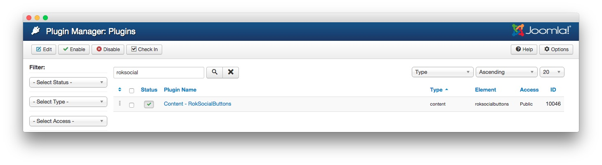

Introduction
-----

Configuring and setting up RokSocialButtons is a fairly straightforward process. Most of the work is done by the plugin itself, but you do have the ability to turn certain buttons on or off, as well as add unique CSS styling to them.

Settings
-----

RokSocialButtons uses the [AddThis](http://www.addthis.com/) system for generating social sharing links. If you have an [AddThis](http://www.addthis.com/) account, you can take your social sharing a step further using the AddThis ID which gives you tracking and analytics capabilities. 

To access RokSocialButton's settings page, you will need to navigate to **Admin > Extensions > Plugin Manager** and either search for or navigate to the **Content - RokSocialButtons** plugin. Click the name of the plugin as it appears in the list, and you will be directed to the settings for this extension.

:	1. **AddThis ID** This field gives you the ability to add an AddThis ID to the plugin. [33%, 30%, se]
	2. **Twitter** You can enable or disable the Twitter button using this dropdown. [39%, 30%, se]
	3. **Facebook** You can enable or disable the Facebook button using this dropdown. [45%, 30%, se]
	4. **Google** You can enable or disable the Google button using this dropdown. [52%, 30%, se]
	5. **Prepend Text** Text entered in this field appears with the buttons to add context to them. [58%, 30%, se]
	6. **Extra CSS Class** This field enables you to add an extra CSS class to the buttons, giving you the opportunity to add some additional styling. [64%, 30%, se]
	7. **Display Position** This dropdown gives you the ability to determine if the buttons will appear above, or below the article content body.  [70%, 30%, se]
	8. **Add Method** This dropdown gives you the ability to choose how the buttons are added to content. [76%, 30%, se]
	9. **Category** If the **Both Replace and Selected Categories** or **Selected Categories** methods are used, this field determines which categories have the buttons added. [83%, 30%, se]

1. **AddThis ID**: This field gives you the ability to add an AddThis ID to the plugin which enables you to receive detailed tracking and analytics information from your AddThis account. This field is completely optional.

2. **Twitter**: You can enable or disable the Twitter button using this dropdown.

3. **Facebook**: You can enable or disable the Facebook button using this dropdown.

4. **Google**: You can enable or disable the Google button using this dropdown.

5. **Prepend Text**: Text entered in this field appears with the buttons to add context to them.

6. **Extra CSS Class**: This field enables you to add an extra CSS class to the buttons, giving you the opportunity to add some additional styling.

7. **Display Position**: This dropdown gives you the ability to determine if the buttons will appear above, or below the article content body. 

8. **Add Method**: This dropdown gives you the ability to choose how the buttons are added to content. You can have them automatically added to articles in selected categories, as a replacement to the `{socialbuttons}` string, or both.

9. **Category**: If the **Both Replace and Selected Categories** or **Selected Categories** methods are used, this field determines which categories have the buttons added.
