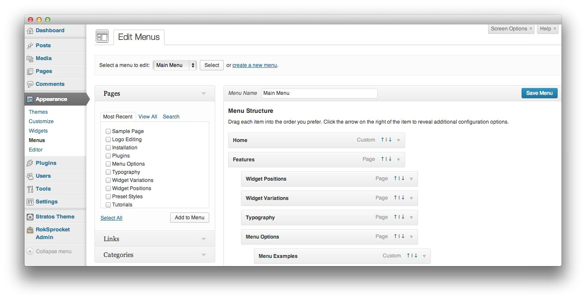
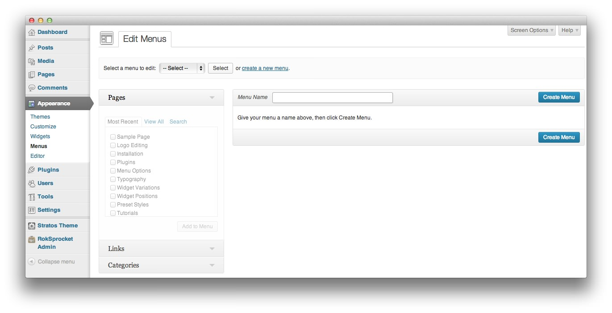
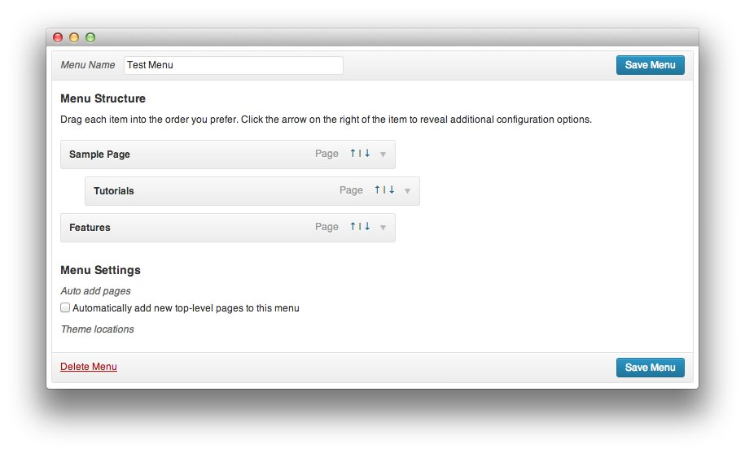

Introduction
-----

WordPress has a powerful built-in menu system that makes it easy to create and manage menus that appear on the frontend of your site. These menus serve as the source by which the **Custom Menu** and our **Gantry Menu** widgets pull information. This allows you to create multiple custom menus and apply them in different ways throughout your site.

The menus you create using the menu editor determine the menu's content. The widget that links to the menu determines where and how that information will be presented.

For the purpose of this guide, we are using a site built with the Gantry template as an example. Not all of the options present in this guide will be available on a core WordPress installation.

How to Create a Menu
-----

:	1. **Menus** This link gives you access to the main menu editor for WordPress. [47%, 5%, se]

To get to the **Menus** area of the backend of WordPress, you need to navigate to **Admin -> Appearance -> Menus**. This will take you to the primary menu management area where you can create a new menu and manage existing menus. 

:	1. **Create a New Menu** When you would like to create a new menu, click this link. [22%, 40%, se]
	2. **Menu Name** This is the name for your custom menu. [30%, 45%, se]
	3. **Create Menu** Select this after assigning a name to your menu in order to access the menu items list and begin customization. [30%, 88%, se]

The first step to building a new menu is to click **Create a New Menu** located to the right of the menu selection area of the page. This will create a blank menu which you can name and assign links to. You will have to give your menu a name before you can begin item assignments. Once you have typed a name in the **Menu Name** field, select **Create Menu**.

:	1. **Add to Menu** Select the check box next to the item you wish to add to your menu, and select this link. [71%, 29%, se]

This will place you in the menu editing page, allowing you to add new items to the menu from the left-hand column. You can add **Pages**, **Links**, and **Categories**. To add them, simply click the check box next to the item (or items) you wish to add, and select **Add to Menu**. This will add your selected items to the menu. We have outlined these menu item types below.

* **Pages**: This menu item type links to individual pages created within your WordPress site.
* **Links**: This is a simple link, with a custom label, that enables you to create a menu item for any specific URL. This could be either an internal or external link. For example, you could use this option to link to a Facebook or Yelp page.
* **Categories**: This is a convenient way to link post categories within your site. For example, if you have a category of posts dedicated to your personal blog, that category could be directly linked to your menu.

:	1. **Top-Level Menu Item** This is a top-level menu item. It appears on the front of the menu. [32%, 53%, sw]
	2. **Submenu Item** This is a submenu item. It appears under the top-level item above it. [40%, 56%, sw]
	3. **Auto Add Pages** This option allows new top-level pages to be added to the menu automatically. [67%, 8%, se]

You can assign certain items to be top-level menu items, and others to be submenu items by clicking and dragging them. By dragging one item slightly to the right, you can drop it into place to serve as a submenu item. Alternatively, you can click the up and down arrows located in the right-hand side of the menu item to raise or lower its menu level. In the image above, we have made **Tutorials** a submenu item to the **Sample Page**.

You can also elect to have new top-level pages automatically appear as part of the menu by selecting the **Auto add pages** check box.

Once you have arranged the menu, simply click **Save Menu** to lock-in your changes. You can then use a menu widget to place the menu on your site.

Item Customization
-----

Individual menu items can be customized to meet your needs. For example, you can change the name of a menu item as it appears on the frontend, as well as add subtext to further define what that menu item is for the user. In some themes, you can even choose icons that add visual appeal to the menu items, such as a house for the home page, or a telephone for the contact page.

### Pages and Categories

* **Navigation Label**: This field sets the title of the menu item as it appears to visitors.

* **Title Attribute**: This field specifies the **Alt** text for the menu item. This text will be displayed when a user's mouse hovers over a menu item.

* **Subtext**: In supporting themes, this field adds text that appears under the **Navigation Label** on the frontend.

* **Custom Image**: In supporting themes, this field allows you to set a custom image that appears in the menu for the item.

* **Custom Icon**: In support themes, this field allows you to set a custom icon that appears in the menu for the item. This could appear next to, or in replacement of the **Navigtation Lebel**, depending on the theme.

* **Number of Columns in Submenu**: This option sets the number of columns submenu items will be displayed in. 

* **Item Distribution**: This option sets the distribution ratio for submenu items in your menu. They can appear evenly, in order, or you can elect to set this manually.

* **Group Child Items**: Allows you to set whether or not to group child items.

* **Drop-Down Width (px)**: Sets the width for the drop-down menu item.

* **Column Widths (px)**: Sets the width for columns of submenu items.

### Links

* **URL** This is the URL you wish to have the menu item link to. Clicking the menu item will send the user directly to this URL.

* **Navigation Label**: This field sets the title of the menu item as it appears to visitors.

* **Title Attribute**: This field specifies the **Alt** text for the menu item. This text will be displayed when a user's mouse hovers over a menu item.

* **Subtext**: In supporting themes, this field adds text that appears under the **Navigation Label** on the frontend.

* **Custom Image**: In supporting themes, this field allows you to set a custom image that appears in the menu for the item.

* **Custom Icon**: In support themes, this field allows you to set a custom icon that appears in the menu for the item. This could appear next to, or in replacement of the **Navigtation Lebel**, depending on the theme.

* **Number of Columns in Submenu**: This option sets the number of columns submenu items will be displayed in. 

* **Item Distribution**: This option sets the distribution ratio for submenu items in your menu. They can appear evenly, in order, or you can elect to set this manually.

* **Group Child Items**: Allows you to set whether or not to group child items.

* **Drop-Down Width (px)**: Sets the width (in pixels) for the drop-down menu item.

* **Column Widths (px)**: Sets the width (in pixels) for columns of submenu items.
