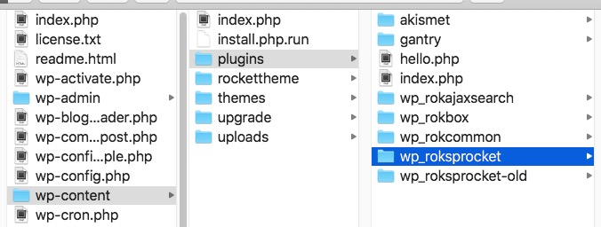
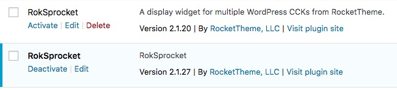
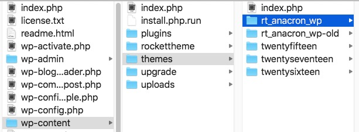
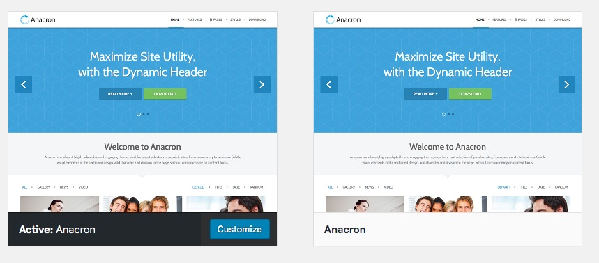

Updating Plugins
-----

When updating our WordPress plugins simply rename the existing plugin folder in the wp-content/plugins directory (for example wp_roksprocket to wp_roksprocket-old) and then place the folder from our updated zip file into that same /plugins/ directory. 

Then (if not already done) activate the new version of plugin. If you are satisfied with the update, you can then delete the old version of the plugin via your WordPress admin.

Updating Gantry 4 Themes
-----

Updating our WordPress Gantry 4 themes is very similar. Simply rename the existing theme folder in the wp-content/themes directory (for example rt_anacron_wp to rt_anacron_wp-old) and then place the new folder from our updated zip file into that same /themes/ directory. If you have a custom CSS file, please copy and paste this file over to the new theme as well.

Then (if not already done) activate the new version of the theme. If you are satisfied with the update, you can then delete the old version of the theme via Appearances -> Theme Details -> Delete (bottom right).

Updating Gantry 5 Themes
-----

To update our Gantry 5 themes, please follow the documentation here (click on the WordPress tab):

[http://docs.gantry.org/gantry5/basics/updating-themes](http://docs.gantry.org/gantry5/basics/updating-themes)