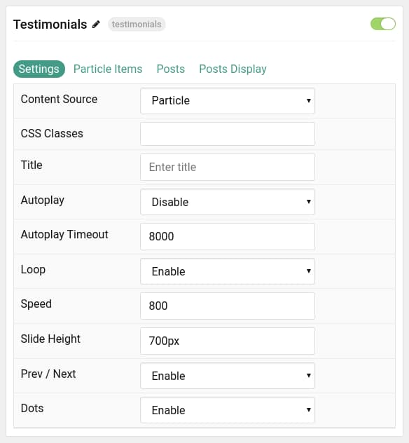
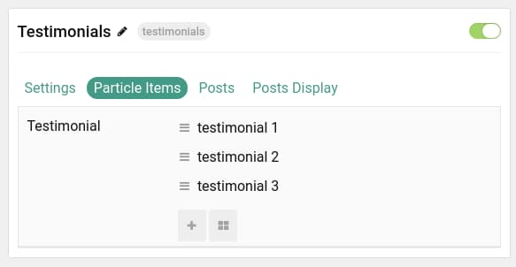
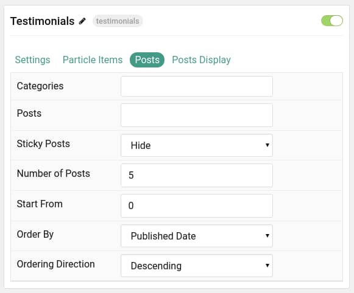
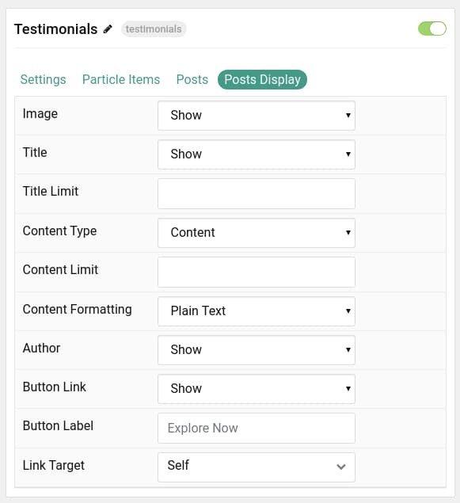

## Introduction

The **Testimonials** particle displays testimonials in an elegant, east-to-read way. You can manually input testimonial content, or pull it from your CMS.

Here are the topics covered in this guide:

* [Configuration](#configuration)
    - [Main Options](#main-options)
    - [Item Options](#particle-items)
    - [Posts](#posts)
    - [Posts Display](#display)

## Configuration

### Main Options 

These options affect the main area of the particle, and not the individual items within. You can set the title of the particle, as well as give it an introductory paragraph here.

| Option           | Description                                                                                         |
| :-----           | :-----                                                                                              |
| Particle Name    | This is the name of the particle used for back end management. It does not appear on the front end. |
| Content Source   | Choose between **Particle** and **WordPress** as the content source.                                |
| CSS Classes      | Enter any CSS class(es) you wish to have apply to the particle.                                     |
| Title            | Enter a title for the particle. This will appear on the front end.                                  |
| Autoplay         | **Enable** or **Disable** autoplay.                                                                 |
| Autoplay Timeout | Enter (in milliseconds) the delay between automatic switching between items.                        |
| Loop             | **Enable** or **Disable** looping of items.                                                         |
| Speed            | Set the transition speed (in milliseconds).                                                         |
| Slide Height     | Enter a height for the slides. (Example: `700px`)                                                   |
| Prev / Next      | **Enable** or **Disable** the prev / next navigation.                                               |
| Dots             | **Enable** or **Disable** dots navigation.                                                          |

### Particle Items

These items make up the individual featured items in the particle. They sit apart from the particle's title and introduction. Each item can have its own properties, including icons and written content.

| Option              | Description                                                                        |
| :-----              | :-----                                                                             |
| Item Name           | This is the name of the item. This becomes the name that appears on the front end. |
| Testimonial Content | Descriptive text goes here. This is the bulk of the item's content.                |
| Testimony Author    | Enter the name of the person giving the testimonial.                               |
| Person Position     | Enter a title or position for the author of the testimonial.                       |
| Person Photo        | The image file can be linked here.                                                 |
| Alt Tag             | Enter an alternative text for the photo.                                           |

### Posts

| Option             | Description                                                                                  |
| :-----             | :-----                                                                                       |
| Categories         | Select the categories of posts this particle will display.                                   |
| Posts              | Select the number of posts you would like the particle to fetch.                             |
| Sticky Posts       | Choose to **Hide** or **Show** sticky posts.                                                 |
| Number of Posts    | Enter the maximum number of posts to display.                                                |
| Start From         | Enter offset specifying the first article to return. The default is '0' (the first article). |
| Order By           | Choose the type of factor to order by.                                                       |
| Ordering Direction | Choose between **Ascending** and **Descending** as the article ordering method.              |

### Display

This section configures how posts are displayed.

| Option             | Description                                                                                                                                              |
| :-----             | :-----                                                                                                                                                   |
| Image              | Select which image in an article should be displayed.                                                                                                    |
| Title              | Choose whether or not the title of an article should be shown.                                                                                           |
| Title Limit        | Set a character limit for titles.                                                                                                                        |
| Content Type       | Choose between **Content**, **Excerpt**, and **Hide** article content.                                                                                   |
| Content Limit      | Enter a limit (in characters) of article text to display with each item.                                                                                 |
| Content Formatting | Select between **Plain Text** and **HTML** text formatting.                                                                                              |
| Author             | **Show** or **Hide** the author.                                                                                                                         |
| Button Label       | Enter the text you would like to have appear as the button link.                                                                                         |
| Button Link        | Enter the url you want that link to go to.                                                                                                               |
| Link Target        | Set the target for the button. You can choose between **Self** which opens the link in the current tab or **New Window** which opens links in a new tab. |
