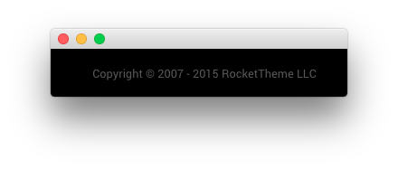

## Introduction

The **Copyright** section is made up of a single **Copyright** particle.

Settings used in the demo for the particle used in this section can be found below.

## Section Settings

| Field          | Setting   |
| :-----         | :-----    |
| Layout         | Fullwidth |
| CSS Classes    | Blank     |
| Tag Attributes | Blank     |

### Copyright (Particle)

#### Particle Settings

| Field           | Setting           |
| :-----          | :-----            |
| Particle Name   | `Copyright`       |
| Start Year      | `2007`            |
| End Year        | `now`             |
| Copyright Owner | `RocketTheme LLC` |

#### Block Settings

| Field          | Setting                 |
| :-----         | :-----                  |
| CSS ID         | Blank                   |
| CSS Classes    | `g-copyright` `center` |
| Variations     | Blank                   |
| Tag Attributes | Blank                   |
| Block Size     | `100%`                  |
