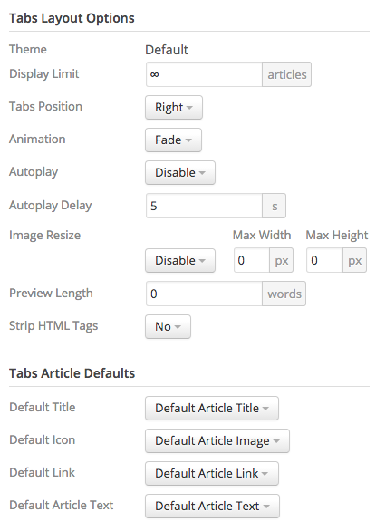
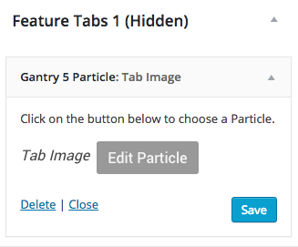
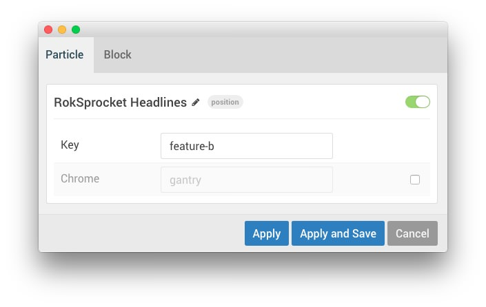
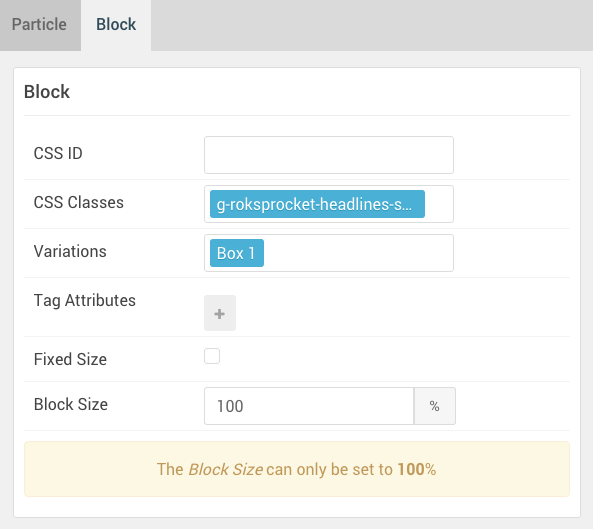
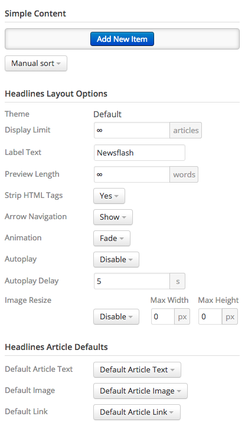

## Introduction

:   1. **Feature A - RokSprocket (Tabs)** [17%, 7%, se]
    2. **Feature B - RokSprocket (Headlines)** [70%, 7%, se]

The **Feature** section contains two **Widget Position** particles set in two rows. These particles create the `feature-a` and `feature-b` positions, which are host to **RokSprocket (Tabs)** and **RokSprocket (Headlines)** widgets.

Here is a breakdown of the widgets and particles that appear in this section:

* [Widget Position (feature-a)](#widget-position-(feature-a))
    * [RokSprocket (Tabs)](#assigned-widget(s)---roksprocket-(tabs))
        * [Gantry 5 Particle (Widget)](#gantry-5-particle-(widget))
            * [Tab Image (Particle)](#tab-image-(particle))
* [Widget Position (feature-b)](#widget-position-(feature-b))
    * [RokSprocket (Headlines)](#assigned-widget(s)---roksprocket-(headlines))

Settings used in the demo for the particle used in this section can be found below.

## Section Settings

| Field          | Setting   |
| :-----         | :-----    |
| Layout         | Fullwidth |
| CSS Classes    | Blank     |
| Tag Attributes | Blank     |

## Widget Position (feature-a)

There is an important aspect of this widget position used in our demo you should be aware of. First, the `RokSprocket Tabs Feature` widget position contains a **RokSprocket (Tabs)** widget. This widget loads multiple widget positions through its simple items' descriptions. These widget positions are then used to assign **Gantry 5 Particle** widgets which enable you to embed Gantry 5 particles within RokSprocket.

### Particle Settings

| Field         | Setting                    |
| :-----        | :-----                     |
| Particle Name | `RokSprocket Tabs Feature` |
| Key           | `feature-a`                |
| Chrome        | `gantry`                   |

### Block Settings

| Field          | Setting                              |
| :-----         | :-----                               |
| CSS ID         | Blank                                |
| CSS Classes    | `flush` `g-roksprocket-tabs-style-1` |
| Variations     | Blank                                |
| Tag Attributes | Blank                                |
| Block Size     | `100%`                               |

### Assigned Widget(s) - RokSprocket (Tabs)

The `RokSprocket Tabs Feature` widget position is host to a single **RokSprocket** widget.

We utilized the **Simple** Content Provider, linking each item in the RokSprocket widget to an post. You can find examples of the **Simple** items used in this widget in the **Filtered Article List** section below.

#### RokSprocket Settings

| Option                | Setting                       |
| :-----                | :-----                        |
| Title                 | `FP RokSprocket Tabs Feature` |
| Content Provider      | Simple                        |
| Type                  | Tabs                          |
| Theme                 | Default                       |
| Display Limit         | `∞`                           |
| Tabs Position         | Right                         |
| Animation             | Fade                          |
| Autoplay              | Disable                       |
| Autoplay Delay        | `5`                           |
| Image Resize          | Disable                       |
| Default Title         | Default Article Title         |
| Default Article Text  | Default Article Text          |
| Default Article Image | Default Article Image         |
| Default Link          | Default Article Link          |

#### Filtered Article List

##### Item 1

| Option      | Setting                                             |
| :-----      | :-----                                              |
| Tab Label   | `News`                                              |
| Icon        | None                                                |
| Link        | None                                                |
| Description | `[loadposition id="feature-tabs-1"][/loadposition]` |

##### Item 2

| Option      | Setting                                             |
| :-----      | :-----                                              |
| Tab Label   | `Games`                                             |
| Icon        | None                                                |
| Link        | None                                                |
| Description | `[loadposition id="feature-tabs-2"][/loadposition]` |

##### Item 3

| Option      | Setting                                             |
| :-----      | :-----                                              |
| Tab Label   | `Reviews`                                           |
| Icon        | None                                                |
| Link        | None                                                |
| Description | `[loadposition id="feature-tabs-3"][/loadposition]` |

>> NOTE: The description fields for these items load widget positions (for example: `feature-tabs-1`), which have been assigned **Gantry 5 Particle** widgets, each of which contain a single **Tab Image** particle. You will find the details for the **Tab Image** particle assigned to the **Gantry 5 Particle** widget, and assigned to the `feature-tabs-1` position loaded in the `News` tab in the [Tab Image](#tab-image-(particle)) section below.

### Gantry 5 Particle (Widget)

In this section, we will cover one of the embedded particles that appear in the **RokSprocket** widget assigned to the `feature-a` position. This **Gantry 5 Particle** widget loads a single **Tab Image** particle.

#### Gantry 5 Particle

### Tab Image (Particle)

#### Particle Settings

| Field         | Setting     |
| :-----        | :-----      |
| Particle Name | `Tab Image` |
| CSS Classes   | Blank       |
| Title         | None        |

#### Tab Image Example

| Field               | Setting                                                             |
| :-----              | :-----                                                              |
| Tab Image 1 Name    | `Layout - Drag & Drop`                                              |
| Tab Image 1 Image   | Custom                                                              |
| Tab Image 1 Link    | `#`                                                                 |
| Tab Image 1 Label   | `Read More`                                                         |
| Tab Image 1 Text    | `Unlimited layout possibilities powered by a drag & drop interface` |
| Tab Image 1 Tag     | `Layout`                                                            |
| Tab Image 1 Sub Tag | `Drag & Drop`                                                       |

## Widget Position (feature-b)

### Particle Settings

| Field         | Setting                 |
| :-----        | :-----                  |
| Particle Name | `RokSprocket Headlines` |
| Key           | `feature-b`             |
| Chrome        | `gantry`                |

### Block Settings

| Field          | Setting                           |
| :-----         | :-----                            |
| CSS ID         | Blank                             |
| CSS Classes    | `g-roksprocket-headlines-style-1` |
| Variations     | Box 1                             |
| Tag Attributes | Blank                             |
| Block Size     | `100%`                            |

### Assigned Widget(s) - RokSprocket (Headlines)

The `feature-b` widget position is host to a single **RokSprocket** widget.

We utilized the **Simple** Content Provider, linking each item in the RokSprocket widget to an post. You can find examples of the **Simple** items used in this widget in the **Filtered Article List** section below.

#### RokSprocket Settings

| Option                | Setting                            |
| :-----                | :-----                             |
| Title                 | `FP RokSprocket Headlines Feature` |
| Content Provider      | Simple                             |
| Type                  | Headlines                          |
| Theme                 | Default                            |
| Display Limit         | `∞`                                |
| Label Text            | `Newsflash`                        |
| Preview Length        | `∞`                                |
| Strip HTML Tags       | Yes                                |
| Arrow Navigation      | Show                               |
| Animation             | Fade                               |
| Autoplay              | Disable                            |
| Autoplay Delay        | `5`                                |
| Image Resize          | Disable                            |
| Default Title         | Default Article Title              |
| Default Article Text  | Default Article Text               |
| Default Article Image | Default Article Image              |
| Default Link          | Default Article Link               |

#### Filtered Article List

##### Item 1

| Option      | Setting                                                               |
| :-----      | :-----                                                                |
| Image       | None                                                                  |
| Link        | `#`                                                                   |
| Description | `Gantry 5's new layout manager features drag-and-drop functionality.` |

##### Item 2

| Option      | Setting                                                                      |
| :-----      | :-----                                                                       |
| Image       | None                                                                         |
| Link        | `#`                                                                          |
| Description | `The Particles system makes it easy to create and configure content blocks.` |

##### Item 3

| Option      | Setting                                                                 |
| :-----      | :-----                                                                  |
| Image       | None                                                                    |
| Link        | `#`                                                                     |
| Description | `Menu Editor allows for inserting Widgets and adding icons in seconds.` |
