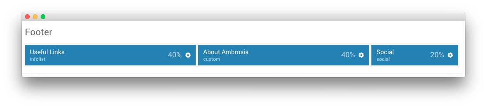

## Introduction

:   1. **Info List (Particle)** [17%, 5%, se]
    2. **Custom HTML (Particle)** [17%, 42%, se]
    3. **Social (Particle)** [17%, 75%, se]

The **Footer** section is made up of three particles. 

Here is a breakdown of the particles that appear in this section:

* [Info List (Particle)](#info-list-(particle))
* [Custom HTML (Particle)](#custom-html-(particle))
* [Social (Particle)](#social-(particle))

Settings used in our demo for each of these particles can be found below.

## Section Settings

| Field          | Setting   |
| :-----         | :-----    |
| Layout         | Fullwidth |
| CSS Classes    | Blank     |
| Tag Attributes | Blank     |

## Info List (Particle)

### Particle Settings

| Field                           | Setting                                                     |
| :-----                          | :------                                                     |
| Particle Name                   | `Useful Links`                                              |
| CSS Classes                     | Blank                                                       |
| Title                           | `Useful Links`                                              |
| Intro                           | Blank                                                       |
| Grid Column                     | 1 Column                                                    |
| Info List Item 1 Name           | `Online Guides for the Ambrosia Theme`                   |
| Info List Item 1 Image Location | Left                                                        |
| Info List Item 1 Text Style     | Compact                                                     |
| Info List Item 1 Image Style    | Compact                                                     |
| Info List Item 1 Description    | Blank                                                       |
| Info List Item 1 Tag            | Blank                                                       |
| Info List Item 1 Sub Tag        | Blank                                                       |
| Info List Item 1 Label          | Blank                                                       |
| Info List Item 1 Link           | `http://www.rockettheme.com/docs/wordpress/themes/ambrosia` |
| Info List Item 1 Icon           | Blank                                                       |
| Info List Item 1 CSS Classes    | Blank                                                       |

### Block Settings

| Field          | Setting |
| :-----         | :-----  |
| CSS ID         | Blank   |
| CSS Classes    | Blank   |
| Variations     | Blank   |
| Tag Attributes | Blank   |
| Block Size     | `40%`   |

## Custom HTML (Particle)

### Particle Settings

| Field         | Setting          |
| :-----        | :------          |
| Particle Name | `About Ambrosia` |

**Custom HTML**
~~~ .html
<h2 class="g-title">About Ambrosia</h2>

All demo content is for sample purposes only, intended to represent a live site. All content images are licensed from <a href="http://tookapic.com">tookapic.com</a>.

Note: Ambrosia is built on the latest version of Gantry Framework, version 5.

~~~

### Block Settings

| Field          | Setting        |
| :-----         | :-----         |
| CSS ID         | Blank          |
| CSS Classes    | `fp-demo-info` |
| Variations     | Blank          |
| Tag Attributes | Blank          |
| Block Size     | `40%`          |

## Social (Particle)

### Particle Settings

| Field              | Setting                          |
| :-----             | :------                          |
| Particle Name      | `Social`                         |
| CSS Classes        | `social-items`                   |
| Title              | `Connect With Us`                |
| Target             | New Window                       |
| Social Item 1 Name | `Twitter`                        |
| Social Item 1 Icon | `fa fa-twitter fa-fw`            |
| Social Item 1 Text | Blank                            |
| Social Item 1 Link | `http://twitter.com/rockettheme` |

### Block Settings

| Field          | Setting   |
| :-----         | :-----    |
| CSS ID         | Blank     |
| CSS Classes    | Blank     |
| Variations     | Blank     |
| Tag Attributes | Blank     |
| Block Size     | `40%`     |
