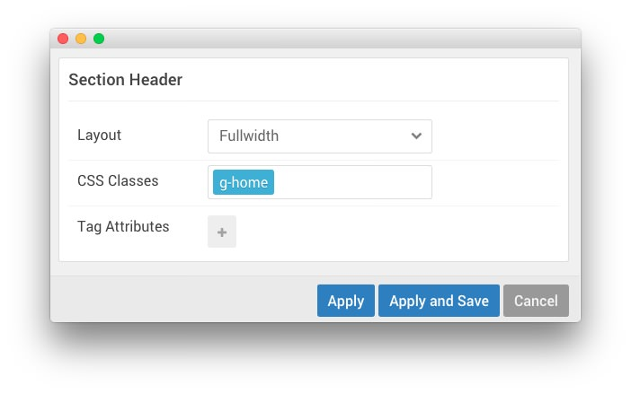

## Introduction

:   1. **Logo (Particle)** [40%, 5%, se]
    2. **Menu (Particle)** [40%, 65%, se]

The **Header** section is made up of the System Messages position, as well as two particles set in two rows.

The **System Messages** Position displays system messages in your layout. Always include this particle to all of your layouts. Otherwise users will not see important system messages like login failures.

In the second row, we have a **Logo** particle and a **Horizontal Menu** particle which make up the visual body of this area of the site. Settings used in our demo for each of these particles can be found below.

## Section Settings

| Field          | Setting   |
| :-----         | :-----    |
| Layout         | Fullwidth |
| CSS Classes    | `g-home`  |
| Tag Attributes | Blank     |

## System Messages (Position)

### Particle Settings

### Block Settings

| Field          | Setting               |
| :-----         | :-----                |
| CSS ID         | Blank                 |
| CSS Classes    | Blank                 |
| Variations     | No Margin, No Padding |
| Tag Attributes | Blank                 |
| Block Size     | `100%`                |

## Logo (Particle)

### Particle Settings

| Field         | Setting    |
| :-----        | :-----     |
| Particle Name | `Logo`     |
| URL           | Blank      |
| Image         | Custom     |
| Text          | `Ambrosia` |
| CSS Classes   | `g-logo`   |

### Block Settings

| Field          | Setting        |
| :-----         | :-----         |
| CSS ID         | Blank          |
| CSS Classes    | `g-logo-block` |
| Variations     | Blank          |
| Tag Attributes | Blank          |
| Block Size     | `25%`          |

## Horizontal Menu (Particle)

### Particle Settings

| Field            | Setting                                              |
| :-----           | :-----                                               |
| Particle Name    | `Top Menu`                                           |
| CSS Classes      | Blank                                                |
| Target           | New Window                                           |
| Menu Item 1 Name | `Features`                                           |
| Menu Item 1 Text | `Features`                                           |
| Menu Item 1 Link | `http://docs.gantry.org/gantry5/basics/key-features` |

### Block Settings

| Field          | Setting |
| :-----         | :-----  |
| CSS ID         | Blank   |
| CSS Classes    | Blank   |
| Variations     | Blank   |
| Tag Attributes | Blank   |
| Block Size     | `75%`   |
