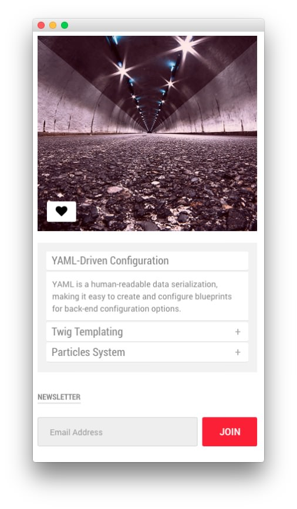
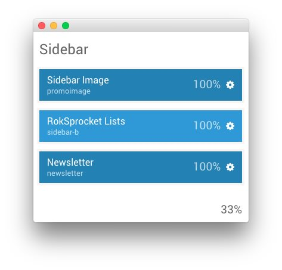
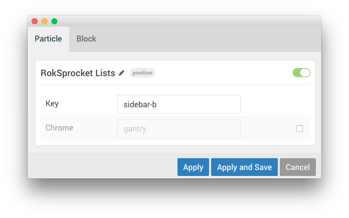
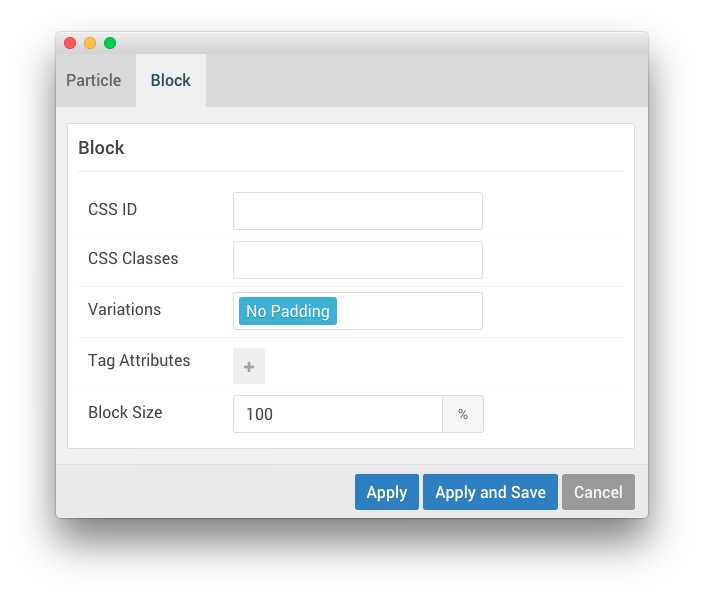

## Introduction

:   1. **Sidebar Image (Particle)** [7%, 12%, se]
    2. **RokSprocket (Lists)** [47%, 12%, se]
    3. **Newsletter (Particle)** [78%, 12%, se]

The **Sidebar** section contains three particles, one of which is a **Widget Position** containing a RokSprocket widget. 

Here is a breakdown of the particles that appear in this section:

* [Sidebar Image (Particle)](#sidebar-image-(particle))
* [Widget Position (sidebar-b)](#widget-position-(sidebar-b))
    * [RokSprocket (Lists)](#assigned-widget(s)---roksprocket-(lists))
* [Newsletter (Particle)](#newsletter-(particle))

Settings used in this section can be found below.

## Section Settings

| Field          | Setting   |
| :-----         | :-----    |
| CSS Classes    | Blank     |
| Tag Attributes | Blank     |
| Width          | `33%`     |

## Sidebar Image (Particle)

### Particle Settings

| Field             | Setting                                                                                                          |
| :-----            | :-----                                                                                                           |
| CSS Classes       | Blank                                                                                                            |
| Title             | Blank                                                                                                            |
| Promo Image       | Custom                                                                                                           |
| Promo Image Title | `Gantry 5 particles intuitively faciliate content creation  <a href="#">Read More</a>` |
| Description       | Blank                                                                                                            |
| Icon Button       | `fa fa-heart`                                                                                                    |
| Icons             | Blank                                                                                                            |

### Block Settings

| Field          | Setting         |
| :-----         | :-----          |
| CSS ID         | Blank           |
| CSS Classes    | `fp-promoimage` |
| Variations     | No Padding      |
| Tag Attributes | Blank           |
| Block Size     | `100%`          |

## Widget Position (sidebar-b)

### Particle Settings

| Field         | Setting             |
| :-----        | :-----              |
| Particle Name | `RokSprocket Lists` |
| Key           | `sidebar-b`         |
| Chrome        | `gantry`            |

### Block Settings

| Field          | Setting                |
| :-----         | :-----                 |
| CSS ID         | Blank                  |
| CSS Classes    | `fp-roksprocket-lists` |
| Variations     | Box 4                  |
| Tag Attributes | Blank                  |
| Block Size     | `100%`                 |

### Assigned Widget(s) - RokSprocket (Lists)

The `sidebar-b` widget position is host to a single **RokSprocket** widget.

We utilized the **Simple** Content Provider, linking each item in the RokSprocket widget to an article. You can find examples of the **Simple** items used in this widget in the **Filtered Article List** section below.

#### Details

| Option           | Setting                |
| :-----           | :-----                 |
| Title            | `FP RokSprocket Lists` |
| Show Title       | Hide                   |
| Access           | Public                 |
| Position         | `sidebar-b`            |
| Status           | Published              |
| Content Provider | Simple                 |
| Type             | Lists                  |

#### Filtered Article List

##### Item 1

| Option      | Setting                                                                                                                              |
| :-----      | :-----                                                                                                                               |
| Title       | `YAML-Driven Configuration`                                                                                                          |
| Image       | None                                                                                                                                 |
| Link        | None                                                                                                                                 |
| Description | `YAML is a human-readable data serialization, making it easy to create and configure blueprints for back-end configuration options.` |

##### Item 2

| Option      | Setting                                                                                                                                     |
| :-----      | :-----                                                                                                                                      |
| Title       | `Twig Templating`                                                                                                                           |
| Image       | None                                                                                                                                        |
| Link        | None                                                                                                                                        |
| Description | `Gantry 5 utilizes Twig - a flexible, fast, and secure template engine for PHP - to make creating powerful, dynamic themes quick and easy.` |

##### Item 3

| Option      | Setting                                                                                                         |
| :-----      | :-----                                                                                                          |
| Title       | `Particles System`                                                                                              |
| Image       | None                                                                                                            |
| Link        | None                                                                                                            |
| Description | `Gantry 5's Particles system makes it easy to create, configure, and manage content blocks on multiple levels.` |

#### Layout Options

| Option                | Setting               |
| :-----                | :-----                |
| Theme                 | Default               |
| Display Limit         | `3`                   |
| Collapsible Preview   | Enable                |
| Preview Length        | `∞`                   |
| Strip HTML Tags       | No                    |
| Preview Per Page      | `4`                   |
| Arrow Navigation      | Show                  |
| Pagination            | Show                  |
| Image Resize          | Disable               |
| Autoplay Delay        | `5`                   |
| Default Title         | Default Article Title |
| Default Article Text  | Default Article Text  |
| Default Article Image | Default Article Image |
| Default Link          | Default Article Link  |

#### Advanced

| Option              | Setting |
| :-----              | :-----  |
| Widget Class Suffix | Blank   |

## Newsletter (Particle)

### Particle Settings

| Field          | Setting           |
| :-----         | :-----            |
| CSS Classes    | Blank             |
| Title          | `Newsletter`      |
| Headline Text  | Blank             |
| Feedburner URI | `rocketthemeblog` |
| Button Classes | Blank             |

### Block Settings

| Field          | Setting    |
| :-----         | :-----     |
| CSS ID         | Blank      |
| CSS Classes    | Blank      |
| Variations     | No Padding |
| Tag Attributes | Blank      |
| Block Size     | `100%`     |
