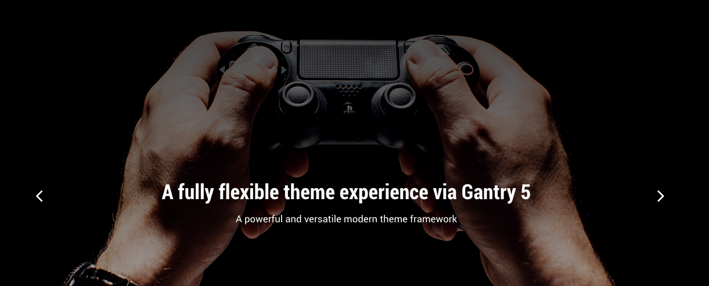
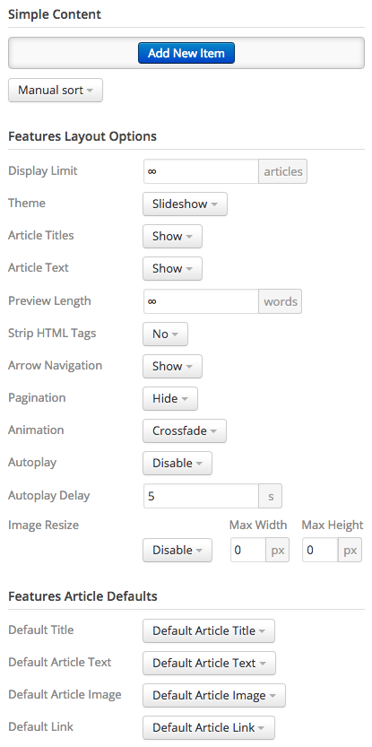

## Introduction

The **Slideshow** section is made up of one **Widget Position** particle. This position, once placed and set up in the **Layout Manager** makes it possible to assign Widgets to it that appear on your site.

Settings used in our demo can be found below.

## Section Settings

| Field          | Setting   |
| :-----         | :-----    |
| Layout         | Fullwidth |
| CSS Classes    | Blank     |
| Tag Attributes | Blank     |

## Slideshow (Particle)

### Particle Settings

| Field         | Setting                 |
| :-----        | :-----                  |
| Particle Name | `RokSprocket Slideshow` |
| Key           | `slideshow`             |
| Chrome        | `gantry`                |

### Block Settings

| Field          | Setting                                               |
| :-----         | :-----                                                |
| CSS ID         | Blank                                                 |
| CSS Classes    | `flush` `fp-roksprocket-slideshow` `sprocket-presets` |
| Variations     | Center                                                |
| Tag Attributes | Blank                                                 |
| Block Size     | `100%`                                                |

## Assigned Widget(s)

The `RokSprocket Slideshow` widget position is host to a single **RokSprocket** widget.

We utilized the **Simple** Content Provider, linking each item in the RokSprocket widget to an post. You can find examples of the **Simple** items used in this widget in the **Filtered Article List** section below.

### Layout Options

| Option                | Setting                    |
| :-----                | :-----                     |
| Title                 | `FP RokSprocket Slideshow` |
| Display Limit         | `∞`                        |
| Theme                 | Slideshow                  |
| Article Titles        | Show                       |
| Article Text          | Show                       |
| Preview Length        | `∞`                        |
| Strip HTML Tags       | No                         |
| Arrow Navigation      | Show                       |
| Pagination            | Hide                       |
| Animation             | Crossfade                  |
| Autoplay              | Disable                    |
| Autoplay Delay        | `5`                        |
| Image Resize          | Disable                    |
| Default Title         | Default Article Title      |
| Default Article Text  | Default Article Text       |
| Default Article Image | Default Article Image      |
| Default Link          | Default Article Link       |

### Filtered Article List

#### Item 1

| Option      | Setting                                              |
| :-----      | :-----                                               |
| Title       | `A fully flexible theme experience via Gantry 5`     |
| Description | `A powerful and versatile modern theme framework` |
| Image       | Custom                                               |
| Link        | None                                                 |

#### Item 2

| Option      | Setting                                                           |
| :-----      | :-----                                                            |
| Title       | `Built-in dropdown menu system with mobile support`               |
| Description | `Options include multiple columns and inline particles/positions` |
| Image       | Custom                                                            |
| Link        | None                                                              |

#### Item 3

| Option      | Setting                                                       |
| :-----      | :-----                                                        |
| Title       | `RokSprocket simplifies complex content setup`                |
| Description | `Easy to use interface with many prebuilt themes and layouts` |
| Image       | Custom                                                        |
| Link        | None                                                          |

