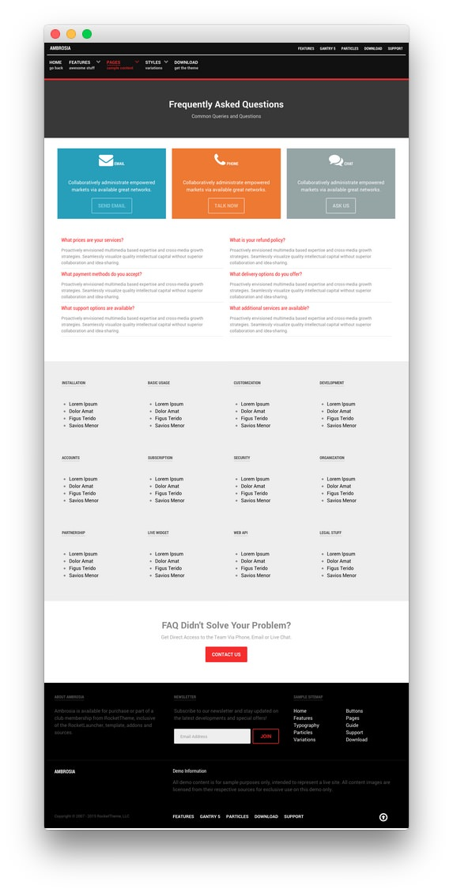
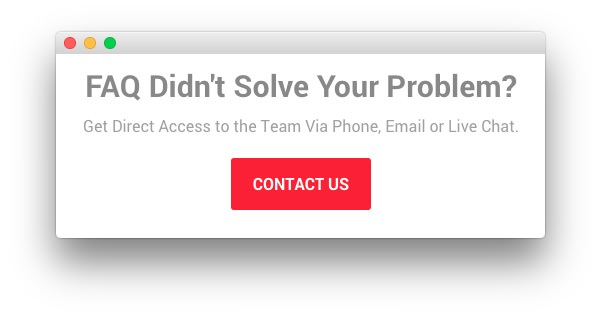

## Introduction

The **FAQ** example page demonstrates how you can create a beautiful page with the Ambrosia template. Here is some information to help you replicate this page as it appears in the demo.

## Widgets and Particles

Below is a brief rundown of the widgets and particles used to make up the demo page.

:   1. **Showcase - Custom HTML (Widget)** [12%, 40%, se]
    2. **Feature - Custom HTML (Widget)** [17%, 15% se]
    3. **Mainbar - Page Content** [27%, 15%, se]
    4. **Plugin - Custom HTML (Widget)** [45%, 15%, se]
    5. **Bottom - Custom HTML (Widget)** [70%, 35%, se]

1. [Showcase](#showcase-section)
2. [Feature](#feature-section)
2. [Mainbar](#mainbar-section)
3. [Plugin](#plugin-section)
4. [Bottom](#bottom-section)

## Showcase Section

This area of the page is a **Custom HTML** widget. You will find the settings used in our demo below.

>> Any **mod_custom** (Custom HTML) widgets are best handled using either RokPad or no editor as a WYSIWYG editor can cause issues with any code that exists in the **Custom Output** field.

### Custom HTML (Widget)

### Details

| Field      | Setting                               |
| :-----     | :-----                                |
| Title      | `Frequently Asked Questions - Header` |
| Show Title | Hide                                  |
| Position   | `showcase-a`                          |
| Status     | Published                             |

### Custom Output

Enter the following in the **Custom Output** text editor.

~~~ .html

  <h2 class="g-layercontent-title">Frequently Asked Questions</h2>
  
Common Queries and Questions

~~~

### Basic

| Option                    | Setting     |
| :----------               | :---------- |
| Prepare Content           | No          |
| Select a Background Image | Blank       |

### Advanced

| Option              | Setting        |
| :----------         | :----------    |
| Widget Class Suffix | `flush center` |

## Feature Section

This area of the page is a **Custom HTML** widget. You will find the settings used in our demo below.

>> Any **mod_custom** (Custom HTML) widgets are best handled using either RokPad or no editor as a WYSIWYG editor can cause issues with any code that exists in the **Custom Output** field.

### Custom HTML (Widget)

### Details

| Field      | Setting                |
| :-----     | :-----                 |
| Title      | `Email - Phone - Chat` |
| Show Title | Hide                   |
| Position   | `feature-a`            |
| Status     | Published              |

### Custom Output

Enter the following in the **Custom Output** text editor.

~~~ .html

  

    

      
      <h2 class="g-title">Email</h2>
      
Collaboratively administrate empowered markets via available great networks.

      <a class="button button-4" href="">Send Email</a>
    

  

  

    

      
      <h2 class="g-title">Phone</h2>
      
Collaboratively administrate empowered markets via available great networks.

      <a class="button button-4" href="">Talk Now</a>
    

  

  

    

      
      <h2 class="g-title">Chat</h2>
      
Collaboratively administrate empowered markets via available great networks.

      <a class="button button-4" href="">Ask Us</a>
    

  

~~~

### Basic

| Option                    | Setting     |
| :----------               | :---------- |
| Prepare Content           | No          |
| Select a Background Image | Blank       |

### Advanced

| Option              | Setting     |
| :----------         | :---------- |
| Widget Class Suffix | Blank       |

## Mainbar Section

The **Mainbar** section includes the **Frequently Asked Questions** article, displayed through the **Page Content** particle. Here are the settings found in the **Frequently Asked Questions** article.

| Option   | Setting                      |
| :-----   | :-----                       |
| Title    | `Frequently Asked Questions` |
| Alias    | `frequently-asked-questions` |
| Status   | Published                    |
| Featured | No                           |
| Category | `Sample Pages`               |

**Content Body**

~~~ .html
{loadposition faq-body}
~~~

## Plugin Section

This area of the page is a **Custom HTML** widget. You will find the settings used in our demo below.

>> Any **mod_custom** (Custom HTML) widgets are best handled using either RokPad or no editor as a WYSIWYG editor can cause issues with any code that exists in the **Custom Output** field.

### Custom HTML (Widget)

### Details

| Field      | Setting       |
| :-----     | :-----        |
| Title      | `FAQ List`    |
| Show Title | Hide          |
| Position   | `plugin-a` |
| Status     | Published     |

### Custom Output

Enter the following in the **Custom Output** text editor.

~~~ .html
<section id="g-mainbar">
  

    

      

        <h2 class="g-title">Installation</h2>
        <ul>
          <li><a href="">Lorem Ipsum</a></li>
          <li><a href="">Dolor Amat</a></li>
          <li><a href="">Figus Terido</a></li>
          <li><a href="">Savios Menor</a></li>
        </ul>
      

    

    

      

        <h2 class="g-title">Basic Usage</h2>
        <ul>
          <li><a href="">Lorem Ipsum</a></li>
          <li><a href="">Dolor Amat</a></li>
          <li><a href="">Figus Terido</a></li>
          <li><a href="">Savios Menor</a></li>
        </ul>
      

    

    

      

        <h2 class="g-title">Customization</h2>
        <ul>
          <li><a href="">Lorem Ipsum</a></li>
          <li><a href="">Dolor Amat</a></li>
          <li><a href="">Figus Terido</a></li>
          <li><a href="">Savios Menor</a></li>
        </ul>
      

    

    

      

        <h2 class="g-title">Development</h2>
        <ul>
          <li><a href="">Lorem Ipsum</a></li>
          <li><a href="">Dolor Amat</a></li>
          <li><a href="">Figus Terido</a></li>
          <li><a href="">Savios Menor</a></li>
        </ul>
      

    

  

  

    

      

        <h2 class="g-title">Accounts</h2>
        <ul>
          <li><a href="">Lorem Ipsum</a></li>
          <li><a href="">Dolor Amat</a></li>
          <li><a href="">Figus Terido</a></li>
          <li><a href="">Savios Menor</a></li>
        </ul>
      

    

    

      

        <h2 class="g-title">Subscription</h2>
        <ul>
          <li><a href="">Lorem Ipsum</a></li>
          <li><a href="">Dolor Amat</a></li>
          <li><a href="">Figus Terido</a></li>
          <li><a href="">Savios Menor</a></li>
        </ul>
      

    

    

      

        <h2 class="g-title">Security</h2>
        <ul>
          <li><a href="">Lorem Ipsum</a></li>
          <li><a href="">Dolor Amat</a></li>
          <li><a href="">Figus Terido</a></li>
          <li><a href="">Savios Menor</a></li>
        </ul>
      

    

    

      

        <h2 class="g-title">Organization</h2>
        <ul>
          <li><a href="">Lorem Ipsum</a></li>
          <li><a href="">Dolor Amat</a></li>
          <li><a href="">Figus Terido</a></li>
          <li><a href="">Savios Menor</a></li>
        </ul>
      

    

  

  

    

      

        <h2 class="g-title">Partnership</h2>
        <ul>
          <li><a href="">Lorem Ipsum</a></li>
          <li><a href="">Dolor Amat</a></li>
          <li><a href="">Figus Terido</a></li>
          <li><a href="">Savios Menor</a></li>
        </ul>
      

    

    

      

        <h2 class="g-title">Live Widget</h2>
        <ul>
          <li><a href="">Lorem Ipsum</a></li>
          <li><a href="">Dolor Amat</a></li>
          <li><a href="">Figus Terido</a></li>
          <li><a href="">Savios Menor</a></li>
        </ul>
      

    

    

      

        <h2 class="g-title">Web API</h2>
        <ul>
          <li><a href="">Lorem Ipsum</a></li>
          <li><a href="">Dolor Amat</a></li>
          <li><a href="">Figus Terido</a></li>
          <li><a href="">Savios Menor</a></li>
        </ul>
      

    

    

      

        <h2 class="g-title">Legal Stuff</h2>
        <ul>
          <li><a href="">Lorem Ipsum</a></li>
          <li><a href="">Dolor Amat</a></li>
          <li><a href="">Figus Terido</a></li>
          <li><a href="">Savios Menor</a></li>
        </ul>
      

    

  

</section>
~~~

### Basic

| Option                    | Setting     |
| :----------               | :---------- |
| Prepare Content           | No          |
| Select a Background Image | Blank       |

### Advanced

| Option              | Setting     |
| :----------         | :---------- |
| Widget Class Suffix | Blank       |

## Bottom Section

This area of the page is a **Custom HTML** widget. You will find the settings used in our demo below.

>> Any **mod_custom** (Custom HTML) widgets are best handled using either RokPad or no editor as a WYSIWYG editor can cause issues with any code that exists in the **Custom Output** field.

### Custom HTML (Widget)

### Details

| Field      | Setting                          |
| :-----     | :-----                           |
| Title      | `FAQ Didn't Solve Your Problem?` |
| Show Title | Hide                             |
| Position   | `bottom-a`                       |
| Status     | Published                        |

### Custom Output

Enter the following in the **Custom Output** text editor.

~~~ .html

  <h2 class="g-layercontent-title">FAQ Didn't Solve Your Problem?</h2>
  
Get Direct Access to the Team Via Phone, Email or Live Chat.

  <a href="http://www.rockettheme.com/wordpress/templates/ambrosia" class="button">Contact Us</a>

~~~

### Basic

| Option                    | Setting     |
| :----------               | :---------- |
| Prepare Content           | No          |
| Select a Background Image | Blank       |

### Advanced

| Option              | Setting        |
| :----------         | :----------    |
| Widget Class Suffix | `flush center` |
