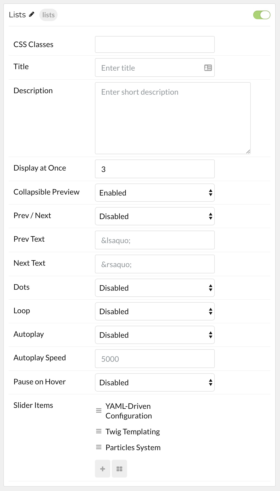

## Introduction

The **List** particle makes it easy to display detailed bullet-point list items with descriptions that expand on click.

Here are the topics covered in this guide:

* [Configuration](#configuration)
    - [Main Options](#main-options)
    - [Item Options](#item-options)

## Configuration

### Main Options 

| Option              | Description                                                                     |
| :-----              | :-----                                                                          |
| CSS Classes         | Set the CSS class(es) you would like to have apply at the particle level.       |
| Title               | Enter the title of the particle you would like to have appear on the front end. |
| Description         | Enter a description for the particle, appears under the subtitle.               |
| Display at Once     | Enter the number of items to display at a time.                                 |
| Collapsible Preview | Enable or Disable collapsible previews.                                         |
| Prev / Next         | Enable or Disable Prev / Next navigation.                                       |
| Prev Text           | Enter text for the Prev button.                                                 |
| Next Text           | Enter text for the Next button.                                                 |
| Dots                | Enable or Disable dots navigation.                                              |
| Loop                | Enable or Disable item looping.                                                 |
| Autoplay            | Enable or Disable autoplay.                                                     |
| Autoplay Speed      | Set the speed of Autoplay (in milliseconds).                                    |
| Pause on Hover      | Pause autoplay on cursor hover.                                                 |

### Item Options

| Option      | Description                                                                            |
| :-----      | :-----                                                                                 |
| Name        | The item's name is used for backend organization and does not appear on the front end. |
| Title       | Enter a title for the item. This is what appears when the item is collapsed.           |
| Description | Enter a description that appears when the item is interacted with on the front end.    |
| Link        | Enter a URL that users will be taken to upon selecting the link.                       |
| Link Text   | Enter text for the link to be displayed through.                                       |
| Target      | Select a target for the link URL.                                                      |
