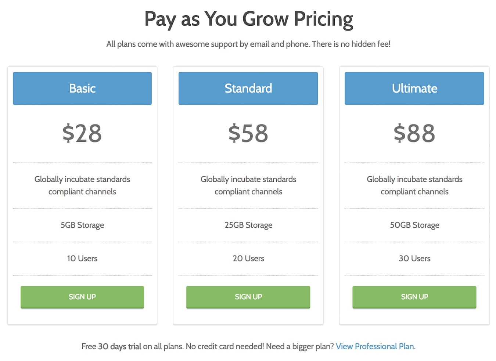

## Introduction

The **Pricing Table** particle is a simple particle that enables you to create clean, organized comparison tables. This is a perfect addition to any website featuring tiered products and/or services.

Here are the topics covered in this guide:

* [Configuration](#configuration)
    - [Main Options](#main-options)
    - [Item Options](#item-options)
    - [Sub Item Options](#sub-item-options)

## Configuration

### Main Options 

These options affect the main area of the particle, and not the individual items within.

| Option        | Description                                                                               |
| :-----        | :-----                                                                                    |
| Particle Name | Sets the name for the particle that appears on the back end.                              |
| CSS Classes   | Enter any CSS class(es) that you would like to have apply to the particle's content here. |
| Title         | Enter a title here that will appear on the front end.                                     |
| Header Text   | Enter any text here you want to appear in the header area of the particle.                |
| Footer Text   | Enter any text here you want to appear in the footer area of the particle.                |
| Grid Columns  | Set the number of columns items appear in here.                                           |

### Item Options

Items in this particle are the actual individual columns.

| Option           | Description                                                               |
| :-----           | :-----                                                                    |
| CSS Classes      | Enter any CSS class(es) you wish to apply to the column here.             |
| Plan Name        | Enter a name for the plan.                                                |
| Price            | Set a price for the product or service represented by this column.        |
| Description      | Enter a description for the product or service represented by the column. |
| Additional Items | Add single-line items here.                                               |
| Button Label     | Enter a button label.                                                     |
| Button Link      | Enter the link that takes the user to the product or service page.        |
| Target           | Enter a browser target for the link.                                      |
| Button Classes   | Enter any class(es) you wish to have apply to the button.                 |