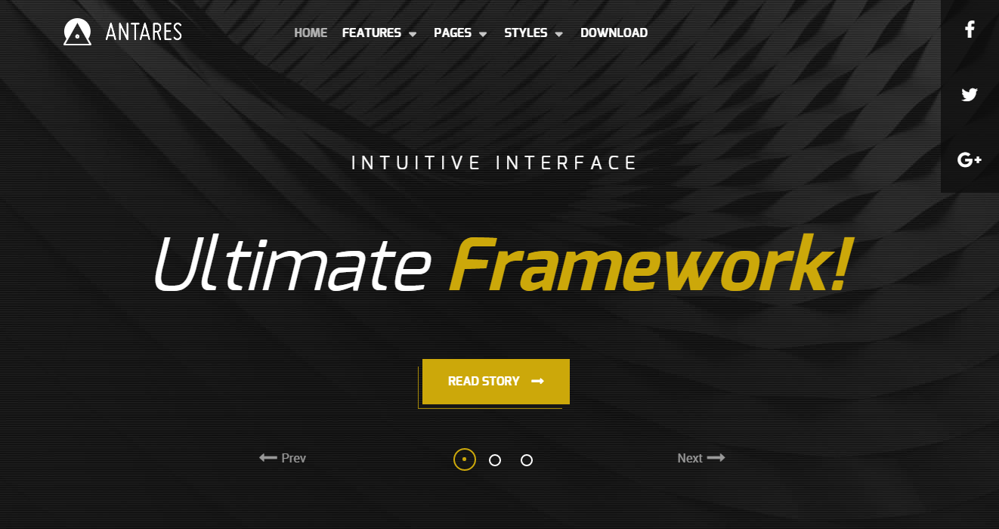

Introduction
-----

Antares is a theme bolstered with bold and impressive visual elements, to add depth to your site, whilst remaining within an elegant and acute design paradigm. Reimagine your site with this vibrant, adaptable and highly customizable theme.

Requirements
-----

* PHP 7.1+
* Curl
* OpenSSL Libraries
* Multibyte String Support
* MySQL
* Gantry 5 Framework (Latest)

Key Features
-----

* Responsive Layout
* 6 Preset Styles
* Block Variations
* Custom Typography
* Unlimited Positions
* Popup Widget
* Custom Particles
* Horizontal Menu
* Social Icons
* Mobile Menu
* Coming Soon Page
* Font Awesome Icons 
* YAML-based Configuration
* Twig Templating
* Powerful Particle System
* Visual Menu Editor
* MegaMenu Support
* Off-Canvas Panel
* Ajax Admin
* Layout Manager
* Theme Inheritance
* Fluid Width Option
* Fixed Width Option
* SCSS Support
* Sophisticated Fields
* Unlimited Undo/Redo

## Particles

The theme features a versatile and diverse catalog of particles, to enrich your site content. New with Antares is the Content Tabs particle, alongside theme integrated enhancements for preexisting particle types.

## Typography

Typography is an important instrument in not only the site design, but how your content is portrayed and utilized by your visitors. Therefore, Antares offers a rich selection of elegant typography to provide focus to varying content types.

## Responsive

Antares is a responsive theme which means it adapts to the viewing device's width, such as mobile, tablet or desktop. Mobile modes have a unique menu to aid usability. Support classes can also be used to display or hide various types of content for each device.
