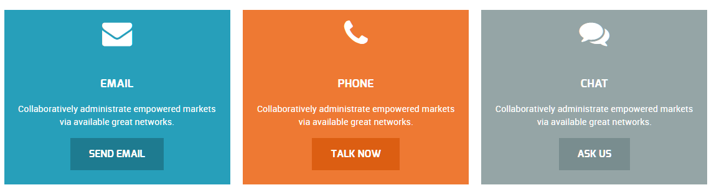
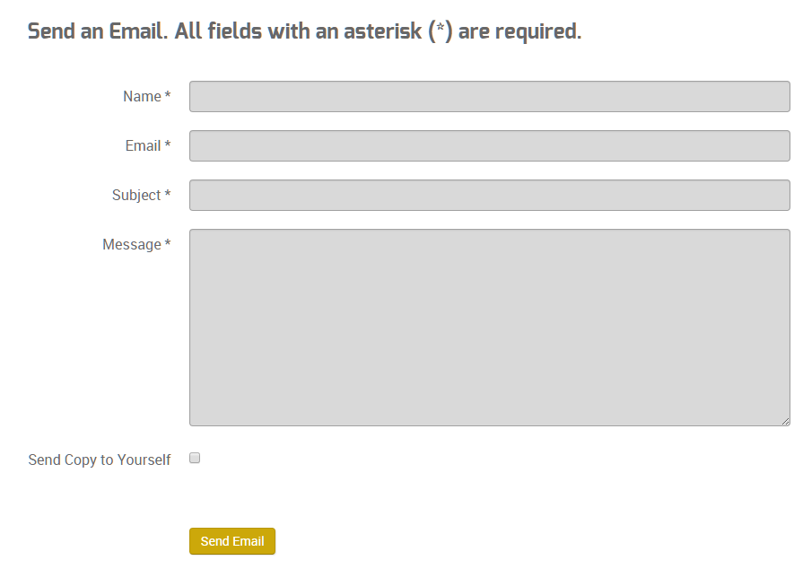
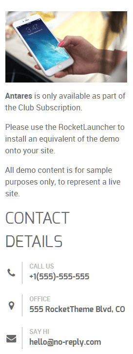
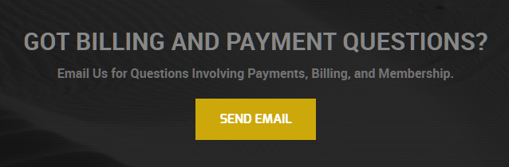

## Introduction

The **Contact** example page demonstrates how you can create a beautiful page with the Antares theme. Here is some information to help you replicate this page as it appears in the demo.

## Widgets and Particles

Below is a brief rundown of the widgets and particles used to make up the demo page.

:   1. **Header - Info List (Particle)** [6%, 40%, se]
    2. **Above - Block Content (Particle)** [12%, 8%, se]
    3. **Mainbar - Page Content** [24%, 8%, se]
    4. **Aside - Custom HTML (Particle)** [24%, 75%, se]
    5. **Aside - Contact (Particle)** [37%, 75%, se]
    6. **Expanded - Custom HTML (Particle)** [50%, 8%, se]
    7. **Extension - Custom HTML (Particle)** [67%, 30%, se]
    8. **Bottom - Text (Widget)** [80%, 8%, se]
    9. **Bottom - Newsletter (Particle)** [80%, 35%, se]
    10. **Bottom - Text (Widget)** [80%, 65%, se]

1. [Header](#header-section)
2. [Above](#above-section)
3. [Mainbar](#mainbar-section)
4. [Aside](#sidebar-section)
5. [Extension](#extension-section)
6. [Bottom](#bottom-section)

## Header Section

This area of the page is a **Info List** particle. You will find the settings used in our demo below.

### Particle Settings

| Field                 | Setting                              |
| :-----                | :-----                               |
| Particle Name         | `Contact - Header`                   |
| CSS Classes           | `center` `g-layercontent` `noborder` |
| Title                 | Blank                                |
| Intro                 | Blank                                |
| Grid Column           | 1 Column                             |
| Item 1 Name           | `Contact Us`                         |
| Item 1 Image          | Blank                                |
| Item 1 Image Location | Left                                 |
| Item 1 Text Style     | Header                               |
| Item 1 Image Style    | Compact                              |
| Item 1 Description    | `Keep in Touch with Us`              |
| Item 1 Tag            | Blank                                |
| Item 1 Sub Tag        | Blank                                |
| Item 1 Label          | Blank                                |
| Item 1 Link           | Blank                                |
| Item 1 Icon           | Blank                                |
| Read More Classes     | Blank                                |

### Block Settings

| Option         | Setting     |
| :----------    | :---------- |
| CSS ID         | Blank       |
| CSS Classes    | Blank       |
| Variations     | Blank       |
| Tag Attributes | Blank       |
| Fixed Size     | Unchecked   |
| Block Size     | `100%`      |

## Above Section

This area of the page is a **Block Content** particle. You will find the settings used in our demo below.

### Particle Settings

| Field                 | Setting                                                                        |
| :-----                | :-----                                                                         |
| Particle Name         | `Contact - Email - Phone - Chat`                                               |
| CSS Classes           | Blank                                                                          |
| Title                 | Blank                                                                          |
| Image                 | Blank                                                                          |
| Headline              | Blank                                                                          |
| Description           | Blank                                                                          |
| Link                  | Blank                                                                          |
| Link Text             | Blank                                                                          |
| Item 1 Name           | `Email`                                                                        |
| Item 1 Title          | ` Email`                                                                  |
| Item 1 Icon           | `fa fa-envelope fa-3x`                                                         |
| Item 1 Image          | Blank                                                                          |
| Item 1 RokBox Image   | Blank                                                                          |
| Item 1 Caption        | Blank                                                                          |
| Item 1 Sub Title      | Blank                                                                          |
| Item 1 Description    | `Collaboratively administrate empowered markets via available great networks.` |
| Item 1 CSS Classes    | `center` `box-blue`                                                            |
| Item 1 Button Label   | `Send Email`                                                                   |
| Item 1 Button Link    | `#`                                                                            |
| Item 1 Button Classes | `button`                                                                       |

### Block Settings

| Option         | Setting     |
| :----------    | :---------- |
| CSS ID         | Blank       |
| CSS Classes    | Blank       |
| Variations     | Blank       |
| Tag Attributes | Blank       |
| Fixed Size     | Unchecked   |
| Block Size     | `100%`      |

## Mainbar Section

The **Mainbar** section is set to `60`% width and both the **Sidebar** and **Aside** sections are set to `20`%.

The page's contact form is a **Contact Form** particle.

Settings used in our demo for each of these particles can be found below.

### Contact Form

#### Particle Settings

| Field            | Setting        |
| :-----           | :-----         |
| Particle Name    | `Contact Form` |
| CSS Classes      | Blank          |
| Header           | Blank          |
| Email Address    | Custom         |
| Enable reCAPTCHA | Unchecked      |
| Site Key         | Blank          |
| Secret Key       | Blank          |

#### Block Settings

| Field          | Setting |
| :-----         | :-----  |
| CSS ID         | Blank   |
| CSS Classes    | Blank   |
| Variations     | Blank   |
| Tag Attributes | Blank   |
| Block Size     | `100%`  |

## Aside Section

The **Aside** section is set to `20`% width.

This area of the page is made up of two particles, a **Custom HTML** particle and a **Contact** particle.

### Custom HTML (Particle)

#### Particle Settings

| Field              | Setting      |
| :-----             | :-----       |
| Particle Name      | `Antares Info` |
| Process Shortcodes | Unchecked    |

##### Custom Output

Enter the following in the **Custom Output** text editor.

~~~ .html

<strong>Antares</strong> is only available as part of the Club Subscription. Please use the RocketLauncher to install an equivalent of the demo onto your site.

~~~

#### Block Settings

| Field          | Setting   |
| :-----         | :-----    |
| CSS ID         | Blank     |
| CSS Classes    | Blank     |
| Variations     | Blank     |
| Tag Attributes | Blank     |
| Fixed Size     | Unchecked |
| Block Size     | `100%`    |

### Contact (Particle)

#### Particle Settings

| Field                | Setting             |
| :-----               | :-----              |
| Particle Name        | `Contact Details`   |
| CSS Classes          | Blank               |
| Title                | `Contact Details`   |
| Contact Item 1 Name  | `Call Us`           |
| Contact Item 1 Icon  | `fa fa-phone fa-fw` |
| Contact Item 1 Value | `+1(555)-555-555`   |

#### Block Settings

| Field          | Setting   |
| :-----         | :-----    |
| CSS ID         | Blank     |
| CSS Classes    | Blank     |
| Variations     | Blank     |
| Tag Attributes | Blank     |
| Fixed Size     | Unchecked |
| Block Size     | `100%`    |

## Expanded Section

This area of the page is an **Infolist** particle. You will find the settings used in our demo below.

### Info List (Particle)

### Particle Settings

| Field                           | Setting                                                                                                                                                                                   |
| :-----                          | :-----                                                                                                                                                                                    |
| Particle Name                   | `Common Queries and Questions`                                                                                                                                                            |
| CSS Classes                     | Blank                                                                                                                                                                                     |
| Title                           | `Common Queries and Questions`                                                                                                                                                            |
| Intro                           | Blank                                                                                                                                                                                     |
| Grid Column                     | 2 Columns                                                                                                                                                                                 |
| Info List Item 1 Name           | `What prices are your services ?`                                                                                                                                                         |
| Info List Item 1 Image          | Blank                                                                                                                                                                                     |
| Info List Item 1 Image Location | Left                                                                                                                                                                                      |
| Info List Item 1 Text Style     | Compact                                                                                                                                                                                   |
| Info List Item 1 Image Style    | Compact                                                                                                                                                                                   |
| Info List Item 1 Description    | `Proactively envisioned multimedia based expertise and cross-media growth strategies. Seamlessly visualize quality intellectual capital without superior collaboration and idea-sharing.` |
| Info List Item 1 Tag            | Blank                                                                                                                                                                                     |
| Info List Item 1 Sub Tag        | Blank                                                                                                                                                                                     |
| Info List Item 1 Label          | Blank                                                                                                                                                                                     |
| Info List Item 1 Link           | `#`                                                                                                                                                                                       |
| Info List Item 1 Icon           | Blank                                                                                                                                                                                     |
| Info List Item 1 CSS Classes    | Blank                                                                                                                                                                                     |

## Extension Section

This area of the page is an **Info List** particle. You will find the settings used in our demo below.

### Particle Settings

| Field                 | Setting                                                               |
| :-----                | :-----                                                                |
| Particle Name         | `Contact - Got Billing and Payments Questions?`                       |
| CSS Classes           | `center` `g-layercontent`                                             |
| Title                 | Blank                                                                 |
| Intro                 | Blank                                                                 |
| Grid Column           | 1 Column                                                              |
| Item 1 Name           | `Got Billing and Payment Questions?`                                  |
| Item 1 Image          | Blank                                                                 |
| Item 1 Image Location | Left                                                                  |
| Item 1 Text Style     | Header                                                                |
| Item 1 Image Style    | Compact                                                               |
| Item 1 Description    | `Email Us for Questions Involving Payments, Billing, and Membership.` |
| Item 1 Tag            | Blank                                                                 |
| Item 1 Sub Tag        | Blank                                                                 |
| Item 1 Label          | `Send Email`                                                          |
| Item 1 Link           | `http://www.rockettheme.com/wordpress/themes/antares`                   |
| Item 1 Icon           | Blank                                                                 |
| Read More Classes     | Blank                                                                 |

### Block Settings

| Option         | Setting     |
| :----------    | :---------- |
| CSS ID         | Blank       |
| CSS Classes    | Blank       |
| Variations     | Blank       |
| Tag Attributes | Blank       |
| Fixed Size     | Unchecked   |
| Block Size     | `100%`      |

## Bottom Section

:   1. **Text (Widget)** [20%, 2%, se]
    2. **Newsletter (Particle)** [20%, 35%, se]
    3. **Text (Widget)** [20%, 67%, se]

This area of the page is made up of three items. Two of them are **Text** widgets, with a **Newsletter** particle in-between. These items are placed in the **Bottom A**, **Bottom B**, and **Bottom C** widget positions which each are set at `33.3%` width.

### Text (Widget)

The **Text** widget here was placed in the **Bottom A** widget position. The widget position is created within the layout manager by using a **Widget Position** particle. The particle is assigned `bottom-a` as a key and `gantry` as its Chrome.

Below, you will find the widget settings we used in the demo:

### Widget Settings

| Field                        | Setting                                                                                                                                |
| :-----                       | :-----                                                                                                                                 |
| Title                        | `About Antares`                                                                                                                        |
| Content                      | `Antares is available for purchase or part of a club membership from RocketTheme, inclusive of the RocketLauncher, theme and plugins.` |
| Automatically Add Paragraphs | Unchecked                                                                                                                              |
| Custom Class(es)             | Blank                                                                                                                                  |

### Newsletter (Particle)

The **Newsletter** particle here was placed in the **Bottom B** widget position. The widget position is created within the layout manager by using a **Particle Position** particle. The particle is assigned `bottom-b` as a key and `gantry` as its Chrome.

Below, you will find the particle settings we used in the demo:

### Particle Settings

| Field          | Setting                                                                                       |
| :-----         | :-----                                                                                        |
| Particle Name  | `Newsletter`                                                                                  |
| CSS Classes    | Blank                                                                                         |
| Title          | `Subscribe Here`                                                                              |
| Heading Text   | `Subscribe to our newsletter and stay updated on the latest developments and special offers!` |
| InputBox Text  | `Email Address`                                                                               |
| Button Text    | `Join`                                                                                        |
| Feedburner URI | Custom                                                                                        |
| Button Classes | `button-4`                                                                                    |

### Text (Widget)

The **Text** widget here was placed in the **Bottom C** widget position. The widget position is created within the layout manager by using a **Widget Position** particle. The particle is assigned `bottom-c` as a key and `gantry` as its Chrome.

Below, you will find the widget settings we used in the demo:

### Widget Settings

| Field                        | Setting          |
| :-----                       | :-----           |
| Title                        | `Sample Sitemap` |
| Automatically Add Paragraphs | Unchecked        |
| Custom Class(es)             | Blank            |

**Content**

~~~ .html

  

    <ul class="nomarginall noliststyle">
      <li><a href="http://demo.rockettheme.com/live/wordpress/antares/">Home</a></li>
      <li><a href="http://demo.rockettheme.com/live/wordpress/antares/overview/">Features</a></li>
      <li><a href="http://demo.rockettheme.com/live/wordpress/antares/typography/">TypographyContent</a></li>
      <li><a href="http://demo.rockettheme.com/live/wordpress/antares/particles/">Particles</a></li>
      <li><a href="http://demo.rockettheme.com/live/wordpress/antares/block-variations/">Variations</a></li>
    </ul>
  

  

    <ul class="nomarginall noliststyle">
      <li><a href="http://demo.rockettheme.com/live/wordpress/antares/typography/">Buttons</a></li>
      <li><a href="http://demo.rockettheme.com/live/wordpress/antares/overview/">Pages</a></li>
      <li><a href="http://www.rockettheme.com/docs/wordpress/themes/antares">Guide</a></li>
      <li><a href="http://www.rockettheme.com/forum/wordpress-theme-antares">Support</a></li>
      <li><a href="http://www.rockettheme.com/wordpress/themes/antares">Download</a></li>
    </ul>
  

~~~