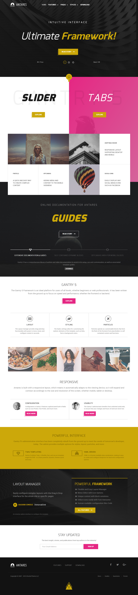
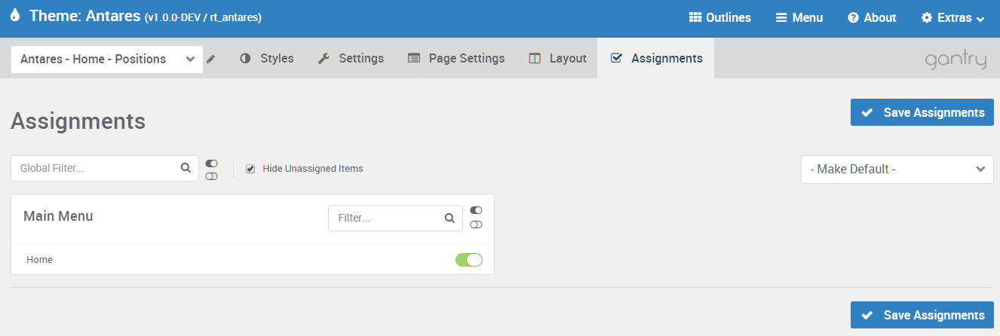

Introduction
-----

Recreating features of the demo site used to show off some of the more interesting aspects of Antares can be done fairly easily. All you need is the right particles and settings, and you should be able to reproduce most (if not all) of the elements found in our demo site.

Below, we will break down some of these elements and give you the information you need to know to recreate them on your own site using the Antares Theme.

Keep in mind that a lot of the detail that makes our demos look so good is the result of many hours of hard work by our team, and some of them will require a moderate level of experience working with the WordPress back end. We have added most of these elements into the theme's core files in order to make them easily accessible without having to edit any code.

>> NOTE: We recommend downloading a copy of the RocketLauncher whenever you are attempting to replicate demo content. This allows easy referencing, whether on your site in a subdirectory, development server, or on a localhost. This will allow you to see all of our demo content in context, making it easier to replicate.

Particle Settings
-----

Below, you will find the widget placement and settings for the various widget positions as they appear on the front page of our demo. Not all of these position assignments are unique to the front page.

:   1. **Navigation** Logo (Particle) [1%, 5%, se]
    2. **Navigation** Menu (Particle) [1%, 30%, se]
    3. **Slideshow** FlexSlider (Particle) [3%, 7%, se]
    4. **Above** Grid Promo Gallery (Particle) [23%, 7%, se]
    5. **Above** Grid Promo Gallery (Particle) [23%, 53% se]
    6. **Above** Grid Promo Gallery (Particle) [28%, 7%, se]
    7. **Above** Grid Promo Gallery (Particle) [28%, 53%, se]
    8. **Showcase** Promo Content (Particle) [35%, 7%, se]
    9. **Showcase** Content Tabs (Particle) [42%, 7%, se]
    10. **Utility** Promo Content (Particle) [49%, 7%, se]
    11. **Utility** Block Content (Particle) [53%, 7%, se]
    12. **Utility** Animated Block (Particle) [58%, 7%, se]
    13. **Feature** Promo Content (Particle) [65%, 7%, se]
    14. **Feature** Block Content (Particle) [68%, 7%, se]
    15. **Expanded** Block Content (Particle) [72%, 7%, se]
    16. **Extension** Block Content (Particle) [80%, 7%, se]
    17. **Extension** Promo Content (Particle) [80%, 52%, se]
    18. **Bottom** Newsletter (Particle) [90%, 25%, se]
    19. **Footer** Logo (Particle) [95%, 7%, se]
    20. **Footer** HorizontalMenu (Particle) [95%, 40%, se]
    21. **Footer** Social (Particle) [95%, 75%, se]
    22. **Copyright** Copyright (Particle) [97%, 7%, se]
    23. **Copyright** Horizontal Menu (Particle) [97%, 70%, se]
    23. **Copyright** To Top (Particle) [99%, 40%, se]

Not pictured here is an **Offcanvas** position which hosts the mobile menu. You can find out more about the Offcanvas position in the [Gantry 5 documentation](http://docs.gantry.org/gantry5/configure/layout-manager#offcanvas-section).

### Theme Particles

* [FlexSlider](particle_flexslider.md)
* [Promo Content](particle_promocontent.md)
* [Block Content](particle_block.md)
* [Grid Promo Gallery](particle_gridpromogallery.md)
* [Content Tabs](particle_tabs.md)
* [Animated Block](particle_animatedblock.md)
* [Info List](particle_info.md)
* [Newsletter](particle_newsletter.md)
* [Image Grid](particle_image.md)
* [Contact](particle_contact.md)
* [Pricing Table](particle_pricing.md)
* [Content List](particle_contentlist.md)
* [Grid Content](particle_gridcontent.md)
* [Promo Image](particle_promoimage.md)
* [Simple Counter](particle_simplecounter.md)

### Core Particles 

* [Logo](http://docs.gantry.org/gantry5/particles/logo)
* [Menu](http://docs.gantry.org/gantry5/particles/menu-control)
* [To Top](http://docs.gantry.org/gantry5/particles/to-top)
* [Social](http://docs.gantry.org/gantry5/particles/social)
* [Widget Positions](http://docs.gantry.org/gantry5/particles/position)
* [Spacer](http://docs.gantry.org/gantry5/particles/spacer)
* [Mobile Menu](http://docs.gantry.org/gantry5/particles/mobile-menu)
* [Custom HTML](http://docs.gantry.org/gantry5/particles/custom-html)
* [Widget Instance](http://docs.gantry.org/gantry5/particles/module-instance)
* [Page Content](http://docs.gantry.org/gantry5/particles/page-content)
* [System Messages](http://docs.gantry.org/gantry5/particles/system-messages)

Recommended Plugins
-----

Here is a list of RocketTheme plugins used to create the demo version of Antares:

* [Gantry 5 Theme Framework](http://gantry.org/)

Many of these plugins are included with the Antares RocketLauncher, and can be downloaded and installed individually by going to the RocketTheme website.

Recreating the Front Page
-----

The front page of the Antares demo sits apart from the rest of the page layouts in that it features the latest and greatest features of the theme. It is because of this that several widget and layout overrides were done. In this section, we will break down the settings you will need to recreate elements present in the front page of the Antares demo.

Theme Settings
-----

The first thing you will need to do in order to set your front page apart as it appears in the demo is to create a setting outline. This can be done by navigating to **Admin -> Antares Theme -> Outlines** and selecting the **+** icon.

You can then simply find the default outline and select the dark blue **Duplicate** button to create a new one based on the default outline used by your site. This will create an outline, or **Style**. This outline can have its own layout, style, and settings preferences.

It would be a good idea for organization to name this outline something like **Antares - Home** as it would be used only for the front page of your site.

Menu Editor
-----

Antares has its own built-in Menu Editor which takes full advantage of WordPress's menu system, taking your WordPress menus and enhancing them before passing them to visitors on the front end. Any changes made in the Menu Editor will only affect the way it appears to the visitor, and not the way WordPress sees or uses it.

You can access the Gantry Menu Editor by navigating to **Admin > Antares Theme > Menu**. You can find out more about navigating and using the Gantry Menu Editor [in our documentation](http://docs.gantry.org/gantry5/configure/menu-editor).

Assignments
-----

Assignments are also managed in the Gantry Admin. This administrative panel enables you to assign theme outlines to specific menu items, pages, and other areas of your site. By navigating to **Admin > Antares Theme** and selecting an outline other than the **Base Outline**, you will be able to assign that outline by navigating to the **Assignments** panel. Simply switch any menu items to on (green) that you want to assign that outline to. In the case of the Home page, we used the **Front Page** page, which is a blank page we created.
