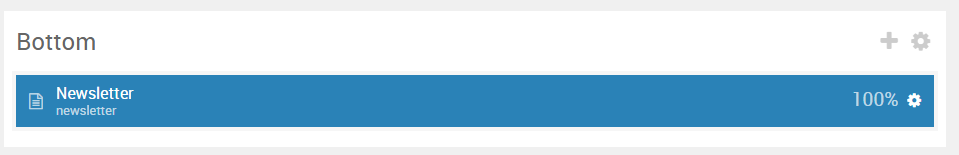
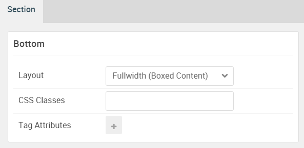

## Introduction

The **Bottom** section includes a single **Newsletter** particle.

Here is a breakdown of the module(s) and particle(s) that appear in this section:

* [Newsletter (particle)](#newsletter-(particle))

## Section Settings

| Option           | Setting                   |
| :--------------- | :----------               |
| Layout           | Fullwidth (Boxed Content) |
| CSS Classes      | Blank                     |
| Tag Attributes   | Blank                     |

## Newsletter (Particle)

### Particle Settings

| Option         | Setting                                                                         |
| :-----         | :-----                                                                          |
| Particle Name  | `Newsletter`                                                                    |
| CSS Classes    | Blank                                                                           |
| Title          | `Stay Updated`                                                                  |
| Heading Text   | `The best insight, stories, and publications from top authors in the industry!` |
| InputBox Text  | `Your Email Address`                                                            |
| Button Text    | `Sign Up`                                                                       |
| Feedburner URI | Blank                                                                           |
| Button Classes | `button-alt`                                                                    |

### Block Settings

| Option         | Setting       |
| :-----         | :-----        |
| CSS ID         | Blank         |
| CSS Classes    | `fp-bottom-a` |
| Variations     | Blank         |
| Tag Attributes | Blank         |
| Fixed Size     | Unchecked     |
| Block Size     | `100%`        |