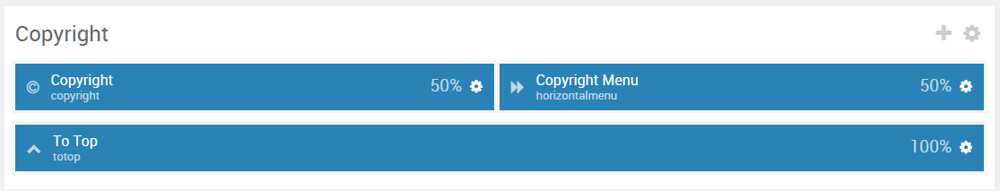
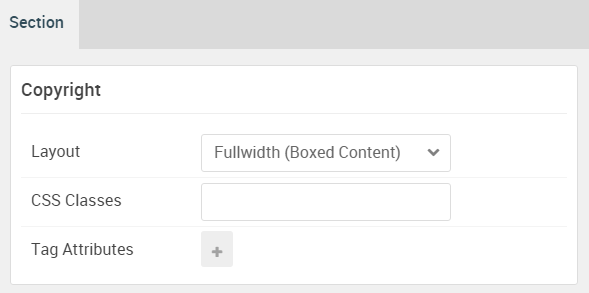

## Introduction

:	1. **Copyright (Particle)** [5%, 1%, se]
	2. **Horizontal (Particle)** [5%, 75%, se]
	3. **To Top (Particle)** [50%, 40%, se]

The **Copyright** section includes three particles.

Here is a breakdown of the module(s) and particle(s) that appear in this section:

* [Copyright (particle)](#copyright-(particle))
* [Horizontal Menu (particle)](#horizontal-menu-(particle))
* [To Top (particle)](#to-top-(particle))

## Section Settings

| Option           | Setting     |
| :--------------- | :---------- |
| Layout           | Boxed       |
| CSS Classes      | Blank       |
| Tag Attributes   | Blank       |

## Copyright (Particle)

### Particle Settings

| Option            | Setting           |
| :-----            | :-----            |
| Particle Name     | `Copyright`       |
| Start Year        | `2007`            |
| End Year          | `now`             |
| Copyright Owner   | `RocketTheme LLC` |
| Owner Link        | Blank             |
| Owner Link Target | New Window        |
| CSS Classes       | Blank             |

### Block Settings

| Option         | Setting   |
| :-----         | :-----    |
| CSS ID         | Blank     |
| CSS Classes    | Blank     |
| Variations     | Blank     |
| Tag Attributes | Blank     |
| Fixed Size     | Unchecked |
| Block Size     | `50%`     |

## Horizontal Menu (Particle)

### Particle Settings

| Option        | Setting                                                    |
| :-----        | :-----                                                     |
| Particle Name | `Copyright Menu`                                           |
| CSS Classes   | Blank                                                      |
| Target        | New Window                                                 |
| Item 1 Name   | `Docs`                                                     |
| Item 1 Text   | `Docs`                                                     |
| Item 1 Link   | `http://www.rockettheme.com/docs/wordpress/themes/antares` |

### Block Settings

| Option         | Setting   |
| :-----         | :-----    |
| CSS ID         | Blank     |
| CSS Classes    | Blank     |
| Variations     | Blank     |
| Tag Attributes | Blank     |
| Fixed Size     | Unchecked |
| Block Size     | `50%`     |

## To Top (Particle)

### Particle Settings

| Option        | Setting               |
| :-----        | :-----                |
| Particle Name | `To Top`              |
| CSS Classes   | `g-totop`             |
| Icon          | `fa fa-long-arrow-up` |
| Text          | `To Top`              |

### Block Settings

| Option         | Setting   |
| :-----         | :-----    |
| CSS ID         | Blank     |
| CSS Classes    | Blank     |
| Variations     | Blank     |
| Tag Attributes | Blank     |
| Fixed Size     | Unchecked |
| Block Size     | `100%`    |

