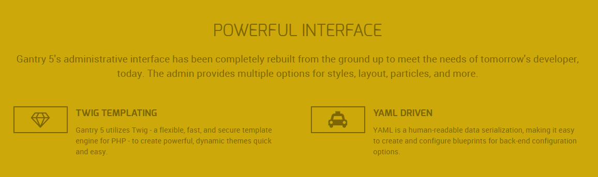
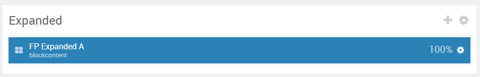
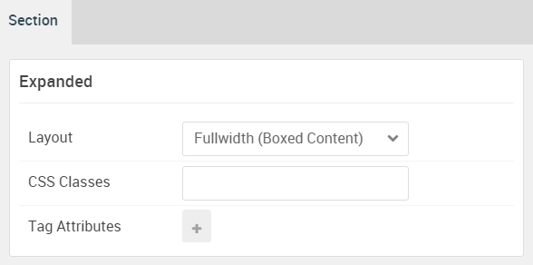

## Introduction

The **Expanded** section includes a single **Block Content** particle.

Here is a breakdown of the module(s) and particle(s) that appear in this section:

* [Block Content (particle)](#block-content-(particle))

## Section Settings

| Option           | Setting                   |
| :--------------- | :----------               |
| Layout           | Fullwidth (Boxed Content) |
| CSS Classes      | Blank                     |
| Tag Attributes   | Blank                     |

## Block Content (Particle)

### Particle Settings

| Option                | Setting                                                                                                                                                                                                             |
| :-----                | :-----                                                                                                                                                                                                              |
| Particle Name         | `Block Content`                                                                                                                                                                                                     |
| CSS Classes           | `g-blockcontent-style-3`                                                                                                                                                                                            |
| Title                 | Blank                                                                                                                                                                                                               |
| Image                 | Blank                                                                                                                                                                                                               |
| Headline              | `Powerful Interface`                                                                                                                                                                                                |
| Description           | `Gantry 5's administrative interface has been completely rebuilt from the ground up to meet the needs of tomorrow's developer, today. The admin provides multiple options for styles, layout, particles, and more.` |
| Button                | Blank                                                                                                                                                                                                               |
| Button Text           | Blank                                                                                                                                                                                                               |
| Button Target         | Self                                                                                                                                                                                                                |
| Button Classes        | Blank                                                                                                                                                                                                               |
| Icon                  | Blank                                                                                                                                                                                                               |
| Alt Text              | Blank                                                                                                                                                                                                               |
| Item 1 Name           | `Twig Templating`                                                                                                                                                                                                   |
| Item 1 Title          | `Twig Templating`                                                                                                                                                                                                   |
| Item 1 Icon           | `fa fa-diamond fa-fw fa-2x`                                                                                                                                                                                         |
| Item 1 Image          | Blank                                                                                                                                                                                                               |
| Item 1 RokBox Image   | Blank                                                                                                                                                                                                               |
| Item 1 Caption        | Blank                                                                                                                                                                                                               |
| Item 1 Sub Title      | Blank                                                                                                                                                                                                               |
| Item 1 Description    | `Gantry 5 utilizes Twig - a flexible, fast, and secure theme engine for PHP - to create powerful, dynamic themes quick and easy.`                                                                                |
| Item 1 CSS Classes    | Blank                                                                                                                                                                                                               |
| Item 1 Button Label   | Blank                                                                                                                                                                                                               |
| Item 1 Button Link    | Blank                                                                                                                                                                                                               |
| Item 1 Button Classes | Blank                                                                                                                                                                                                               |

### Block Settings

| Option         | Setting         |
| :-----         | :-----          |
| CSS ID         | Blank           |
| CSS Classes    | `fp-expanded-b` |
| Variations     | Blank           |
| Tag Attributes | Blank           |
| Fixed Size     | Unchecked       |
| Block Size     | `100%`          |