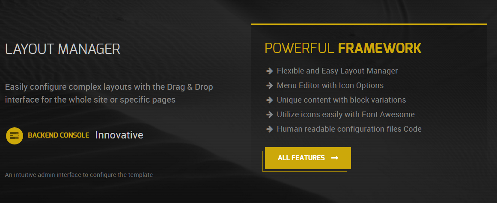
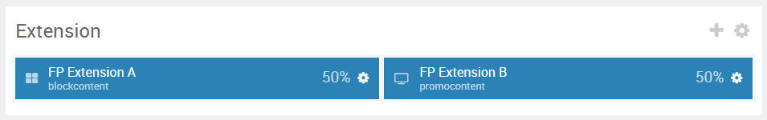
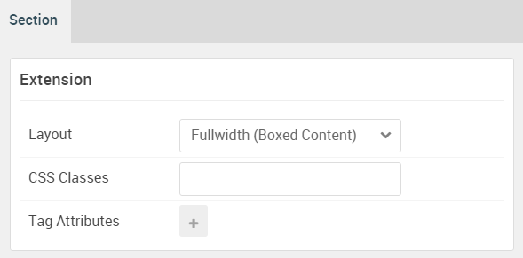

## Introduction

:   1. **Block Content** [20%, 5%, se]
    2. **Promo Content** [20%, 50%, se]

The **Extension** section includes two particles: **Block Content** and **Promo Content**.

Here is a breakdown of the module(s) and particle(s) that appear in this section:

* [Block Content (particle)](#block-content-(particle))
* [Promo Content (particle)](#promo-content-(particle))

## Section Settings

| Option           | Setting                   |
| :--------------- | :----------               |
| Layout           | Fullwidth (Boxed Content) |
| CSS Classes      | Blank                     |
| Tag Attributes   | Blank                     |

## Block Content (Particle)

### Particle Settings

| Option                | Setting                                                                                                |
| :-----                | :-----                                                                                                 |
| Particle Name         | `Block Content`                                                                                        |
| CSS Classes           | `g-blockcontent-style-1`                                                                               |
| Title                 | Blank                                                                                                  |
| Image                 | Blank                                                                                                  |
| Headline              | `Layout Manager`                                                                                       |
| Description           | `Easily configure complex layouts with the Drag & Drop interface for the whole site or specific pages` |
| Button                | `#`                                                                                                    |
| Button Text           | `Backend Console`                                                                                      |
| Button Target         | Self                                                                                                   |
| Button Classes        | `button-text-only`                                                                                     |
| Icon                  | `fa fa-tasks fa-fw`                                                                                    |
| Alt Text              | `Innovative`                                                                                           |
| Item 1 Name           | `Intuitive Admin Interface`                                                                            |
| Item 1 Title          | Blank                                                                                                  |
| Item 1 Icon           | Blank                                                                                                  |
| Item 1 Image          | Blank                                                                                                  |
| Item 1 RokBox Image   | Blank                                                                                                  |
| Item 1 Caption        | Blank                                                                                                  |
| Item 1 Sub Title      | Blank                                                                                                  |
| Item 1 Description    | `An intuitive admin interface to configure the theme`                                               |
| Item 1 CSS Classes    | Blank                                                                                                  |
| Item 1 Button Label   | Blank                                                                                                  |
| Item 1 Button Link    | Blank                                                                                                  |
| Item 1 Button Classes | Blank                                                                                                  |

### Block Settings

| Option         | Setting          |
| :-----         | :-----           |
| CSS ID         | Blank            |
| CSS Classes    | `fp-extension-a` |
| Variations     | Blank            |
| Tag Attributes | Blank            |
| Fixed Size     | Unchecked        |
| Block Size     | `50%`            |

## Promo Content (Particle)

### Particle Settings

| Option             | Setting                             |
| :-----             | :-----                              |
| Particle Name      | `Promo Content`                     |
| CSS Classes        | `g-promocontent-box`                |
| Title              | Blank                               |
| Promo Style        | Standard                            |
| Subpromo Text      | Blank                               |
| Promo Text         | `Powerful Framework`   |
| Description        | Blank                               |
| Readmore Text      | Blank                               |
| Readmore Classes   | Blank                               |
| Link               | Blank                               |
| Link Target        | Self                                |
| Readmore Style     | Block                               |
| Tag 1 Name         | `Flexible and Easy Layout Manager`  |
| Tag 1 Icon         | `fa fa-arrow-right fa-fw`           |
| Tag 1 Text         | `Flexible and Easy Layout Manager ` |
| Tag 1 Link         | Blank                               |
| Tag 1 Link Target  | Self                                |
| Alt Button Label   | `All Features`                      |
| Alt Button Link    | `#`                                 |
| Alt Button Target  | Self                                |
| Alt Button Classes | `button-special` `button-arrow`     |

### Block Settings

| Option         | Setting          |
| :-----         | :-----           |
| CSS ID         | Blank            |
| CSS Classes    | `fp-extension-b` |
| Variations     | Blank            |
| Tag Attributes | Blank            |
| Fixed Size     | Unchecked        |
| Block Size     | `50%`            |