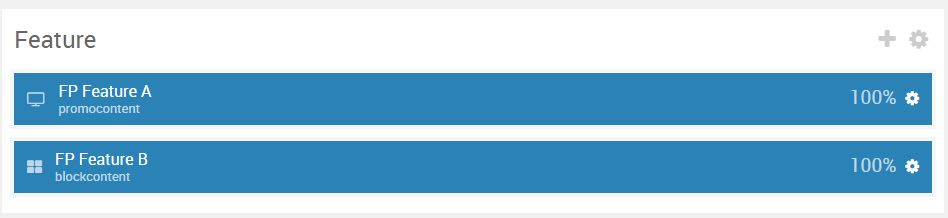
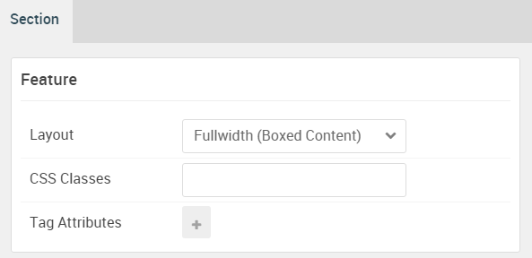

## Introduction

The **Feature** section includes two particles: **Promo Content** and **Block Content**.

Here is a breakdown of the module(s) and particle(s) that appear in this section:

* [Image Grid (particle)](#image-grid-(particle))

## Section Settings

| Option           | Setting                   |
| :--------------- | :----------               |
| Layout           | Fullwidth (Boxed Content) |
| CSS Classes      | Blank                     |
| Tag Attributes   | Blank                     |

## Promo Content (Particle)

### Particle Settings

| Option             | Setting                                                                                                                                                                                                                         |
| :-----             | :-----                                                                                                                                                                                                                          |
| Particle Name      | `Promo Content`                                                                                                                                                                                                                 |
| CSS Classes        | Blank                                                                                                                                                                                                                           |
| Title              | `Responsive`                                                                                                                                                                                                                    |
| Promo Style        | Standard                                                                                                                                                                                                                        |
| Subpromo Text      | Blank                                                                                                                                                                                                                           |
| Promo Text         | Blank                                                                                                                                                                                                                           |
| Description        | `Antares is built with a responsive layout, which means it automatically adapts to the viewing device, so it will expand and contract accordingly to the size and resolution of the screen, whether mobile, tablet or desktop.` |
| Readmore Text      | Blank                                                                                                                                                                                                                           |
| Readmore Classes   | Blank                                                                                                                                                                                                                           |
| Link               | Blank                                                                                                                                                                                                                           |
| Link Target        | Self                                                                                                                                                                                                                            |
| Readmore Style     | Block                                                                                                                                                                                                                           |
| Tags               | Blank                                                                                                                                                                                                                           |
| Alt Button Label   | Blank                                                                                                                                                                                                                           |
| Alt Button Link    | Blank                                                                                                                                                                                                                           |
| Alt Button Target  | Self                                                                                                                                                                                                                            |
| Alt Button Classes | Blank                                                                                                                                                                                                                           |

### Block Settings

| Option         | Setting        |
| :-----         | :-----         |
| CSS ID         | Blank          |
| CSS Classes    | `fp-feature-a` |
| Variations     | Blank          |
| Tag Attributes | Blank          |
| Fixed Size     | Unchecked      |
| Block Size     | `100%`         |

## Block Content (Particle)

### Particle Settings

| Option                | Setting                                                                                                             |
| :-----                | :-----                                                                                                              |
| Particle Name         | `Block Content`                                                                                                     |
| CSS Classes           | `g-blockcontent-style-2`                                                                                            |
| Title                 | Blank                                                                                                               |
| Image                 | Blank                                                                                                               |
| Headline              | Blank                                                                                                               |
| Description           | Blank                                                                                                               |
| Button                | Blank                                                                                                               |
| Button Text           | Blank                                                                                                               |
| Button Target         | Self                                                                                                                |
| Button Classes        | Blank                                                                                                               |
| Icon                  | Blank                                                                                                               |
| Alt Text              | Blank                                                                                                               |
| Item 1 Name           | `Configuration`                                                                                                     |
| Item 1 Title          | `Configuration`                                                                                                     |
| Item 1 Icon           | Blank                                                                                                               |
| Item 1 Image          | Blank                                                                                                               |
| Item 1 RokBox Image   | Blank                                                                                                               |
| Item 1 Caption        | Blank                                                                                                               |
| Item 1 Sub Title      | Blank                                                                                                               |
| Item 1 Description    | `Configuration in Gantry 5 features sophisticated built-in fields such as Icon Picker, Font Picker, and much more.` |
| Item 1 CSS Classes    | Blank                                                                                                               |
| Item 1 Button Label   | `Read More`                                                                                                         |
| Item 1 Button Link    | `#`                                                                                                                 |
| Item 1 Button Classes | `button-special` `button-alt`                                                                                       |

### Block Settings

| Option         | Setting        |
| :-----         | :-----         |
| CSS ID         | Blank          |
| CSS Classes    | `fp-feature-b` |
| Variations     | Blank          |
| Tag Attributes | Blank          |
| Fixed Size     | Unchecked      |
| Block Size     | `100%`         |
