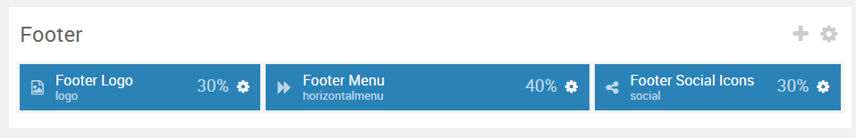
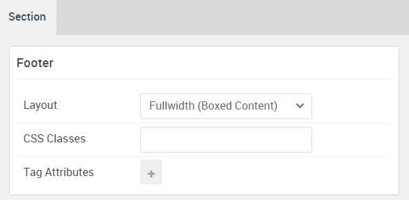

## Introduction

:	1. **Logo (Particle)** [25%, 1%, se]
	2. **Horizontal Menu (Particle)** [25%, 30%, se]
	3. **Social (Particle)** [25%, 85%, se]

The **Footer** section includes three particles: **Logo**, **Horizontal Menu**, and **Social**.

Here is a breakdown of the module(s) and particle(s) that appear in this section:

* [Logo (particle)](#logo-(particle)-1)
* [Horizontal Menu (particle)](#horizontal-menu-(particle)-2)
* [Social (particle)](#social-(particle))

## Section Settings

| Option           | Setting                   |
| :--------------- | :----------               |
| Layout           | Fullwidth (Boxed Content) |
| CSS Classes      | Blank                     |
| Tag Attributes   | Blank                     |

## Logo (Particle)

### Particle Settings

| Option        | Setting       |
| :-----        | :-----        |
| Particle Name | `Footer Logo` |
| URL           | Blank         |
| Image         | Custom        |
| Text          | Blank         |
| CSS Classes   | `g-logo`      |

### Block Settings

| Option         | Setting   |
| :-----         | :-----    |
| CSS ID         | Blank     |
| CSS Classes    | Blank     |
| Variations     | Blank     |
| Tag Attributes | Blank     |
| Fixed Size     | Unchecked |
| Block Size     | `30%`     |

## Horizontal Menu (Particle)

### Particle Settings

| Option        | Setting                                              |
| :-----        | :-----                                               |
| Particle Name | `Footer Menu`                                        |
| CSS Classes   | `demo-footer-menu`                                   |
| Target        | New Window                                           |
| Item 1 Name   | `Features`                                           |
| Item 1 Text   | `Features`                                           |
| Item 1 Link   | `http://docs.gantry.org/gantry5/basics/key-features` |

### Block Settings

| Option         | Setting   |
| :-----         | :-----    |
| CSS ID         | Blank     |
| CSS Classes    | Blank     |
| Variations     | Blank     |
| Tag Attributes | Blank     |
| Fixed Size     | Unchecked |
| Block Size     | `40%`     |

## Social (Particle)

### Particle Settings

| Option        | Setting                               |
| :-----        | :-----                                |
| Particle Name | `Footer Social Icons`                 |
| CSS Classes   | `g-social`                            |
| Title         | Blank                                 |
| Target        | New Window                            |
| Item 1 Name   | `Facebook`                            |
| Item 1 Icon   | `fa fa-facebook fa-fw`                |
| Item 1 Text   | Blank                                 |
| Item 1 Link   | `http://www.facebook.com/RocketTheme` |

### Block Settings

| Option         | Setting   |
| :-----         | :-----    |
| CSS ID         | Blank     |
| CSS Classes    | Blank     |
| Variations     | Blank     |
| Tag Attributes | Blank     |
| Fixed Size     | Unchecked |
| Block Size     | `30%`     |