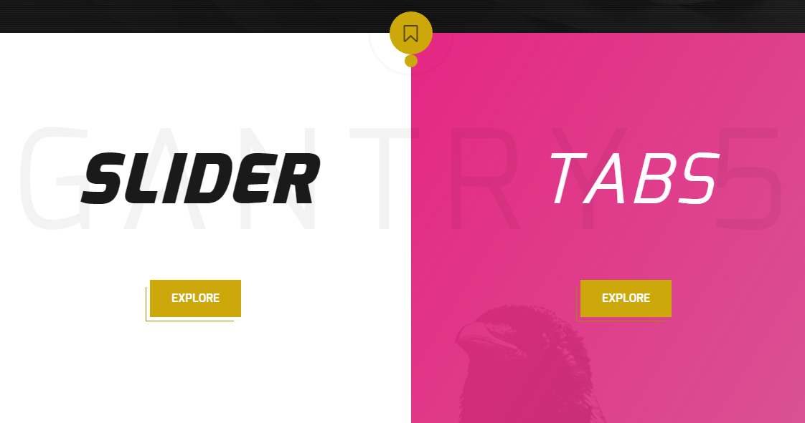
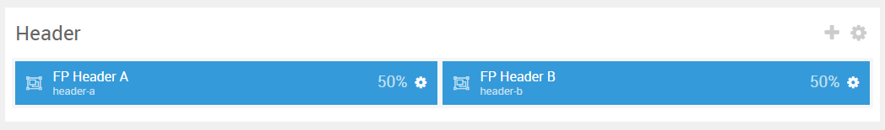
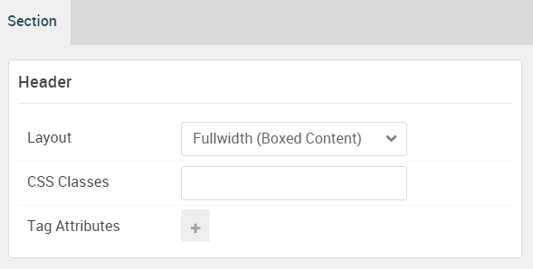

## Introduction

:	1. **Promo Content (Particle)** [20%, 5%, se]
	2. **Promo Content (Particle)** [20%, 60%, se]

The **Header** section includes a two **Promo Content** particles.

Here is a breakdown of the module(s) and particle(s) that appear in this section:

* [Promo Content (particle)](#promo-content-(particle)-1)
* [Promo Content (particle)](#promo-content-(particle)-2)

## Section Settings

| Option           | Setting                   |
| :--------------- | :----------               |
| Layout           | Fullwidth (Boxed Content) |
| CSS Classes      | Blank                     |
| Tag Attributes   | Blank                     |

## Promo Content (Particle) 1

### Particle Settings

| Option             | Setting          |
| :-----             | :-----           |
| Particle Name      | `Promo Content`  |
| CSS Classes        | Blank            |
| Title              | Blank            |
| Promo Style        | Super Promo      |
| Subpromo Text      | Blank            |
| Promo Text         | Slider           |
| Description        | Blank            |
| Readmore Text      | `Explore`        |
| Readmore Classes   | `button-special` |
| Link               | `#`              |
| Link Target        | Self             |
| Readmore Style     | Block            |
| Tags               | Blank            |
| Alt Button Label   | Blank            |
| Alt Button Link    | Blank            |
| Alt Button Target  | Self             |
| Alt Button Classes | Blank            |

### Block Settings

| Option         | Setting       |
| :-----         | :-----        |
| CSS ID         | Blank         |
| CSS Classes    | `fp-header-a` |
| Variations     | Blank         |
| Tag Attributes | Blank         |
| Fixed Size     | Unchecked     |
| Block Size     | `50%`         |

## Promo Content (Particle) 2

### Particle Settings

| Option             | Setting          |
| :-----             | :-----           |
| Particle Name      | `Promo Content`  |
| CSS Classes        | Blank            |
| Title              | Blank            |
| Promo Style        | Promo            |
| Subpromo Text      | Blank            |
| Promo Text         | Slider           |
| Description        | Blank            |
| Readmore Text      | `Tabs`           |
| Readmore Classes   | `button-special` |
| Link               | `#`              |
| Link Target        | Self             |
| Readmore Style     | Block            |
| Tags               | Blank            |
| Alt Button Label   | Blank            |
| Alt Button Link    | Blank            |
| Alt Button Target  | Self             |
| Alt Button Classes | Blank            |

### Block Settings

| Option         | Setting       |
| :-----         | :-----        |
| CSS ID         | Blank         |
| CSS Classes    | `fp-header-b` |
| Variations     | Blank         |
| Tag Attributes | Blank         |
| Fixed Size     | Unchecked     |
| Block Size     | `50%`         |