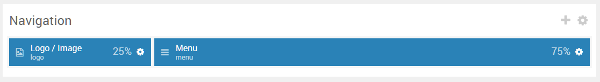

## Introduction

:   1. **Logo (Particle)** [10%, 2%, se]
    2. **Menu (Particle)** [10%, 88%, se]

The **Navigation** section includes two particles, **Logo** and **Menu**.

Here is a breakdown of the module(s) and particle(s) that appear in this section:

* [Menu (particle)](#menu-(particle))
* [Popup Module (Particle)](#popup-module-(particle))

## Section Settings

| Option           | Setting                   |
| :--------------- | :----------               |
| Layout           | Fullwidth (Boxed Content) |
| CSS Classes      | Blank                     |
| Tag Attributes   | Blank                     |

## Login (Particle)

### Particle Settings

| Option        | Setting                        |
| :-----        | :-----                         |
| Particle Name | `Logo / Image`                 |
| URL           | Blank                          |
| Image         | `gantry-media://logo/logo.png` |
| Text          | Blank                          |
| CSS Classes   | `g-logo`                       |

### Block Settings

| Option         | Setting   |
| :-----         | :-----    |
| CSS ID         | Blank     |
| CSS Classes    | Blank     |
| Variations     | Blank     |
| Tag Attributes | Blank     |
| Fixed Size     | Unchecked |
| Block Size     | `25%`     |

## Menu (Particle)

### Particle Settings

| Option        | Setting          |
| :-----        | :-----           |
| Particle Name | `Menu`           |
| Menu          | Use Default Menu |
| Base Item     | Active           |
| Start Level   | `1`              |
| Max Levels    | `0`              |
| Render Titles | Unchecked        |
| Mobile Target | Unchecked        |

### Block Settings

| Option         | Setting   |
| :-----         | :-----    |
| CSS ID         | Blank     |
| CSS Classes    | Blank     |
| Variations     | Blank     |
| Tag Attributes | Blank     |
| Fixed Size     | Unchecked |
| Block Size     | `75%`     |
