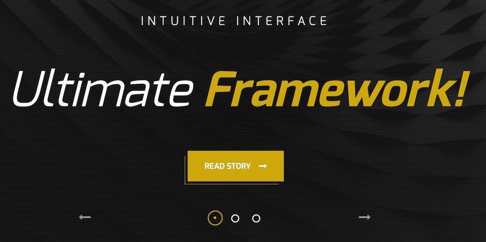
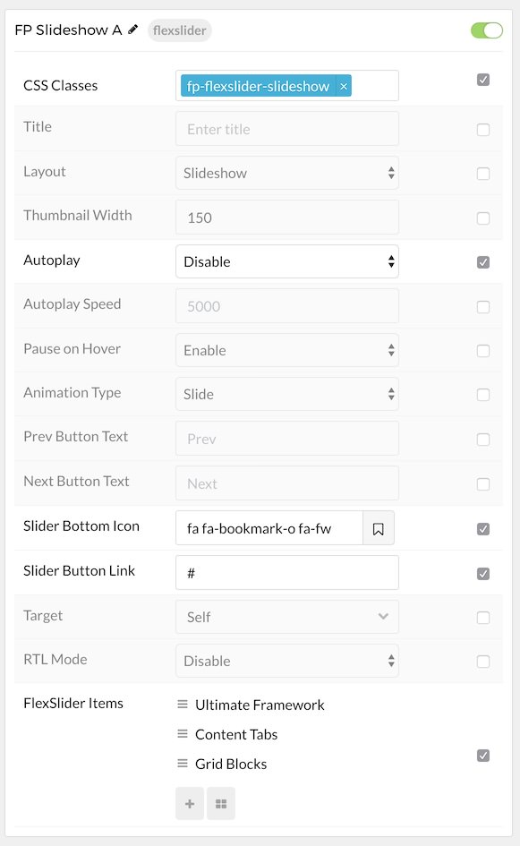
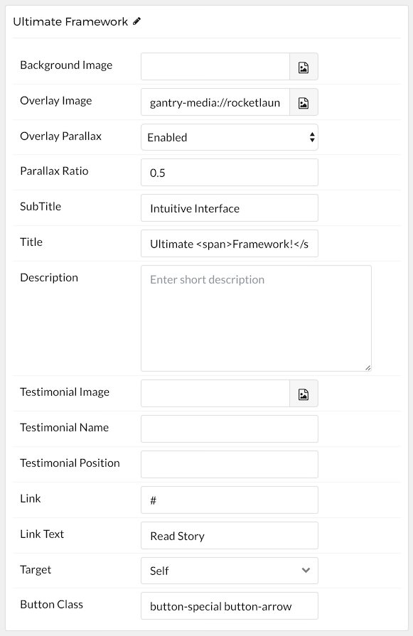

## Introduction

The **Simple Content** particle makes it easy to create smooth, modern sliders for your website.

Here are the topics covered in this guide:

* [Configuration](#configuration)
    - [Main Options](#main-options)
    - [Item Options](#item-options)

## Configuration

### Main Options 

These options affect the main area of the particle, and not the individual items within.

| Option             | Setting                                                                                                                                 |
| :-----             | :-----                                                                                                                                  |
| Particle Name      | The name of the particle for organizational use in the backend.                                                                         |
| CSS Classes        | CSS Class(es) you would like to have apply to the particle's content. In the front page of our demo we used: `fp-flexslider-slideshow`. |
| Title              | Title of the particle as it will appear on the front end.                                                                               |
| Layout             | Select a layout style to apply to the particle. Choose `Layout`, `Slideshow`, or `Showcase`.                                            |
| Thumbnail Width    | Set the width (in pixels) of the image's thumbnail.                                                                                     |
| Autoplay           | **Enable** or **Disable** autoplay for the particle.                                                                                    |
| Autoplay Speed     | Set the speed (in milliseconds) of the particle's animation.                                                                            |
| Pause on Hover     | **Enable** or **Disable** the pause-on-hover effect for the particle.                                                                   |
| Animation Type     | Choose between **Slide** and **Fade** animation types.                                                                                  |
| Prev Button Text   | Enter text for the previous button. In our demo we used: `Prev`.                                                                        |
| Next Button Text   | Enter text for the next button. In our demo we used: `Next`.                                                                            |
| Slider Button Icon | Select an icon for the button. In our demo we used: `fa fa-bookmark-o fa-fw`.                                                           |
| Slider Button Link | Select a link you would link the bottom to go to.                                                                                       |
| Target             | Select the target you want the link go open in. Choose between `New Window` and `Self`.                                                 |
| RTL Mode           | **Enable** or **Disable** RTL mode.                                                                                                     |

### Item Options

These items make up the individual featured items in the particle.

| Option               | Description                                                                                                        |
| :-----               | :-----                                                                                                             |
| Name                 | Enter a name for your item. This only appears on the back end.                                                     |
| Background Image     | Set a background image for the item.                                                                               |
| Overlay Image        | Set an overlay image for the item.                                                                                 |
| Overlay Parallax     | Enable or Disable parallax for the item's overlay.                                                                 |
| Parallax Ratio       | Set the ratio for the parallax. Usually this is `0.5`.                                                             |
| SubTitle             | Enter a subtitle for the item.                                                                                     |
| Title                | Enter a title for the item.                                                                                        |
| Description          | Enter a description for the item.                                                                                  |
| Testimonial Image    | Select a testimonial image for the item. Used in the **Testimonial** layout type.                                  |
| Testimonial Name     | Enter a name for the person giving testimony. Used in the **Testimonial** layout type.                             |
| Testimonial Position | Enter a position (job title or employer) for the person giving testimony. Used in the **Testimonial** layout type. |
| Link                 | Enter a link for the item.                                                                                         |
| Link Text            | Enter text that appears as the link for the item.                                                                  |
| Target               | Select between **Self** and **New Window** for the link's target.                                                  |
| Button Class         | Insert and CSS class(es) you want to have apply to the button.                                                     |

