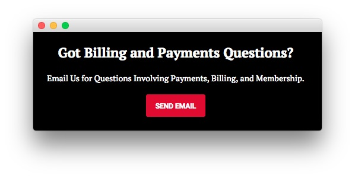
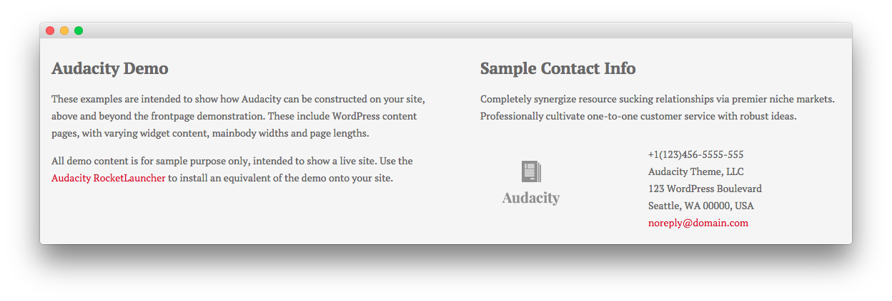

Introduction
-----

The **Contact Us** example page demonstrates how you can create a beautiful contact page with the Audacity template. Here is some information to help you replicate this page as it appears in the demo.

Mainbody
-----

The contact page's content is blank. The contact form is loaded as the result of setting the **Template** in the **Page Attributes** section of the sidebar to **Contact Form**. This form is loaded from the `template-contact.php` file located in the theme's directory.

Widgets
-----

Below is a brief rundown of the widgets used to make up the demo page. Widgets in the [**Header**](demo_header.md) and [**Copyright**](demo_copyright.md) positions are outlined in the main demo replication area of this guide.

:   1. **Showcase - Text** [9%, 45%, se]
    2. **Breadcrumbs** [14%, 10%, se]
    3. **Mainbody** [18%, 10%, se]
    4. **Sidebar - Text** [18%, 66%, se]
    5. **Extension - Text** [66%, 35%, se]
    6. **Footer - Text** [76%, 10%, se]
    7. **Footer - Text** [76%, 50%, se]

1. [Showcase - Text](#showcase-section)
2. [Breadcrumbs](#breadcrumbs-section)
3. [Mainbody](#sidebar-section)
4. [Sidebar - Text](#sidebar-section)
5. [Sidebar - Gantry Login Form](#sidebar-section)
6. [Extension - Text](#extension_section)
7. [Footer - Text](#footer-section)

Showcase Section
-----

Here is the widget breakdown for the Showcase section:

#### Text

This section of the page is a standard text widget. You will need to enter the following in the main text field.

~~~ .html
&nbsp;
~~~

Here is a breakdown of options changes you will want to make to match the demo.

| Option            | Setting                                                                      |
| :---------------- | :-----------------------------------------------------------                 |
| Title             | `Contact Us[span class="rt-title-tag"]We Would Love to Hear From You[/span]` |
| Widget Variations | RT-Center, No Margin All                                                     |
| Custom Variations | `rt-title-large rt-nomodulecontent rt-top-large-padding`                     |

Leaving everything else at its default setting, select **Save**.

Breadcrumbs Section
-----

#### Gantry Breadcrumbs

The **Gantry Breadcrumbs** widget gives you the ability to present page-aware breadcrumbs on the page. All you need to do to add them is to drag the **Gantry Breadcrumbs** widget from the **Available Widgets** area to the **Breadcrumbs** widget position.

Sidebar Section
-----

Here is the widget breakdown for the Breadcrumbs section:

#### Text

This section of the page is a standard text widget. You will need to enter the following in the main text field.

~~~ .html

Audacity is only available as part of the Club Subscription. Please use the RocketLauncher to install an equivalent of the demo onto your site.

<h4>Address</h4>

    Audacity Theme, LLC 
    123 WordPress Boulevard 
    Seattle, WA 00000, USA

<h4>Email</h4>

    noreply@audacity-theme.com 
    noperson@audacity-theme.com

<h4>Phone</h4>

    +1(123)456-5555-555 
    +1(123)456-6666-666

<h4>Online Support</h4>

    Skype ID: audacity.theme 
    BBM PIN: 12ABC345

~~~

Here is a breakdown of options changes you will want to make to match the demo.

| Option            | Setting        |
| :---------------- | :---------     |
| Widget Variations | Box 1, Title 3 |

Leaving everything else at its default setting, select **Save**.

Extension Section
-----

Here is a breakdown of the widgets in the **Extension** section:

#### Text

This section of the page is a standard text widget. You will need to enter the following in the main text field.

~~~ .html

Email Us for Questions Involving Payments, Billing, and Membership.

<a href="http://www.rockettheme.com/forum/wordpress-theme-audacity" class="readon">Send Email</a>

~~~

Here is a breakdown of options changes you will want to make to match the demo.

| Option            | Setting                               |
| :---------------- | :--------------------                 |
| Title             | `Got Billing and Payments Questions?` |
| Widget Variations | RT-Center                             |

Leaving everything else at its default setting, select **Save**.

Footer Section
-----

:   1. **Text 1** [20%, 5%, se]
    2. **Text 2** [20%, 52%, se]

Here is a breakdown of the widgets in the **Footer** section:

* Text
* Gantry Divider
* Text

#### Text 1

This section of the page is a standard text widget. You will need to enter the following in the main text field.

~~~ .html

These examples are intended to show how Audacity can be constructed on your site, above and beyond the frontpage demonstration. These include WordPress content with varying widgetized content, mainbody widths and page lengths.

All demo content is for sample purpose only, intended to show a live site. Use the <a href="http://www.rockettheme.com/wordpress/themes/audacity">Audacity RocketLauncher</a> to install an equivalent of the demo onto your site.

~~~

Here is a breakdown of options changes you will want to make to match the demo.

|       Option      |      Setting      |
| :---------------- | :---------------- |
| Title             | `Audacity Demo` |
| Custom Variations | `rt-phone-center` |

Leaving everything else at its default setting, select **Save**.

#### Gantry Divider

This widget tells WordPress to start a new widget column beginning with the widget placed directly below the divider in the section.

#### Text 2

This section of the page is a standard text widget. You will need to enter the following in the main text field.

~~~ .html

Completely synergize resource sucking relationships via premier niche markets. Professionally cultivate one-to-one customer service with robust ideas.

    

        

            
        
  
    

    

        

            +1(123)456-5555-555 
            Audacity Theme, LLC 
            123 WordPress Boulevard 
            Seattle, WA 00000, USA 
            <a href="#">noreply@domain.com</a>
        

    

~~~

Here is a breakdown of options changes you will want to make to match the demo.

|       Option      |        Setting        |
| :---------------- | :-------------------- |
| Title             | `Sample Contact Info` |
| Custom Variations | `rt-phone-center`     |

Leaving everything else at its default setting, select **Save**.